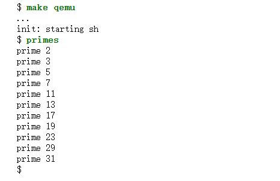
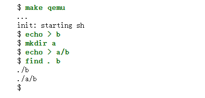
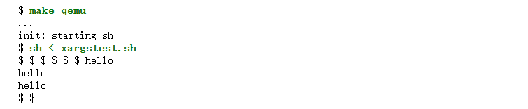
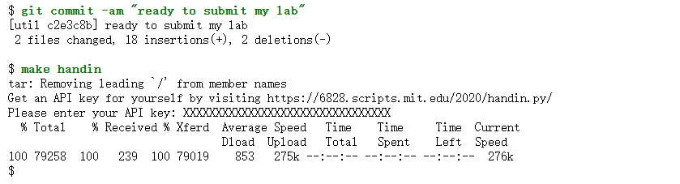
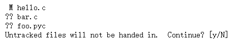

# 				Lab1 : Xv6 and Unix utilities

[原网页](https://pdos.csail.mit.edu/6.828/2020/labs/util.html)

分支名称：util

---

## 1. Boot xv6

（easy）

搭建实验环境。。。ignore

---

## 2. sleep

（easy）

> 为 xv6 实现 UNIX 程序 sleep； 您的sleep应该暂停用户指定的时钟周期数。 时钟周期是 xv6 内核定义的时间概念，即定时器芯片两次中断之间的时间。 
>
> 您的解决方案应该位于文件 **user/sleep.c** 中。

### 2.1 一些提示

+ 查看 user/ 中的一些其他程序（例如 user/echo.c、user/grep.c 和 user/rm.c），了解如何获取传递给程序的命令行参数。（√）

+ 如果用户忘记传递参数，sleep 应该打印一条错误消息。（√）

+ 命令行参数作为字符串传递； 您可以使用 `atoi ()`将其转换为整数（请参阅 **user/ulib.c**）。（√）

+ 使用系统调用`sleep`。(√)

+ 请参阅 **kernel/sysproc.c** 了解实现 `sleep` 系统调用的 xv6 内核代码（查找 `sys_sleep`），参见 **user/user.h** 了解可从用户程序调用 sleep 的 C 定义，以及 **user/usys.S** 了解从用户代码跳转到内核进行sleep的汇编代码。

  （`sleep系统调用的xv6内核代码 sys_sleep还得再看一下`）:herb:

+ 确保 main 调用 exit() 以退出程序。（√）

+ 将你的sleep程序添加到Makefile文件中的**UPROGS**中； （√）

+ 完成此操作后，make qemu 将编译您写的程序，您将能够从 xv6 shell 运行它。（√）

### 2.2 运行

从xv6的shell中运行该程序：

如果您的程序在运行时暂停，如上所示，您的解决方案是正确的。

运行 `make grade` 看看您是否确实通过了sleep测试。

---

## 3. pingpong

 (easy)

> 编写一个程序，使用 UNIX 系统调用通过一对管道（每个方向一个）在两个进程之间“pingpong”一个字节。 父进程应向子进程发送一个字节； 子进程应打印“<pid>：已收到 ping”，其中 <pid> 是其进程 ID，将管道上的字节写入到父进程，然后退出； 父进程应该从子进程读取字节，打印“<pid>：收到 pong”，然后退出。
>
>  您的解决方案应该位于文件 user/pingpong.c 中。

### 3.1 一些提示

+ 使用 `pipe` 来创建管道（√）

+ 使用 `fork` 来创建子进程（√）

+ 使用 `read` 从管道读，使用 write 向管道写（√）

+ 使用 `getpid` 获取当前进程的进程ID（√）

+ 添加程序到Makefile的 `UPRPGS` 中（√）

+ xv6 上的用户程序具有一组有限的可用库函数。 （√）

  您可以在 user/user.h 中看到该列表； 源代码（系统调用除外）位于 user/ulib.c、user/printf.c 和 user/umalloc.c 中。（√）

### 3.2 运行

如果您的程序在两个进程之间交换一个字节并产生如上所示的输出，则您的解决方案是正确的。

## 4. primes 

(moderate)/(hard)

> 使用管道编写素数筛选的**并发**版本。 这个想法源自 Unix 管道的发明者 Doug McIlroy。 [**本页**](https://swtch.com/~rsc/thread/)中间的图片和周围的文字解释了如何操作。 
>
> 您的解决方案应该位于文件 user/primes.c 中。

您的目标是使用pipe和fork来设置管道。 第一个进程将数字 2 到 35 输入管道。 对于每个质数，您将安排创建一个进程，通过管道从其左邻居读取数据，并通过另一个管道向其右邻居写入数据。 由于xv6的文件描述符和进程数量有限，第一个进程可以停在35。?

### 4.1 一些提示

+ 请小心关闭进程不需要的文件描述符，否则您的程序将在第一个进程达到 35 之前耗尽资源来运行 xv6。
+ 一旦第一个进程达到 35，它应该等待全部管道终止，包括所有子进程、孙子进程等。。。 因此，主 primes 进程仅应在所有输出打印完毕以及所有其他 primes 进程退出后退出。
+ 当管道的写入端关闭时，读取返回零。
+ 最简单的方法是直接将 32 位（4 字节）整数写入管道，而不是使用格式化的 ASCII I/O。
+ 您应该仅在需要时在pipeline中创建进程。
+ 将程序添加到 Makefile 中的 `UPROGS` 中。

### 4.2 运行

如果您的解决方案实现了基于管道的筛选并产生以下输出，则它是正确的：

---

## 5. find

(moderate)

> 编写一个简单版本的 UNIX 查找程序：查找目录树中具有特定名称的所有文件。 
>
> 您的解决方案应该位于文件 user/find.c 中。

### 5.1 一些提示

+ 查看 **user/ls.c** 以了解如何读取目录。
+ 使用递归允许 find 进入到子目录。
+ 不要递归到“.” 和 ”..”。
+ 文件系统的更改在 qemu 运行期间持续存在； 要获得干净的文件系统，请运行 `make clean`，然后运行 `make qemu`。
+ 你需要使用c字符串。
+ 请注意，== 并不像 Python 中那样比较字符串。 请改用 **`strcmp()`**。
+ 将程序添加到 Makefile 中的 **UPROGS** 中。

### 5.2 运行

如果产生以下输出（当文件系统包含文件 b 和 a/b 时），您的解决方案是正确的：

---

## 6.xargs

(moderate)

> 编写一个简单版本的 UNIX xargs 程序：从标准输入读取行并为每行运行一个xargs后跟随的命令，将该行作为**参数**提供给命令。
>
>  您的解决方案应该位于文件 user/xargs.c 中。

下面这个例子阐述了xargs的行为：

请注意，这里的命令是“echo bye”，附加参数是“hello too”，使得命令“echo bye hello too”输出“bye hello too”。

请注意，UNIX 上的 xargs 进行了优化，它一次向命令提供多个参数。 我们不希望您进行此优化。 要使 UNIX 上的 xargs 按照我们在本实验中希望的方式运行，请在 -n 选项设置为 1 的情况下运行它。例如：

### 6.1 一些提示

+ 使用 fork 和 exec 在每行输入上调用命令。 在父级中使用 wait 来等待子级完成命令。
+ 要读取单行输入，请一次读取一个字符，直到出现换行符 ('\n')。
+ kernel/param.h 声明了 MAXARG，如果您需要声明 argv 数组，这可能很有用。
+ Add the program to `UPROGS` in Makefile.

### 6.2 运行

xargs, find, and grep 可以很好的结合：

将对“.”目录下名为 b 的每个文件运行“grep hello”。

要测试 xargs 的解决方案，请运行 shell 脚本 xargstest.sh。 如果您的解决方案产生以下输出，则它是正确的：

您可能必须返回并修复查找程序中的错误。 

输出有很多$。

因为 xv6 shell 没有意识到它正在处理来自文件而不是来自控制台的命令，并为文件中的每个命令打印一个 $。

---

## 7. 提交实验

至此实验就完成了。 确保您通过所有制造等级测试。 提交您的更改（包括添加answers-lab-name.txt）并在实验室目录中输入 `make handin` 以提交您的实验。

### 7.1 花费的时间

创建一个新文件 time.txt，并在其中放入一个整数，即您在实验上花费的小时数。 不要忘记 git add 和 git commit 该文件。

### 7.2 提交

您将使用[提交网站](https://6828.scripts.mit.edu/2020/handin.py/student)提交作业。 您需要先从提交网站请求一次 API 密钥，然后才能提交任何作业或实验。

将最终更改提交到实验后，输入 `make handin` 以提交您的实验。

make handin 会将您的 API 密钥存储在 myapi.key 中。 如果您需要更改 API 密钥，只需删除此文件并让 `make handin` 再次生成它（myapi.key 不得包含换行符）。

如果您运行 `make handin` 并且您有未跟踪文件或者未提交的更改，您将看到类似于以下内容的输出：

检查上述行并确保实验所需的所有文件都被跟踪，即未列出在以 ?? 开头的行中。 您可以让 git 跟踪您使用 git add filename 创建的新文件。

如果 make handin 无法正常工作，请尝试使用curl 或Git 命令修复问题。 或者你可以运行 make tarball。 这将为您创建一个 tar 文件，然后您可以通过我们的网络界面上传该文件。

> 请运行“makegrade”以确保您的代码通过所有测试
> 在运行“make handin”之前提交任何修改的源代码
> 您可以在 https://6828.scripts.mit.edu/2020/handin.py/ 检查提交的状态并下载提交的代码

## 8.可选的挑战性练习~~~

+ 编写一个uptime程序，使用 `uptime` 系统调用以时钟周期数形式打印正常运行时间。 （easy）
+ 使find支持正则表达式进行名称匹配。 **grep.c** 对正则表达式有一些原始支持。 （easy）
+ xv6 shell (user/sh.c) 只是另一个用户程序，您可以改进它。 它是一个最小的 shell，缺乏真实 shell 中的许多功能。 例如，修改shell以在处理来自文件的shell命令时不打印$（中等），修改shell以支持等待（简单），修改shell以支持命令列表，以“;”分隔。 （中等），修改 shell 以通过实现“(”和“)”来支持子 shell（中等），修改 shell 以支持制表符补全（简单），修改 shell 以保留传递的 shell 命令的历史记录（中等） ，或者您希望 shell 执行的任何其他操作。 （如果您雄心勃勃，您可能必须修改内核以支持您需要的内核功能；xv6 支持的不多。）

