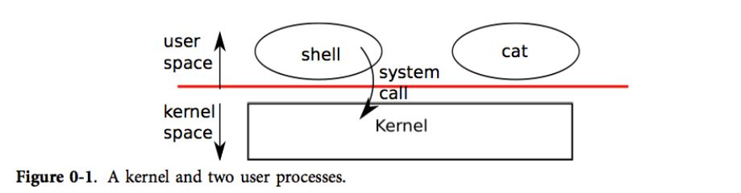
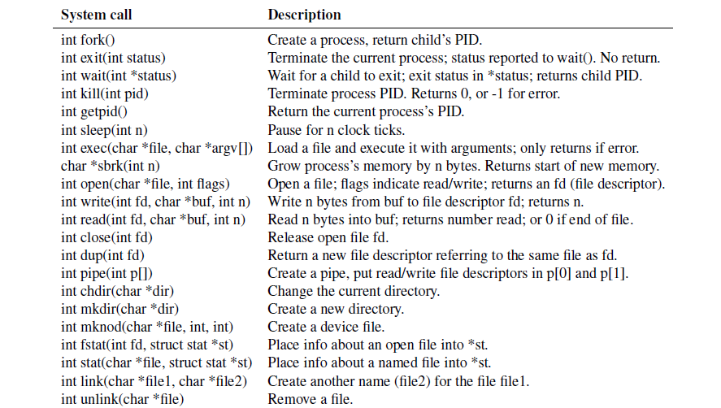

# 			book-riscv-rev1

本文档只是笔记，详细内容可参考resources文件夹中的**book-riscv-rev1.pdf**(英文，也是本项目的教材) 或 [xv6中文文档(2012年教材的译版 旧)](https://th0ar.gitbooks.io/xv6-chinese/content/content/chapter0.html)。

另外，resources文件夹中也有xv6的源代码文档：**xv6-源码.pdf**(2012年的版本) 或 直接查看github上的[源代码](https://github.com/mit-pdos/xv6-riscv/tree/riscv)，可以和教材一起食用。


**xv6：一个简单的， 类 Unix 的教学操作系统**

**xv6 是 Dennis Ritchie 和 Ken Thompson 合著的 Unix Version 6（v6）操作系统的重新实现。xv6 在一定程度上遵守 v6 的结构和风格，但它是用 ANSI C 实现的，并且是基于RISC-V 多核处理器的。**

:happy:enjoy it.

---

## Chapter 1. 操作系统接口

操作系统的工作是将计算机的资源在多个程序间共享，并且给程序提供一系列比硬件本身更有用的服务。

操作系统通过**接口**向用户程序提供服务。设计一个好的接口实际上是很难的。一方面我们希望接口设计得简单和精准，使其易于正确地实现；另一方面，我们可能忍不住想为应用提供一些更加复杂的功能。解决这种矛盾的办法是让接口的设计依赖于少量的**机制** （*mechanism*)，而通过这些机制的组合提供强大、通用的功能。

我们的xv6操作系统提供了提供了基本的接口，同时模仿了Unix的内部设计，Unix提供的机制结合良好的小而精悍的接口提供了令人吃惊的通用性。

xv6采用了传统内核的概念，即作为一个特殊的程序为其他运行的程序提供服务。当一个进程需要内核的服务时，它调用一个**系统调用**（这属于os接口的一部分）。系统调用会进入内核，然后内核执行相应的服务并返回。所以进程总是在内核空间和用户空间之间交替运行。如下图所示：



内核使用了 **CPU 的硬件保护机制**来保证用户进程只能访问自己的内存空间。内核拥有实现保护机制所需的硬件权限(hardware privileges)，而用户程序没有这些权限。当一个用户程序进行一次系统调用时，硬件会提升特权级并且开始执行一些内核中预定义的功能。

内核提供的一系列系统调用就是用户程序可见的操作系统接口，xv6 内核提供了 Unix 传统系统调用的一部分，它们是：



这一章剩下的部分将说明 xv6 系统服务的概貌 —— **进程，内存，文件描述符，管道和一种文件系统**。为了描述他们，我们给出了代码和一些讨论。这些系统调用在 shell 上的应用阐述了他们的设计是多么独具匠心。

**xv6 shell 本质上是一个 Unix Bourne shell 的简单实现。它的实现在[(user/sh.c:1)](https://github.com/mit-pdos/xv6-riscv/blob/riscv/user/sh.c).**

### 1.1 进程和内存

一个 xv6 进程由两部分组成，一部分是用户内存空间（指令，数据，栈），另一部分是仅对内核可见的进程状态。

xv6 提供了**分时**特性：它在可用 CPU 之间不断切换，决定哪一个等待中的进程被执行。当一个进程不在执行时，xv6 保存它的 CPU 寄存器，当他们再次被执行时恢复这些寄存器的值。

内核将每个进程和一个 **pid** (process identifier) 关联起来。

> 忽略介绍上述系统调用。。。。。

xv6 使用 **ELF** 文件格式，第3章将详细介绍它。

xv6 shell 通过`exec()`系统调用为用户执行程序。shell 的主要结构很简单，详见 [(user/sh.c:145)](https://github.com/mit-pdos/xv6-riscv/blob/riscv//user/sh.c#L145).的代码。主循环读取用户的一行输入
获取命令。 然后它调用 fork，创建 shell 进程的副本。 父进程调用 wait，而子进程运行命令。 例如，如果用户在 shell 中输入“echo hello”，则将以“echo hello”作为参数调用 `runcmd`。 `runcmd` (user/sh.c:58) 运行实际命令。 对于“echo hello”，它将调用 `exec` (user/sh.c:78)。 如果 `exec` 成功，那么子进程将执行来自 echo 而不是 runcmd 的指令。 在某些时候，echo 将调用 `exit`，这将导致父进程从 main 中的等待(`wait()`)返回（user/sh.c:145）。

xv6 通常隐式地分配用户的内存空间。`fork` 在子进程需要装入父进程的内存拷贝时分配空间，`exec` 在需要装入可执行文件时分配空间。一个进程在需要额外内存时可以通过调用 `sbrk(n)` 来增加 n 字节的数据内存。 `sbrk` 返回新的内存的地址。

---

### 1.2 I/O和文件描述符

**文件描述符**是一个整数，它代表了 一个进程可以读写的被内核管理的对象。进程可以通过多种方式获得一个文件描述符，**如打开文件、目录、设备，或者创建一个管道（pipe），或者创建了一个网络连接(socket)，或者复制已经存在的文件描述符。**简单起见，我们常常把文件描述符指向的对象称为“文件”。文件描述符的接口是对文件、管道、设备等的抽象，这种抽象使得它们看上去就是**字节流**。我们把输入/输出称为**I/O**。:yum:

​	操作系统内核在内部为每一个进程维护了一张表，而文件描述符就是这张表的**索引**，因此每个进程都有一个从零开始的私有的文件描述符空间。按照惯例，一个进程从文件描述符0( 默认代表标准输入，stdin)读取数据，向文件描述符1(默认代表标准输出，stdout)写入数据，向文件描述符2(默认代表标准错误，stderr)写入错误信息。shell正是利用了这个惯例，实现了I/O重定向和管道。shell确保一个进程总是有三个文件描述符(0-2)是打开的([user/sh.c:151](user/sh.c:151))，他们默认是console的文件描述符。	

系统调用 `read` 和 `write` 从文件描述符所指的文件中读或者写 n 个字节。

下面这段程序（实际上就是 `cat` 的本质实现）将数据从标准输入复制到标准输出，如果遇到了错误，它会在标准错误输出输出一条信息。

```c
char buf[512];
int n;

for(;;){
    n = read(0, buf, sizeof buf);
    if(n == 0)
        break;
    if(n < 0){
        fprintf(2, "read error\n");
        exit();
    }
    if(write(1, buf, n) != n){
        fprintf(2, "write error\n");
        exit();
    }
}
```

这段代码中值得一提的是 `cat` 并不知道它是从文件、控制台或者管道中读取数据的。同样地 `cat` 也不知道它是写到文件、控制台或者别的什么地方。

系统调用 `close` 会释放一个文件描述符(**释放的是文件描述符，指向的文件只有在完全没有文件描述符引用它时才被关闭**），使得它未来可以被 `open`, `pipe`, `dup` 等调用重用。一个新分配的文件描述符永远都是当前进程的**最小的未被使用**的文件描述符。

文件描述符和 `fork` 的交叉使用使得 I/O 重定向能够轻易实现。`fork` 会复制父进程的文件描述符和内存，所以子进程和父进程的文件描述符一模一样。`exec` 会替换调用它的进程的内存但是会保留它的文件描述符表。这种行为使得 shell 可以这样实现重定向：`fork` 一个进程，重新打开指定文件的文件描述符，然后执行新的程序。[🤩](https://emojipedia.org/star-struck)

下面是一个简化版的 shell 执行 `cat<input.txt` (<表示输入重定向，这里的意思是将input.txt作为cat的输入~)的代码:

```c
char *argv[2];
argv[0] = "cat";
### argv[1] = 0;
if(fork() == 0) {
    close(0);
    open("input.txt", O_RDONLY);
    exec("cat", argv);
}
```

xv6 shell是这样实现I/O重定向的([user/sh.c:82](user/sh.c:82)).在看完以后你就可以理解`fork`和`exec`分别实现的巧妙之处了~~**这使得shell有机会在`fork`和`exec`的间隔重定向子进程的I/O而不会影响到父进程(shell)本身，也可以很好地重新利用我们要exec的程序而且也无需修改它**。🤭√（不然的话我们要么修改shell的i/o然后恢复修改；要么为每个程序实现i/o重定向，然后通过参数传递给它 。。。。no。。）

`open()`的第二参数包含了一系列用bit表示的标志，指出了open以什么样的方式/权限打开文件，这些标志位的宏定义在([kernel/fcntl.h:1-5](kernel/fcntl.h:1-5))

**`fork()`不仅会复制父进程的文件描述符，还会共享(不是拷贝，是共享！！！这很重要)文件偏移。**

**`dup()`复制指定文件描述符，返回新的文件描述符的值，新的文件描述符和旧的文件描述符指向相同的内核里的I/O对象，而且共享文件偏移，就像`fork`复制的文件描述符那样（不过这里的文件描述符是新的值）**

从同一个原初文件描述符通过一系列 `fork` 和 `dup` 调用产生的文件描述符都共享同一个文件偏移，而其他情况下产生的文件描述符就不是这样了，即使他们打开的都是同一份文件。


`dup()`能够让shell实现这样的命令：

```shell
ls existing-file non-exsiting-file > tmp1 2>&1
```

`2>&1`告诉shell给这条命令从文件描述符1复制一个文件描述符2，这样文件描述符2也指向标准输出了。

因为xv6的shell不支持对标准错误重定向，这样做能够把对标准错误信息也重定向输出到tmp1文件中了~~~，我们就可以这样自己实现对标准错误的重定向了。


文件描述符是一个强大的抽象，因为他们将他们所连接的细节隐藏起来了~~~[🥱](https://emojipedia.org/yawning-face)

---

### 1.3 管道

**管道**就是一片小的内核缓冲区，它以一对文件描述符的形式提供给进程，一个用于写操作，一个用于读操作。从管道的一端写的数据可以从管道的另一端读取。管道提供了一种**进程间通信**的方式。

如果数据没有准备好，那么对管道执行的`read`会一直等待，直到有数据了或者其他绑定在这个管道写端口的文件描述符**全部被**关闭。所以对于一些复制的而又不需要使用的文件描述符，记得close()，以免eof永远不会到来。

xv6 shell 对管道的实现（比如 `fork sh.c | wc -l`）和上面的描述是类似的，源码在([user/sh.c:100](user/sh.c:100)).


> > 下面是关于对管道命令如何实现的论述：
>
> The child process creates a pipe to connect the left end of the pipeline with the right end. Then it calls fork and runcmd for the left end of the pipeline and fork and runcmd for the right end, and waits for both to finish. The right end of the pipeline may be a command that itself includes a pipe (e.g., a | b | c), which itself forks two new child processes (one for b and one for c). Thus, the shell may create a tree of processes. The leaves
> of this tree are commands and the interior nodes are processes that wait until the left and right children complete.
>
> In principle, one could have the interior nodes run the left end of a pipeline, but doing so correctly would complicate the implementation. Consider making just the following modification: change sh.c to not fork for p->left and run runcmd(p->left) in the interior process. Then, for example, echo hi | wc won’t produce output, because when echo hi exits in runcmd, the interior process exits and never calls fork to run the right end of the pipe. This incorrect behavior could be fixed by not calling exit in runcmd for interior processes, but this fix complicates the code: now runcmd needs to know if it a interior process or not. Complications also arise when not forking for runcmd(p->right). For example, with just that modification, sleep 10 | echo hi will immediately print “hi” instead of after 10 seconds, because echo runs immediately and exits, not waiting for sleep to finish. Since the goal of the sh.c is to be as simple as possible, it doesn’t try to avoid creating interior processes.


使用管道看起来可能和使用文件进行重定向没什么区别，just like this：

用管道:

```shell
echo hello world | wc
```

用文件：

```shell
echo hello world >/tmp/xyz; wc </tmp/xyz
```

**在这种情况下，管道有四个优势：**

1. 管道会进行自我清空，在命令执行完之后；而文件重定向，我们必须要在任务完成后删除 `/tmp/xyz`。

2. 管道可以传输任意长度的数据流；而文件重定向需要充足的磁盘空间去存储所有数据。

3. 管道允许并行执行；而文件方式需要顺序执行

4. 如果你在进行进程间通信，管道的阻塞读写比文件的非阻塞读写语义更高效。（这是为什么呢？）

   **一些对4的解释：**

   + **同步机制的简化：** 管道提供了一种同步机制，当一个进程试图从空管道读取数据或者向满管道写入数据时，它会被阻塞。这种同步机制可以更容易地实现和管理，而且对于很多情况下的进程间通信是合适的。
   + **内核缓冲区的优化：** 管道是内核中的缓冲区，它被设计用于在进程间传递数据。在典型的实现中，管道的缓冲机制能够更有效地处理数据传输，而且操作系统可以更好地优化对管道的读写操作。
   + **更高的抽象层次：** 管道提供了更高层次的抽象，使得进程间通信更为简单。相对于文件，管道的设计更专注于进程间通信的需求，而文件系统可能包含了更多的功能和复杂性。
   + **操作系统优化：** 操作系统对于管道的实现通常更为优化，因为管道是专门为进程通信而设计的。文件的非阻塞读写则可能需要更多的系统调用和额外的处理。

---


