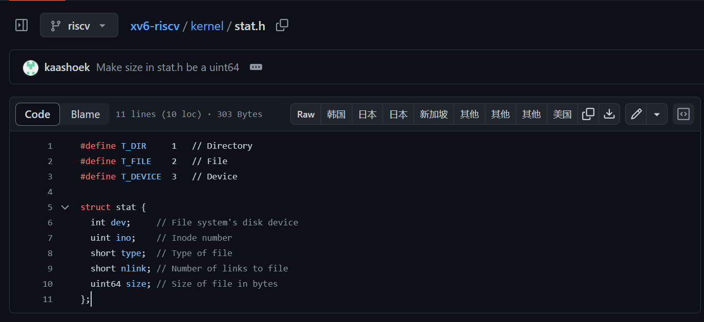
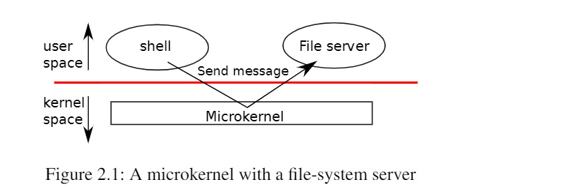
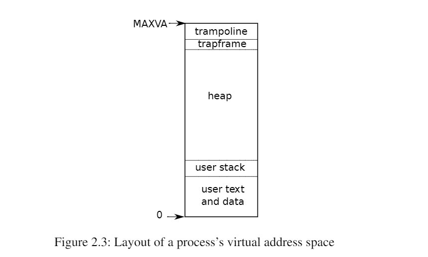
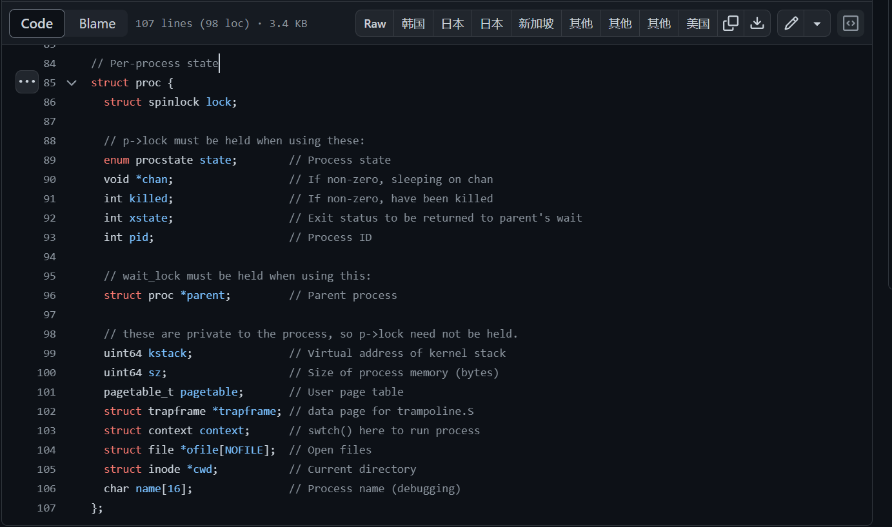

# 			book-riscv-rev1

本文档只是笔记，详细内容可参考resources文件夹中的**book-riscv-rev1.pdf**(英文，也是本项目的教材) 或 [xv6中文文档(2012年教材的译版 旧)](https://th0ar.gitbooks.io/xv6-chinese/content/content/chapter0.html)。

另外，resources文件夹中也有xv6的源代码文档：**xv6-源码.pdf**(2012年的版本) 或 直接查看github上的[源代码](https://github.com/mit-pdos/xv6-riscv/tree/riscv)，可以和教材一起食用。


**xv6：一个简单的， 类 Unix 的教学操作系统**

**xv6 是 Dennis Ritchie 和 Ken Thompson 合著的 Unix Version 6（v6）操作系统的重新实现。xv6 在一定程度上遵守 v6 的结构和风格，但它是用 ANSI C 实现的，并且是基于RISC-V 多核处理器的。**

:happy:enjoy it.

---

## Chapter 1. 操作系统接口

操作系统的工作是将计算机的资源在多个程序间共享，并且给程序提供一系列比硬件本身更有用的服务。

操作系统通过**接口**向用户程序提供服务。设计一个好的接口实际上是很难的。一方面我们希望接口设计得简单和精准，使其易于正确地实现；另一方面，我们可能忍不住想为应用提供一些更加复杂的功能。解决这种矛盾的办法是让接口的设计依赖于少量的**机制** （*mechanism*)，而通过这些机制的组合提供强大、通用的功能。

我们的xv6操作系统提供了提供了基本的接口，同时模仿了Unix的内部设计，Unix提供的机制结合良好的小而精悍的接口提供了令人吃惊的通用性。

xv6采用了传统内核的概念，即作为一个特殊的程序为其他运行的程序提供服务。当一个进程需要内核的服务时，它调用一个**系统调用**（这属于os接口的一部分）。系统调用会进入内核，然后内核执行相应的服务并返回。所以进程总是在内核空间和用户空间之间交替运行。如下图所示：


内核使用了 **CPU 的硬件保护机制**来保证用户进程只能访问自己的内存空间。内核拥有实现保护机制所需的硬件权限(hardware privileges)，而用户程序没有这些权限。当一个用户程序进行一次系统调用时，硬件会提升特权级并且开始执行一些内核中预定义的功能。

内核提供的一系列系统调用就是用户程序可见的操作系统接口，xv6 内核提供了 Unix 传统系统调用的一部分，它们是：


这一章剩下的部分将说明 xv6 系统服务的概貌 —— **进程，内存，文件描述符，管道和一种文件系统**。为了描述他们，我们给出了代码和一些讨论。这些系统调用在 shell 上的应用阐述了他们的设计是多么独具匠心。

**xv6 shell 本质上是一个 Unix Bourne shell 的简单实现。它的实现在[(user/sh.c:1)](https://github.com/mit-pdos/xv6-riscv/blob/riscv/user/sh.c).**

### 1.1 进程和内存

一个 xv6 进程由两部分组成，一部分是用户内存空间（指令，数据，栈），另一部分是仅对内核可见的进程状态。

xv6 提供了**分时**特性：它在可用 CPU 之间不断切换，决定哪一个等待中的进程被执行。当一个进程不在执行时，xv6 保存它的 CPU 寄存器，当他们再次被执行时恢复这些寄存器的值。

内核将每个进程和一个 **pid** (process identifier) 关联起来。

> 忽略介绍上述系统调用。。。。。

xv6 使用 **ELF** 文件格式，第3章将详细介绍它。

xv6 shell 通过`exec()`系统调用为用户执行程序。shell 的主要结构很简单，详见 [(user/sh.c:145)](https://github.com/mit-pdos/xv6-riscv/blob/riscv//user/sh.c#L145).的代码。主循环读取用户的一行输入
获取命令。 然后它调用 fork，创建 shell 进程的副本。 父进程调用 wait，而子进程运行命令。 例如，如果用户在 shell 中输入“echo hello”，则将以“echo hello”作为参数调用 `runcmd`。 `runcmd` (user/sh.c:58) 运行实际命令。 对于“echo hello”，它将调用 `exec` (user/sh.c:78)。 如果 `exec` 成功，那么子进程将执行来自 echo 而不是 runcmd 的指令。 在某些时候，echo 将调用 `exit`，这将导致父进程从 main 中的等待(`wait()`)返回（user/sh.c:145）。

xv6 通常隐式地分配用户的内存空间。`fork` 在子进程需要装入父进程的内存拷贝时分配空间，`exec` 在需要装入可执行文件时分配空间。一个进程在需要额外内存时可以通过调用 `sbrk(n)` 来增加 n 字节的数据内存。 `sbrk` 返回新的内存的地址。

---

### 1.2 I/O和文件描述符

**文件描述符**是一个整数，它代表了 一个进程可以读写的被内核管理的对象。进程可以通过多种方式获得一个文件描述符，**如打开文件、目录、设备，或者创建一个管道（pipe），或者创建了一个网络连接(socket)，或者复制已经存在的文件描述符。**简单起见，我们常常把文件描述符指向的对象称为“文件”。文件描述符的接口是对文件、管道、设备等的抽象，这种抽象使得它们看上去就是**字节流**。我们把输入/输出称为**I/O**。:yum:

​	操作系统内核在内部为每一个进程维护了一张表，而文件描述符就是这张表的**索引**，因此每个进程都有一个从零开始的私有的文件描述符空间。按照惯例，一个进程从文件描述符0( 默认代表标准输入，stdin)读取数据，向文件描述符1(默认代表标准输出，stdout)写入数据，向文件描述符2(默认代表标准错误，stderr)写入错误信息。shell正是利用了这个惯例，实现了I/O重定向和管道。shell确保一个进程总是有三个文件描述符(0-2)是打开的([user/sh.c:151](user/sh.c:151))，他们默认是console的文件描述符。	

系统调用 `read` 和 `write` 从文件描述符所指的文件中读或者写 n 个字节。

下面这段程序（实际上就是 `cat` 的本质实现）将数据从标准输入复制到标准输出，如果遇到了错误，它会在标准错误输出输出一条信息。

```c
char buf[512];
int n;

for(;;){
    n = read(0, buf, sizeof buf);
    if(n == 0)
        break;
    if(n < 0){
        fprintf(2, "read error\n");
        exit();
    }
    if(write(1, buf, n) != n){
        fprintf(2, "write error\n");
        exit();
    }
}
```

这段代码中值得一提的是 `cat` 并不知道它是从文件、控制台或者管道中读取数据的。同样地 `cat` 也不知道它是写到文件、控制台或者别的什么地方。

系统调用 `close` 会释放一个文件描述符(**释放的是文件描述符，指向的文件只有在完全没有文件描述符引用它时才被关闭**），使得它未来可以被 `open`, `pipe`, `dup` 等调用重用。一个新分配的文件描述符永远都是当前进程的**最小的未被使用**的文件描述符。

文件描述符和 `fork` 的交叉使用使得 I/O 重定向能够轻易实现。`fork` 会复制父进程的文件描述符和内存，所以子进程和父进程的文件描述符一模一样。`exec` 会替换调用它的进程的内存但是会保留它的文件描述符表。这种行为使得 shell 可以这样实现重定向：`fork` 一个进程，重新打开指定文件的文件描述符，然后执行新的程序。[🤩](https://emojipedia.org/star-struck)

下面是一个简化版的 shell 执行 `cat<input.txt` (<表示输入重定向，这里的意思是将input.txt作为cat的输入~)的代码:

```c
char *argv[2];
argv[0] = "cat";
### argv[1] = 0;
if(fork() == 0) {
    close(0);
    open("input.txt", O_RDONLY);
    exec("cat", argv);
}
```

xv6 shell是这样实现I/O重定向的([user/sh.c:82](user/sh.c:82)).在看完以后你就可以理解`fork`和`exec`分别实现的巧妙之处了~~**这使得shell有机会在`fork`和`exec`的间隔重定向子进程的I/O而不会影响到父进程(shell)本身，也可以很好地重新利用我们要exec的程序而且也无需修改它**。🤭√（不然的话我们要么修改shell的i/o然后恢复修改；要么为每个程序实现i/o重定向，然后通过参数传递给它 。。。。no。。）

`open()`的第二参数包含了一系列用bit表示的标志，指出了open以什么样的方式/权限打开文件，这些标志位的宏定义在([kernel/fcntl.h:1-5](kernel/fcntl.h:1-5))

**`fork()`不仅会复制父进程的文件描述符，还会共享(不是拷贝，是共享！！！这很重要)文件偏移。**

**`dup()`复制指定文件描述符，返回新的文件描述符的值，新的文件描述符和旧的文件描述符指向相同的内核里的I/O对象，而且共享文件偏移，就像`fork`复制的文件描述符那样（不过这里的文件描述符是新的值）**

从同一个原初文件描述符通过一系列 `fork` 和 `dup` 调用产生的文件描述符都共享同一个文件偏移，而其他情况下产生的文件描述符就不是这样了，即使他们打开的都是同一份文件。


`dup()`能够让shell实现这样的命令：

```shell
ls existing-file non-exsiting-file > tmp1 2>&1
```

`2>&1`告诉shell给这条命令从文件描述符1复制一个文件描述符2，这样文件描述符2也指向标准输出了。

因为xv6的shell不支持对标准错误重定向，这样做能够把对标准错误信息也重定向输出到tmp1文件中了~~~，我们就可以这样自己实现对标准错误的重定向了。


文件描述符是一个强大的抽象，因为他们将他们所连接的细节隐藏起来了~~~[🥱](https://emojipedia.org/yawning-face)

---

### 1.3 管道

**管道**就是一片小的内核缓冲区，它以一对文件描述符的形式提供给进程，一个用于写操作，一个用于读操作。从管道的一端写的数据可以从管道的另一端读取。管道提供了一种**进程间通信**的方式。

如果数据没有准备好，那么对管道执行的`read`会一直等待，直到有数据了或者其他绑定在这个管道写端口的文件描述符**全部被**关闭。所以对于一些复制的而又不需要使用的文件描述符，记得close()，**以免eof永远不会到来。**

xv6 shell 对管道的实现（比如 `fork sh.c | wc -l`）和上面的描述是类似的，源码在([user/sh.c:100](user/sh.c:100)).


> > 下面是关于对管道命令如何实现的论述：
>
> The child process creates a pipe to connect the left end of the pipeline with the right end. Then it calls fork and runcmd for the left end of the pipeline and fork and runcmd for the right end, and waits for both to finish. The right end of the pipeline may be a command that itself includes a pipe (e.g., a | b | c), which itself forks two new child processes (one for b and one for c). Thus, the shell may create a tree of processes. The leaves
> of this tree are commands and the interior nodes are processes that wait until the left and right children complete.
>
> In principle, one could have the interior nodes run the left end of a pipeline, but doing so correctly would complicate the implementation. Consider making just the following modification: change sh.c to not fork for p->left and run runcmd(p->left) in the interior process. Then, for example, echo hi | wc won’t produce output, because when echo hi exits in runcmd, the interior process exits and never calls fork to run the right end of the pipe. This incorrect behavior could be fixed by not calling exit in runcmd for interior processes, but this fix complicates the code: now runcmd needs to know if it a interior process or not. Complications also arise when not forking for runcmd(p->right). For example, with just that modification, sleep 10 | echo hi will immediately print “hi” instead of after 10 seconds, because echo runs immediately and exits, not waiting for sleep to finish. Since the goal of the sh.c is to be as simple as possible, it doesn’t try to avoid creating interior processes.


使用管道看起来可能和使用文件进行重定向没什么区别，just like this：

用管道:

```shell
echo hello world | wc
```

用文件：

```shell
echo hello world >/tmp/xyz; wc </tmp/xyz
```

**在这种情况下，管道有四个优势：**

1. 管道会进行自我清空，在命令执行完之后；而文件重定向，我们必须要在任务完成后删除 `/tmp/xyz`。

2. 管道可以传输任意长度的数据流；而文件重定向需要充足的磁盘空间去存储所有数据。

3. 管道允许并行执行；而文件方式需要顺序执行

4. 如果你在进行进程间通信，管道的阻塞读写比文件的非阻塞读写语义更高效。（这是为什么呢？）

   **一些对4的解释：**

   + **同步机制的简化：** 管道提供了一种同步机制，当一个进程试图从空管道读取数据或者向满管道写入数据时，它会被阻塞。这种同步机制可以更容易地实现和管理，而且对于很多情况下的进程间通信是合适的。
   + **内核缓冲区的优化：** 管道是内核中的缓冲区，它被设计用于在进程间传递数据。在典型的实现中，管道的缓冲机制能够更有效地处理数据传输，而且操作系统可以更好地优化对管道的读写操作。
   + **更高的抽象层次：** 管道提供了更高层次的抽象，使得进程间通信更为简单。相对于文件，管道的设计更专注于进程间通信的需求，而文件系统可能包含了更多的功能和复杂性。
   + **操作系统优化：** 操作系统对于管道的实现通常更为优化，因为管道是专门为进程通信而设计的。文件的非阻塞读写则可能需要更多的系统调用和额外的处理。

---

### 1.4 文件系统

**xv6的文件系统提供数据文件（包含了未解释的字节数组）和目录（包含了对数据文件和其他目录的命名引用）。**所有的目录形成了一颗树，开始于一个叫做root的特殊目录（根目录）。

一个路径**/a/b/c**意味着，c是一个文件或者目录，它在目录b内部，而b在目录a内部，a在根目录/内部。

如果一个路径不以/开始，那么我们认为这个路径是相对于当前进程的current directory的路径，而进程的current directory可以被`chdir()`系统调用修改。

对于`chdir() `系统调用：

```c
chdir("/a");
chdir("b");
open("c", O_RDONLY);
```

```c
open("/a/b/c", O_RDONLY);
```

这两段代码的效果是一样的。


>> `mkdir () `： 例如 ：mkdir("/dir");
>
>> `mknod()` :创建一个空的特殊文件，它指向一个设备。或者说创建一个设备文件。  并且记录主设备号和辅设备号（`mknod` 的两个参数），这两个设备号唯一确定一个内核设备。	例如：mknod("/console", 1, 1);         **当一个进程之后打开这个文件的时候，内核将读、写的系统调用转发到内核设备的实现上，而不是传递给文件系统。**
>
>>  `fstat()`: 可以获取一个文件描述符指向的inode的信息。 它会填充一个结构体**struct stat**，这个结构体定义在stat.h([kernel/stat.h](kernel/stat.h))中。
>>
>> 要知道文件名和文件本身是有很大的区别。
>>
>> 同一个文件（ 这里指`inode`,在Linux的文件系统中，保存在磁盘分区中的文件不管是什么类型都会给它分配一个编号，这个编号被称为索引节点编号号(Inode Index)或者Inode，它是文件或者目录在一个文件系统中的唯一标识）可能有多个名字，比如利用 （硬）链接产生的文件。系统调用 `link()` 创建另一个文件系统里的名称，它和源文件指向同一个 `inode`。(**硬链接**):imp:
>>
>> ```c
>> open("a", O_CREATE|O_WRONGLY);
>> link("a", "b");
>> ```
>>
>> 上述代码创建了一个既叫做 `a` 又叫做 `b` 的新文件。读写 `a` 就相当于读写 `b`。在上面这段代码中，我们可以通过 `fstat` 所设置的 结构体`stat`知道 `a` 和 `b` 都指向同样的内容：`a` 和 `b` 都会返回同样的 inode 号（`ino`），并且 `nlink` 数会设置为2。
>>
>>  ps：**软链接**（也叫**符号链接**），类似于windows系统中的快捷方式，与硬链接不同，软链接就是一个普通文件，只是数据块内容有点特殊，文件用户数据块中存放的内容是另一文件的路径名的指向，通过这个方式可以快速定位到软连接所指向的源文件实体。软链接可对文件或目录创建。
>
>> `unlink`：和`link` 相反，从文件系统中移除一个名称。**一个文件的 inode 和磁盘空间只有当它的链接数（nlinks）变为 0 的时候才会被清空。**也就是没有一个文件再指向它。
>>
>> ```c
>> fd = open("/tmp/xyz", O_CREATE|O_RDWR);
>> unlink("/tmp/xyz");
>> ```
>>
>> 这是创建一个临时 inode 的最佳方式，这个 inode 会在进程关闭 `fd` 或者退出的时候被清空。
>>
>> ps：`unlink("/tmp/xyz");`: 这一行代码使用`unlink`函数删除文件系统中的"/tmp/xyz"文件。`unlink`函数用于删除指定的文件路径。由于文件已经被打开，删除文件并不会导致文件被立即释放，只有在文件被关闭后，操作系统才会释放文件的相关资源。

Unix 关于文件系统的操作都被实现为用户程序，诸如 `mkdir`，`ln`，`rm` 等等。这种设计能够让任何人去扩展命令行接口通过增加新的用户级程序。现在看起来这种设计是很显然的，但是 Unix 时代的其他系统的设计都将这样的命令内置在了 shell 中，而 shell 又是内置在内核中的。

有一个例外，那就是 `cd`，它是在 shell 中实现的([user/sh.c:160](user/sh.c:160)）。`cd` 必须改变 shell 自身的当前工作目录。如果 `cd` 作为一个普通命令执行，那么 shell 就会 `fork` 一个子进程，而子进程会运行 `cd`，`cd` 只会改变**子进程**的当前工作目录。父进程(shell)的工作目录保持原样。:ok_hand:

----

### 1.5 现实世界

UNIX 将“标准”的文件描述符，管道，和便于操作它们的 shell 命令整合在一起，这是编写通用、可重用程序的重大进步。这个想法激发了 UNIX 强大和流行的“软件工具”文化，而且 shell 也是首个所谓的“**脚本语言**”。UNIX 的系统调用接口在今天仍然存在于许多操作系统中，诸如 BSD，Linux，以及 Mac OS X。

Unix系统调用接口已经通过POSIX标准被标准化了。而xv6不符合POSIX规定：它缺少很多系统调用（很基本的一些，比如：`lseek`），并且它提供的很多系统调用和POSIX标准不同。

现代的内核，比xv6提供更多的系统调用和更多的内核服务。比如，他们支持网络，windowing systems（视窗系统），用户级线程，许多设备的驱动程序。。。。现代的内核持续快速地发展，并提供许多超出 POSIX 的功能。

**Unix通过一个单一的文件名和文件描述符接口的集合 去访问各种类型的资源**（比如文件，目录，和设备），这种思想可以被扩展到更多的资源。在后面，我们可以看到一个很好的例子是我们可以把“**资源是文件**”的思想应用到网络，图形和其他资源上。然而，大多数 Unix 派生的操作系统并没有遵循这条路线。

**文件系统和文件描述符是一个强大的抽象。**即使如此，也存在着其他的操作系统接口的模型。Multics，一个 Unix 的前身，将文件抽象为一种类似内存的概念，产生了十分不同的系统接口。Multics 的设计的复杂性对 Unix 的设计者们产生了直接的影响，他们因此想把文件系统的设计做的更简单。

**Xv6 不提供用户的概念**或保护一个用户免受另一用户侵害的概念； 用 Unix 术语来说，**所有 xv6 进程均以 root 身份运行。**

这本书考察 xv6 是如何实现类似 Unix 的接口的，但涉及的想法和概念可以运用到 Unix 之外很多地方上。任何一个操作系统都需要让多个进程复用硬件，实现进程之间的相互隔离，并提供进程间通讯的机制。在学习 xv6 之后，你应该就可以了解一些其他的更加复杂的操作系统，看一下他们当中蕴含的 xv6 的概念。

---

### 1.6 练习

1. 编写一个使用UNIX系统调用的程序，通过一对管道在两个进程之间“ping-pong”一个字节（也就是像打乒乓球一样来回传递），每个方向一个管道。以每秒的交换次数为单位，测量程序的性能。

---

## Chapter 2. 操作系统架构

一个操作系统必须满足三个需求：**复用（硬件）、隔离（进程）、（进程）交互。**

本章概述了如何组织操作系统来满足这三个需求。事实证明，有很多方法可以做到这一点，但是本文侧重于以**宏内核**（a monolithic kernel）为中心的主流设计，许多Unix操作系统都使用这种内核。本章还概述了xv6进程（它是xv6中的隔离单元）以及xv6启动时第一个进程的创建。

Xv6运行在多核RISC-V微处理器上，它的许多低级功能（例如，它的进程实现）是特定于RISC-V的。RISC-V是一个64位的中央处理器。xv6是用基于“LP64”的C语言编写的，这意味着C语言中的`long`（L）和指针（P）变量都是64位的，但`int`是32位的。

完整计算机中的**CPU**被支持的硬件包围，其中大部分是以**I/O接口**的形式。Xv6是对于qemu的“-machine virt”选项模拟的支持硬件编写的。这包括RAM、包含引导代码的ROM、一个到用户键盘/屏幕的串行连接，以及一个用于存储的磁盘。

### 2.1 抽象物理资源

当谈及操作系统时，人们可能会问的第一个问题是为什么需要它？也就是说，我们可以将图1.2中的系统调用**自己实现**为一个库，应用程序可以与之链接。在此方案中，每个应用程序甚至可以根据自己的需求定制自己的库。应用程序可以**直接**与硬件资源交互，并以**应用程序的最佳方式**使用这些资源（例如，实现高性能或可预测的性能）。一些嵌入式设备或实时系统的操作系统就是这样组织的。

这种库函数方法的缺点是，如果有多个应用程序在运行，这些应用程序必须表现良好。例如，每个应用程序必须定期**自己放弃**中央处理器，以便其他应用程序能够运行。如果所有应用程序都**相互信任并且没有错误**，这种协同操作的分时方案可能是可以的。 然而更典型的情况是， 应用程序互不信任且存在bug，所以人们通常希望提供比这种合作方案更强的隔离。

**为了实现强隔离， 最好禁止应用程序直接访问敏感的硬件资源，而是将资源抽象为服务。**例如，Unix应用程序只通过文件系统的`open`、`read`、`write`和`close`系统调用与存储交互，而不是直接读写磁盘。这为应用程序提供了方便实用的路径名，并允许操作系统（作为接口的实现者）管理磁盘。**即使隔离不是一个问题**，有意交互（或者只是希望互不干扰）的程序可能会发现**文件系统比直接使用磁盘更方便。**

同样，Unix在进程之间**透明地**切换硬件处理器，根据需要保存和恢复寄存器状态，这样应用程序就不必意识到分时共享的存在。这种透明性允许操作系统共享处理器，即使有些应用程序处于无限循环中。

另一个例子是，Unix进程使用`exec`来构建它们的内存映像，而不是直接与物理内存交互。这允许操作系统决定将一个进程放在内存中的哪里；如果内存很紧张，操作系统甚至可以将一个进程的一些数据存储在磁盘上。`exec`还为用户提供了存储可执行程序映像的文件系统的便利。

**Unix进程之间的许多交互形式都是通过文件描述符实现的。**Unix进程之间的许多交互形式都是通过文件描述符实现的。文件描述符不仅抽象了许多细节（例如，管道或文件中的数据存储在哪里），而且还定义了一种简化交互的方式。例如，如果管道中的一个应用程序失败了，内核会为管道中的下一个进程生成文件结束信号（EOF）。

图1.2中的系统调用接口是精心设计的，既为程序员提供了便利，又提供了强隔离的可能性。Unix接口不是抽象资源的唯一方法，但它已经被证明是一个非常好的方法。

---

### 2.2. 用户态，核心态，以及系统调用

==强隔离需要应用程序和操作系统之间存在硬边界==，如果应用程序出错，我们不希望操作系统失败或其他应用程序失败，相反，操作系统应该能够清理失败的应用程序，并继续运行其他应用程序，要实现强隔离，**操作系统必须保证应用程序不能修改（甚至读取）操作系统的数据结构和指令，以及应用程序不能访问其他进程的内存。**

==CPU为强隔离提供了硬件支持。==例如，RISC-V有三种CPU可以执行指令的模式：机器模式(Machine Mode)、用户模式(User Mode)和管理模式(Supervisor Mode)。在机器模式下执行的指令具有全部特权；CPU在机器模式下启动。机器模式主要用于配置计算机。Xv6在机器模式下执行很少的几行代码，然后更改为管理模式。

在管理模式下，CPU被允许执行特权指令：例如，启用和禁用中断、读取和写入保存页表地址的寄存器等。如果用户模式下的应用程序试图执行特权指令，那么CPU不会执行该指令，而是切换到管理模式，以便管理模式代码可以终止应用程序，因为它做了它不应该做的事情。第1章中的图1.1说明了这种架构。应用程序只能执行用户模式的指令（例如，数字相加等），并被称为在**用户空间**中运行，而此时处于管理模式下的软件可以执行特权指令，并被称为在**内核空间**中运行。在内核空间（或管理模式）中运行的软件被称为**内核**。

想要调用内核函数的应用程序（例如xv6中的read系统调用）必须进入到内核。CPU提供一个特殊的指令，将CPU从用户模式切换到管理模式，并在内核指定的入口点进入内核（RISC-V为此提供`ecall`指令）。**一旦CPU切换到管理模式，内核就可以验证系统调用的参数，决定是否允许应用程序执行请求的操作，然后拒绝它或执行它。**由内核控制转换到管理模式的入口点是很重要的；如果应用程序可以决定内核入口点， 那么恶意应用程序可以在跳过参数验证的地方进入内核。

---

### 2.3 内核组织

一个关键的设计问题是**操作系统的哪些部分应该以管理模式运行**。一种可能是整个操作系统都驻留在内核中，这样所有系统调用的实现都以管理模式运行。这种组织被称为**宏内核（monolithic kernel）**。

在这种组织中，**整个操作系统以完全的硬件特权运行。这个组织很方便，因为操作系统设计者不必考虑操作系统的哪一部分不需要完全的硬件特权。此外，操作系统的不同部分更容易合作。**例如，一个操作系统可能有一个可以由文件系统和虚拟内存系统共享的数据缓存区。

宏内核的一个缺点是操作系统不同部分之间的接口通常很复杂（正如我们将在本文的其余部分中看到的），因此操作系统开发人员很容易犯错误。在宏内核中，一个错误就可能是致命的，因为管理模式中的错误经常会导致内核失败。如果内核失败，计算机停止工作，因此所有应用程序也会失败。计算机必须重启才能再次使用。

**为了降低内核出错的风险**，操作系统设计者可以最大限度地减少在管理模式下运行的操作系统代码量，并在用户模式下执行大部分操作系统。这种内核组织被称为**微内核（microkernel）**。



图2.1说明了这种微内核设计。在图中，**文件系统作为用户级进程运行。**作为进程运行的操作系统服务被称为**服务器**。为了允许应用程序与文件服务器交互，**内核提供了允许从一个用户态进程向另一个用户态进程发送消息的进程间通信机制。**例如，如果像shell这样的应用程序想要读取或写入文件，它会向文件服务器发送消息并等待响应。

> 由于客户/服务器（[Client/Server](https://baike.baidu.com/item/Client/Server)）模式，具有非常多的优点，故在单机[微内核](https://baike.baidu.com/item/微内核)操作系统中几乎无一例外地都采用客户/服务器模式，将操作系统中最基本的部分放入内核中，而把操作系统的绝大部分功能都放在微内核外面的一组服务器([进程](https://baike.baidu.com/item/进程))中实现。

在微内核中，**内核接口由一些用于启动应用程序、发送消息、访问设备硬件等的低级功能组成。**这种组织允许内核相对简单，因为大多数操作系统驻留在用户级服务器中。

像大多数Unix操作系统一样，Xv6是作为一个**宏内核**实现的。因此，xv6内核接口对应于操作系统接口，内核实现了完整的操作系统。由于xv6不提供太多服务，它的内核可以比一些微内核还小，但从概念上说xv6属于宏内核.

---

### 2.4 代码: xv6架构

XV6的源代码位于**kernel/**子目录中，源代码按照模块化的概念划分为多个文件，图2.2列出了这些文件，模块间的接口都被定义在了**def.h**（**kernel/defs.h**）。

| **文件**      | **描述**                                           |
| ------------- | -------------------------------------------------- |
| bio.c         | 文件系统的磁盘块缓存                               |
| console.c     | 连接到用户的键盘和屏幕                             |
| entry.S       | 首次启动时执行的汇编指令                           |
| exec.c        | `exec()`系统调用                                   |
| file.c        | 文件描述符支持                                     |
| fs.c          | 文件系统                                           |
| kalloc.c      | 物理页面分配器                                     |
| kernelvec.S   | 处理来自内核的陷入指令以及计时器中断               |
| log.c         | 文件系统日志记录以及崩溃修复                       |
| main.c        | 在启动过程中控制其他模块初始化                     |
| pipe.c        | 管道                                               |
| plic.c        | RISC-V中断控制器                                   |
| printf.c      | 格式化输出到控制台                                 |
| proc.c        | 进程和调度                                         |
| sleeplock.c   | Locks that yield the CPU（让出cpu的锁）            |
| spinlock.c    | Locks that don’t yield the CPU.（不会让出cpu的锁） |
| start.c       | 早期机器模式启动代码                               |
| string.c      | 字符串和字节数组库                                 |
| swtch.c       | 线程切换                                           |
| syscall.c     | Dispatch system calls to handling function.        |
| sysfile.c     | 文件相关的系统调用                                 |
| sysproc.c     | 进程相关的系统调用                                 |
| trampoline.S  | 用于在用户和内核之间切换的汇编代码                 |
| trap.c        | 对陷入指令和中断进行处理并返回的C代码              |
| uart.c        | 串行端口控制台设备驱动程序                         |
| virtio_disk.c | 磁盘设备驱动程序                                   |
| vm.c          | 管理页表和地址空间                                 |

 **图2.2：XV6内核源文件**

---

### 2.5 进程概述

Xv6（和其他Unix操作系统一样）中的隔离单位是一个进程。进程抽象防止一个进程破坏或监视另一个进程的内存、CPU、文件描述符等。它还防止一个进程破坏内核本身，这样一个进程就不能破坏内核的隔离机制。内核必须小心地实现进程抽象，因为一个有缺陷或恶意的应用程序可能会欺骗内核或硬件做坏事（例如，绕过隔离）。内核用来实现进程的机制包括**用户/管理模式标志**、**地址空间**和**线程的时间分片**。

为了帮助加强隔离，进程抽象给程序提供了一种错觉，即它有自己的专用机器。进程为程序提供了一个看起来像是私有内存系统或地址空间的东西，其他进程不能读取或写入。进程还为程序提供了看起来像是自己的CPU来执行程序的指令。

Xv6使用**页表（由硬件实现）**为每个进程提供自己的地址空间。RISC-V页表将虚拟地址（RISC-V指令操纵的地址）转换（或“映射”）为物理地址（CPU芯片发送到主存储器的地址）。



> 这只是xv6的进程的虚拟地址空间哦，不是其他os的

Xv6为每个进程维护一个单独的页表，定义了该进程的地址空间。如图2.3所示，以虚拟内存地址0开始的进程的用户内存地址空间。首先是指令，然后是全局变量，然后是栈区，最后是一个堆区域（用于`malloc`）以供进程根据需要进行扩展。

有许多因素限制了进程地址空间的最大范围： **RISC-V上的指针有64位宽；硬件在页表中查找虚拟地址时只使用低39位；xv6只使用这39位中的38位。**因此，最大地址是2^38-1=0x3fffffffff，即`MAXVA`（定义在**[kernel/riscv.h:363](kernel/riscv.h:363)**）。

在地址空间的顶部，xv6为`trampoline`（用于在**用户和内核之间切换**）和**映射进程切换到内核**的`trapframe`分别保留了一个页面，正如我们将在第4章中解释的那样。

xv6内核为每个进程维护许多状态片段，并将它们聚集到一个`proc`(**[kernel/proc.h:85](kernel/proc.h:85)**)结构体中。一个进程最重要的内核状态片段是它的页表、内核栈区和运行状态。我们将使用符号`p->xxx`来引用`proc`结构体的元素；例如，`p->pagetable`是一个指向该进程页表的指针。



每个进程都有一个**执行线程**（或简称线程）来执行进程的指令。一个线程可以挂起并且稍后再恢复。为了透明地在进程之间切换，内核挂起当前运行的线程，并恢复另一个进程的线程。线程的大部分状态（本地变量、函数调用返回地址）存储在线程的栈区上。每个进程有两个栈区：一个用户栈区和一个内核栈区（`p->kstack`）。当进程执行用户指令时，只有它的用户栈在使用，它的内核栈是空的。当进程进入内核（由于系统调用或中断）时，内核代码在进程的内核堆栈上执行；当一个进程在内核中时，它的用户堆栈仍然包含保存的数据，只是不处于活动状态。进程的线程在主动使用它的用户栈和内核栈之间交替。内核栈是独立的（并且不受用户代码的保护），因此即使一个进程破坏了它的用户栈，内核依然可以正常运行。

一个进程可以通过执行RISC-V的`ecall`指令进行系统调用，**该指令提升硬件特权级别，并将程序计数器（PC）更改为内核定义的入口点，入口点的代码切换到内核栈，执行实现系统调用的内核指令，当系统调用完成时，内核切换回用户栈，并通过调用`sret`指令返回用户空间，该指令降低了硬件特权级别，并在系统调用指令刚结束时恢复执行用户指令。**进程的线程可以在内核中“阻塞”等待I/O，并在I/O完成后恢复到中断的位置。

`p->state`表明进程是已分配、就绪态、运行态、等待I/O中（阻塞态）还是退出。


`p->pagetable`以RISC-V硬件所期望的格式保存进程的页表。当在用户空间执行进程时，Xv6让分页硬件使用进程的`p->pagetable`。一个进程的页表也可以作为已分配给该进程用于存储进程内存的物理页面地址的记录。

---

### 2.6 代码: （启动XV6和第一个进程）

为了使xv6更加具体，我们将概述内核如何启动以及如何运行第一个进程。

当RISC-V计算机上电时，它会初始化自己并运行一个存储在只读内存(ROM)中的**引导加载程序**。

引导加载程序将xv6内核加载到内存中。

然后，在机器模式下，中央处理器从`_entry` ([kernel/entry.S:6](https://github.com/mit-pdos/xv6-riscv/blob/riscv//kernel/entry.S#L6))开始运行xv6。

Xv6启动时页表硬件（paging hardware）处于禁用模式：**也就是说虚拟地址将直接映射到物理地址。**加载程序将xv6内核加载到物理地址为`0x80000000`的内存中。它将内核放在`0x80000000`而不是`0x0`的原因是地址范围`0x0:0x80000000`包含I/O设备。

`_entry`的汇编指令设置了一个栈区，这样xv6就可以运行C代码。Xv6在**start. c** ([kernel/start.c:11](https://github.com/mit-pdos/xv6-riscv/blob/riscv//kernel/start.c#L11))文件中为初始栈`stack0`声明了空间。由于RISC-V上的栈是向下扩展的，所以`_entry`的代码将栈顶地址`stack0+（hartid * 4096）`加载到栈顶指针寄存器`sp`中。现在内核有了栈区，`_entry`便调用C代码`start`([kernel/start.c:21](https://github.com/mit-pdos/xv6-riscv/blob/riscv//kernel/start.c#L21))。

函数`start`执行一些**仅在机器模式下允许的配置**，**然后切换到管理模式**。RISC-V提供指令`mret`以进入管理模式，该指令最常用于将管理模式切换到机器模式的调用中返回。而`start`并非从这样的调用返回，而是执行以下操作：

+ 它在寄存器`mstatus`中将先前的运行模式改为管理模式
+ 它通过将`main`函数的地址写入寄存器`mepc`将返回地址设为`main`
+ 它通过向页表寄存器`satp`写入0来禁用虚拟地址转换
+ 将所有的中断和异常委托给管理模式。
+ 配置物理内存保护以使得管理模式能访问所有物理内存。
+ **对时钟芯片进行编程以产生时钟中断**。
+ 清理完这些“家务”后，`start`通过调用`mret`“返回”到管理模式。这将导致程序计数器（PC）的值更改为`main`([kernel/main.c:11](https://github.com/mit-pdos/xv6-riscv/blob/riscv//kernel/main.c#L11))函数地址。

> **注：**`mret`执行返回，返回到先前状态，由于`start`函数将先前模式改为了管理模式且返回地址改为了`main`,因此`mret`将返回到`main`函数，并以管理模式运行.

在`main`([kernel/main.c:11](https://github.com/mit-pdos/xv6-riscv/blob/riscv//kernel/main.c#L11))初始化几个设备和子系统后，便通过调用`userinit` ([kernel/proc.c:233](https://github.com/mit-pdos/xv6-riscv/blob/riscv//kernel/proc.c#L233))创建**第一个进程**，第一个进程执行一个用RISC-V程序集写的小型程序：initcode. S ([user/initcode.S:1](https://github.com/mit-pdos/xv6-riscv/blob/riscv//user/initcode.S#L1))，它通过调用`exec`系统调用重新进入内核。正如我们在第1章中看到的，`exec`用一个新程序（本例中为 `/init`）替换当前进程的内存和寄存器。一旦内核完成`exec`，它就返回`/init`进程中的用户空间。

如果需要，`init`([user/init.c:15](https://github.com/mit-pdos/xv6-riscv/blob/riscv//user/init.c#L15))将创建一个新的控制台设备文件，然后以文件描述符0、1和2打开它。然后它在控制台上启动一个shell。系统就这样启动了。

---

### 2.7 现实世界

在现实中，人们可以同时看到宏内核和微内核。许多Unix都采用宏内核。例如，尽管Linux的一些操作系统功能作为用户级服务器运行（例如窗口系统），但它是宏内核架构。而如L4、Minix和QNX的内核都被组织成一个带有多个服务器的微内核，微内核在嵌入式设备中得到了广泛的应用。

大多数操作系统都采用了进程的概念，并且大多数操作系统的进程看起来与xv6相似。然而，**现代操作系统支持在一个进程中创建多个线程，使得一个进程能够利用多个处理器。**

在一个进程中支持多个线程涉及许多XV6缺乏的机制，包括潜在的接口更改（例如，Linux下`fork`的变体`clone`），以控制进程线程共享哪些内容。

----

### 2.8 练习

你可以使用**gdb**来观察最开始的“内核空间到用户空间”的转换。

1. 请运行`make qemu-gdb`（如果想以单线程方式，则输入`make CPUS=1 qemu-gdb`）。
2. 打开另一个窗口，并在相同的目录下运行`gdb`（注：应当使用riscv64-linux-gnu-gdb）。
3. 键入gdb命令`break *0x3ffffff10e`，这将在内核中的`sret`指令处设置一个断点，该指令从内核空间跳入用户空间。
4. 键入gdb命令`continue`。gdb应当会停留在即将执行`sret`的断点处。
5. 键入`stepi`。gdb现在应当会指示目前在地址为`0x0`处执行，该地址就是以**initcode.S**开始的用户空间的起始地址

---

## Chapter 3. 页表

页表是操作系统为每个进程提供私有地址空间和内存的机制。页表决定了内存地址的含义，以及物理内存的哪些部分可以访问。它们允许xv6隔离不同进程的地址空间，并将它们复用到单个物理内存上。页表还提供了一层抽象（a level of indirection），这允许xv6执行一些特殊操作：映射相同的内存到不同的地址空间中（a trampoline page），并用一个未映射的页面保护内核和用户栈区。本章的其余部分介绍了RISC-V硬件提供的页表以及xv6如何使用它们。

### 3.1 分页硬件

提醒一下，RISC-V指令（用户和内核指令）使用的是虚拟地址，而机器的RAM或物理内存是由物理地址索引的。RISC-V页表硬件通过将每个虚拟地址映射到物理地址来为这两种地址建立联系。

XV6基于Sv39 RISC-V运行，这意味着它只使用64位虚拟地址的低39位；而高25位不使用。


在Sv39 RISC-V中，虚拟地址的前25位不用于转换；将来RISC-V可能会使用那些位来定义更多级别的转换。另外物理地址也是有增长空间的： PTE格式中有空间让物理地址长度再增长10个比特位。RISC-V 的设计者根据技术预测选择了这些数字。 $2^{39}$ 字节是 512 GB，这应该足够让应用程序运行在 RISC-V 计算机上。 $2^{56}$ 的物理内存空间在不久的将来足以容纳可能的 I/O 设备和 DRAM 芯片。 如果需要更多，RISC-V 设计人员定义了具有 48 位虚拟地址的 Sv48

如图3.2所示，实际的转换分三个步骤进行。页表以三级的树型结构存储在物理内存中。该树的根是一个4096字节的页表页，其中包含512个PTE，每个PTE中包含该树下一级页表页的物理地址。这些页中的每一个PTE都包含该树最后一级的512个PTE（也就是说每个PTE占8个字节，正如图3.2最下面所描绘的）。分页硬件使用27位中的前9位在根页表页面中选择PTE，中间9位在树的下一级页表页面中选择PTE，最后9位选择最终的PTE。


如果转换地址所需的三个PTE中的任何一个不存在，**页式硬件**就会引发页面故障异常（page-fault exception），并让内核来处理该异常（参见第4章）。

与图 3.1 的单级设计相比，图 3.2 的三级结构使用了一种更节省内存的方式来记录 PTE。在大范围的虚拟地址没有被映射的常见情况下，三级结构可以忽略整个页面目录。举个例子，如果一个应用程序只使用了一个页面，那么顶级页面目录将只使用条目0，条目 1 到 511 都将被忽略，因此内核不必为这511个条目所对应的中间页面目录分配页面，也就更不必为这 511 个中间页目录分配底层页目录的页。 所以，在这个例子中，三级设计仅使用了三个页面，共占用 $3\times4096$个字节。

因为 CPU 在执行转换时会在硬件中遍历三级结构，所以缺点是 CPU 必须从内存中加载三个 PTE 以将虚拟地址转换为物理地址。为了减少从物理内存加载 PTE 的开销，RISC-V CPU 将页表条目缓存在 Translation Look-aside Buffer (TLB) 中。

每个PTE包含标志位，这些标志位告诉分页硬件允许如何使用关联的虚拟地址。`PTE_V`指示PTE是否存在：如果它没有被设置，对页面的引用会导致异常（即不允许）。`PTE_R`控制是否允许指令读取到页面。`PTE_W`控制是否允许指令写入到页面。`PTE_X`控制CPU是否可以将页面内容解释为指令并执行它们。`PTE_U`控制用户模式下的指令是否被允许访问页面；如果没有设置`PTE_U`，PTE只能在管理模式下使用。图3.2显示了它是如何工作的。标志和所有其他与页面硬件相关的结构在（[kernel/riscv.h](https://github.com/mit-pdos/xv6-riscv/blob/riscv//kernel/riscv.h#L341)）中定义。

为了告诉硬件使用页表，内核必须将根页表页的物理地址写入到`satp`寄存器中（`satp`的作用是存放根页表页在物理内存中的地址）。每个CPU都有自己的`satp`，一个CPU将使用自己的`satp`指向的页表转换后续指令生成的所有地址。每个CPU都有自己的`satp`，因此不同的CPU就可以运行不同的进程，每个进程都有自己的页表描述的私有地址空间。

通常，内核将**所有物理内存**映射到其页表中，以便它可以使用加载/存储指令读取和写入物理内存中的任何位置。 由于页目录位于物理内存中，内核可以通过使用标准存储指令写入 PTE 的虚拟地址来对页目录中的 PTE 内容进行编程。

关于术语的一些注意事项。物理内存是指DRAM中的存储单元。物理内存以一个字节为单位划为地址，称为物理地址。指令只使用虚拟地址，分页硬件将其转换为物理地址，然后将其发送到DRAM硬件来进行读写。与物理内存和虚拟地址不同，虚拟内存不是物理对象，而是指内核提供的管理物理内存和虚拟地址的抽象和机制的集合。

---

### 3.2 内核地址空间

Xv6为每个进程维护一个页表，用以描述每个进程的用户地址空间，外加一个单独描述内核地址空间的页表。内核配置其地址空间的布局，以允许自己以可预测的虚拟地址访问物理内存和各种硬件资源。图3.3显示了这种布局如何将内核虚拟地址映射到物理地址。文件([kernel/memlayout.h](https://github.com/mit-pdos/xv6-riscv/blob/riscv//kernel/memlayout.h)) 声明了xv6内核内存布局的常量。


QEMU模拟了一台计算机，它包括从物理地址`0x80000000`开始并至少到`0x86400000`结束的RAM（物理内存），xv6称结束地址为`PHYSTOP`。QEMU模拟还包括I/O设备，如磁盘接口。QEMU将设备接口作为**内存映射**的控制寄存器暴露给软件，这些寄存器位于物理地址空间`0x80000000`以下。内核可以通过读取/写入这些特殊的物理地址与设备交互；这种读取和写入与设备硬件而不是RAM通信。第4章解释了xv6如何与设备进行交互。

内核使用**“直接映射”**获取内存和内存映射设备寄存器；也就是说，将资源映射到等于物理地址的虚拟地址。例如，内核本身在虚拟地址空间和物理内存中都位于`KERNBASE=0x80000000`。直接映射简化了读取或写入物理内存的内核代码。例如，当`fork`为子进程分配用户内存时，分配器返回该内存的物理地址；`fork`在将父进程的用户内存复制到子进程时直接将该地址用作虚拟地址。

有几个内核虚拟地址不是直接映射：

+ 跳板页面(**trampoline page**)。它映射在虚拟地址空间的顶部；用户页表具有相同的映射。第4章讨论了跳板页面的作用，但我们在这里看到了一个有趣的页表用例；一个物理页面（持有跳板代码）在内核的虚拟地址空间中映射了两次：一次在虚拟地址空间的顶部，一次直接映射。？
+ 内核栈页面。每个进程都有自己的内核栈，它将映射到偏高一些的地址，这样xv6在它之下就可以留下一个未映射的保护页(guard page)。保护页的PTE是无效的（也就是说`PTE_V`没有设置），所以如果内核溢出内核栈就会引发一个异常，内核触发`panic`。如果没有保护页，栈溢出将会覆盖其他内核内存，引发错误操作。恐慌崩溃（panic crash）是更可取的方案。*（注：Guard page不会浪费物理内存，它只是占据了虚拟地址空间的一段靠后的地址，但并不映射到物理地址空间。）*

虽然内核通过高地址内存映射使用内核栈，但是它们也可以通过直接映射的地址被内核使用。另一种设计可能只有直接映射，并在直接映射的地址使用栈。然而，在这种安排中，提供保护页将涉及取消映射虚拟地址，否则虚拟地址将引用物理内存，这将很难使用。

内核在权限`PTE_R`和`PTE_X`下映射跳板页面和内核text页面。内核从这些页面读取和执行指令。内核在权限`PTE_R`和`PTE_W`下映射其他页面，这样它就可以读写那些页面中的内存。对于保护页面的映射是无效的。

---

### 3.3 代码：创建一个地址空间

大多数用于操作地址空间和页表的xv6代码都写在 **vm.c** ([kernel/vm.c:1](https://github.com/mit-pdos/xv6-riscv/blob/riscv//kernel/vm.c#L1)) 中。其核心数据结构是`pagetable_t`，它实际上是指向RISC-V根页表页的指针；一个`pagetable_t`可以是内核页表，也可以是一个进程页表。

最核心的函数是**`walk`**和**`mappages`**，前者为虚拟地址找到PTE，后者为新映射装载PTE。名称以`kvm`开头的函数操作内核页表；以`uvm`开头的函数操作用户页表；其他函数用于二者。`copyout`和`copyin`复制数据到用户虚拟地址或从用户虚拟地址复制数据，这些虚拟地址作为系统调用参数提供; 由于它们需要显式地翻译这些地址，以便找到相应的物理内存，故将它们写在**vm.c**中。

在启动序列的前期，`main` 调用 `kvminit` [(kernel/vm.c54)](https://github.com/mit-pdos/xv6-riscv/blob/riscv//kernel/vm.c#L54) 以使用 `kvmmake` [(kernel/vm.c:20)](https://github.com/mit-pdos/xv6-riscv/blob/riscv//kernel/vm.c#L20) 创建内核的页表。此调用发生在 xv6 启用 RISC-V 上的分页之前，因此地址直接引用物理内存。 `kvmmake` 首先分配一个物理内存页来保存根页表页。然后它调用`kvmmap`来装载内核需要的转换。转换包括内核的指令和数据、物理内存的上限到 `PHYSTOP`，并包括实际上是设备的内存。 `Proc_mapstacks` (kernel/proc.c:33) 为每个进程分配一个内核堆栈。它调用 `kvmmap` 将每个堆栈映射到由 KSTACK 生成的虚拟地址，从而为无效的堆栈保护页面留出空间。

`kvmmap`[(kernel/vm.c:127)](https://github.com/mit-pdos/xv6-riscv/blob/riscv/kernel/vm.c#L132)调用`mappages`([kernel/vm.c:138](kernel/vm.c:138))，`mappages`将范围虚拟地址到同等范围物理地址的映射装载到一个页表中。它以页面大小为间隔，为范围内的每个虚拟地址单独执行此操作。对于要映射的每个虚拟地址，`mappages`调用`walk`来查找该地址的PTE地址。然后，它初始化PTE以保存相关的物理页号、所需权限（`PTE_W`、`PTE_X`和/或`PTE_R`）以及用于标记PTE有效的`PTE_V`[(kernel/vm.c:153)](https://github.com/mit-pdos/xv6-riscv/blob/riscv/kernel/vm.c#L158)。

在查找PTE中的虚拟地址（参见图3.2）时，`walk`[(kernel/vm.c:86)](https://github.com/mit-pdos/xv6-riscv/blob/riscv/kernel/vm.c#L86)模仿RISC-V分页硬件。`walk`它使用每一级的9位虚拟地址来查找下一级页表或最终页面的PTE [(kernel/vm.c:92)](https://github.com/mit-pdos/xv6-riscv/blob/riscv/kernel/vm.c#L92)。如果PTE无效，则所需的页面还没有分配；如果设置了`alloc`参数，`walk`就会分配一个新的页表页面，并将其物理地址放在PTE中。它返回树中最低一级页表的PTE地址[(kernel/vm.c:102)](https://github.com/mit-pdos/xv6-riscv/blob/riscv/kernel/vm.c#L102)。

上面的代码依赖于直接映射到内核虚拟地址空间中的物理内存。例如，当`walk`降低页表的级别时，它从PTE [(kernel/vm.c:94)](https://github.com/mit-pdos/xv6-riscv/blob/riscv/kernel/vm.c#L94)中提取下一级页表的（物理）地址，然后**使用该地址作为虚拟地址**来获取下一级的PTE [(kernel/vm.c:92)](https://github.com/mit-pdos/xv6-riscv/blob/riscv/kernel/vm.c#L92)。

`main`调用`kvminithart` [(kernel/vm.c:62)](https://github.com/mit-pdos/xv6-riscv/blob/riscv/kernel/vm.c#L62)来安装内核页表。它将根页表页的物理地址写入寄存器`satp`。之后，CPU将使用内核页表转换地址。由于内核使用直接映射，下一条指令的当前虚拟地址将映射到正确的物理内存地址。`kvmmap`将映射的PTE添加到内核页表中，对`kvminithart`的调用将内核页表重新加载到`satp`中，以便硬件知道新的PTE。

`main`中调用的`procinit` [(kernel/proc.c:48)](https://github.com/mit-pdos/xv6-riscv/blob/riscv/kernel/proc.c#L48)初始化进程表，包括为每个进程分配一个内核栈。它将每个栈映射到`KSTACK`生成的虚拟地址，这为无效的栈保护页面留下了空间。

每个RISC-V CPU都将页表条目缓存在（快表/TLB）中，当xv6更改页表时，它必须告诉CPU使相应的缓存TLB条目无效。如果没有这么做，那么在某个时候TLB可能会使用旧的缓存映射，指向一个在此期间已分配给另一个进程的物理页面，这样会导致一个进程可能能够在其他进程的内存上读写。RISC-V有一个指令`sfence.vma`，用于刷新当前CPU的TLB。xv6在重新加载`satp`寄存器后，在`kvminithart`中执行`sfence.vma`，并在返回用户空间之前在用于切换至一个用户页表的`trampoline`代码中执行`sfence.vma` [(kernel/trampoline.S:107)](https://github.com/mit-pdos/xv6-riscv/blob/riscv/kernel/trampoline.S#L107)。

---

### 3.4 物理内存分配

内核必须在运行时为页表、用户内存、内核栈和管道缓冲区分配和释放物理内存。xv6使用内核末尾到`PHYSTOP`之间的物理内存进行运行时分配。它一次分配和释放整个4096字节的页面。它使用链表的数据结构将空闲页面记录下来。分配时需要从链表中删除页面；释放时需要将释放的页面添加到链表中。

---

### 3.5 代码:（物理内存分配）

分配器(allocator)位于**kalloc.c**[(kernel/kalloc.c:1)](https://github.com/mit-pdos/xv6-riscv/blob/riscv/kernel/kalloc.c)中。分配器的数据结构是可供分配的物理内存页的一个空闲链表。每个空闲页的链表元素是一个`struct run`[(kernel/kalloc.c:17)](https://github.com/mit-pdos/xv6-riscv/blob/riscv/kernel/kalloc.c#L17)。分配器从哪里获得内存来填充该数据结构呢？它将每个空闲页的`run`结构存储在空闲页本身，因为在那里没有存储其他东西。空闲链表受到自旋锁（spin lock）的保护[(kernel/kalloc.c:21-24)](https://github.com/mit-pdos/xv6-riscv/blob/riscv/kernel/kalloc.c#L22)。链表和锁被封装在一个结构体中，以明确锁在结构体中保护的字段。现在，忽略锁以及对`acquire`和`release`的调用；第6章将详细查看有关锁的细节。

> 对于互斥锁，如果资源已经被占用，资源申请者只能进入睡眠状态。但是自旋锁不会引起调用者睡眠，如果自旋锁已经被别的执行单元保持，调用者就一直循环在那里看是否该自旋锁的保持者已经释放了锁，"自旋"一词就是因此而得名。
>
> 自旋锁比较适用于锁使用者保持锁时间比较短的情况。正是由于自旋锁使用者一般保持锁时间非常短，因此选择自旋而不是睡眠是非常必要的，自旋锁的效率远高于互斥锁。

`main`函数调用`kinit`[(kernel/kalloc.c:27)](https://github.com/mit-pdos/xv6-riscv/blob/riscv/kernel/kalloc.c#L27)来初始化分配器。`kinit`初始化空闲链表以保存从内核结束到`PHYSTOP`之间的每一页。xv6应该通过解析硬件提供的配置信息来确定有多少物理内存可用。然而，xv6假设机器有128兆字节的RAM。`kinit`调用`freerange`将内存添加到空闲列表中，在`freerange`中每页都会调用`kfree`。PTE只能引用在4096字节边界上对齐的物理地址（是4096的倍数），所以`freerange`使用`PGROUNDUP`来确保它只释放对齐的物理地址。分配器开始时没有内存；这些对`kfree`的调用给了它一些管理空间。

分配器有时将地址视为整数，以便对其执行算术运算（例如，在`freerange`中遍历所有页面），有时将地址用作读写内存的指针（例如，操纵存储在每个页面中的`run`结构）；这种地址的双重用途是分配器代码充满C类型转换的主要原因。另一个原因是释放和分配从本质上改变了内存的类型。

函数`kfree` (kernel/kalloc.c:47)首先将内存中的每一个字节设置为1。这将导致使用释放后的内存的代码（使用“悬空引用”）读取到垃圾信息而不是旧的有效内容，从而希望这样的代码更快崩溃。然后`kfree`将页面前置（头插法）到空闲列表中：它将`pa`转换为一个指向`struct run`的指针`r`，在`r->next`中记录空闲链表的旧开始，并将空闲链表设置为等于`r`。

`kalloc`删除并返回空闲链表中的第一个元素/页面，并将页面内容置为垃圾信息。

---

### 3.6 进程地址空间

每个进程都有一个单独的页表，当xv6在进程之间切换时，也会更改页表。如图2.3所示，一个进程的用户内存从虚拟地址零开始，可以增长到MAXVA (kernel/riscv.h:348)，原则上允许一个进程内存寻址空间为256G。


当进程向xv6请求更多的用户内存时，xv6首先使用`kalloc`来分配物理页面。然后，它将PTE添加到进程的页表中，指向新的物理页面。Xv6在这些PTE中设置`PTE_W`、`PTE_X`、`PTE_R`、`PTE_U`和`PTE_V`标志。大多数进程不使用整个用户地址空间；xv6在未使用的PTE中留空`PTE_V`。

我们在这里看到了一些使用页表的很好的例子。首先，不同进程的页表将用户地址转换为物理内存的不同页面，这样每个进程都拥有私有内存。第二，每个进程看到的自己的内存空间都是以0地址起始的连续虚拟地址，而进程的物理内存可以是非连续的。第三，内核在用户地址空间的顶部映射一个带有跳板（trampoline）代码的页面，这样在所有地址空间都可以看到一个**单独**的物理内存页面。

图3.4更详细地显示了xv6中执行态进程的用户内存布局。栈是单独一个页面，显示的是由`exec`创建后的初始内容。包含命令行参数的字符串以及指向它们的指针数组位于栈的最顶部。再往下是允许程序在`main`处开始启动的值（即`main`的地址、`argc`、`argv`），这些值产生的效果就像刚刚调用了`main(argc, argv)`一样。


为了检测用户栈是否溢出了所分配栈内存，xv6在栈正下方放置了一个无效的保护页（guard page）。如果用户栈溢出并且进程试图使用栈下方的地址，那么由于映射无效（`PTE_V`为0）硬件将生成一个页面故障异常。**当用户栈溢出时，实际的操作系统可能会自动为其分配更多内存。**

---

### 3.7 代码：sbrk

`sbrk`是一个用于进程减少或增长其内存的系统调用。这个系统调用由函数`growproc`实现**(kernel/proc.c:260)**。`growproc`根据`n`是正的还是负的调用`uvmalloc`或`uvmdealloc`。`uvmalloc`(kernel/vm.c:229)用`kalloc`分配物理内存，并用`mappages`将PTE添加到用户页表中。`uvmdealloc`调用`uvmunmap`(kernel/vm.c:174)，`uvmunmap`使用`walk`来查找对应的PTE，并使用`kfree`来释放PTE引用的物理内存。

XV6使用进程的页表，不仅是告诉硬件如何映射用户虚拟地址，也是明晰哪一个物理页面已经被分配给该进程的唯一记录。这就是为什么释放用户内存（在`uvmunmap`中）需要检查用户页表的原因。

---

### 3.8 代码：exec

`exec`是创建地址空间的用户部分的系统调用。它使用一个存储在文件系统中的文件初始化地址空间的用户部分。`exec`[(kernel/exec.c:23)](https://github.com/mit-pdos/xv6-riscv/blob/riscv/kernel/exec.c#L23)使用`namei` [(kernel/exec.c:36)](https://github.com/mit-pdos/xv6-riscv/blob/riscv/kernel/exec.c#L36C12-L36C17)打开指定的二进制`path`，这在第8章中有解释。然后，它读取ELF头。Xv6应用程序以广泛使用的ELF格式描述，定义于(kernel/elf.h)。ELF二进制文件由ELF头,`struct elfhdr`(kernel/elf.h:6)，后面一系列的程序节头（section headers）,`struct proghdr`(kernel/elf.h:25)组成。每个`proghdr`描述程序中必须加载到内存中的一节（section）。

xv6程序只有一个程序节头，但是其他系统对于指令和数据部分可能各有单独的节。

> ELF文件格式：在计算机科学中，是一种用于二进制文件、可执行文件、目标代码、共享库和核心转储格式文件。
>
> ELF是UNIX系统实验室（USL）作为应用程序二进制接口（Application Binary Interface，ABI）而开发和发布的，也是Linux的主要可执行文件格式。ELF文件由4部分组成，分别是ELF头（ELF header）、程序头表（Program header table）、节（Section）和节头表（Section header table）。实际上，一个文件中不一定包含全部内容，而且它们的位置也未必如同所示这样安排，**只有ELF头的位置是固定的**，其余各部分的位置、大小等信息由ELF头中的各项值来决定。

第一步是快速检查文件可能包含ELF二进制的文件。ELF二进制文件以四个字节的“幻数”`0x7F`、“`E`”、“`L`”、“`F`”或`ELF_MAGIC`开始(kernel/elf.h:3)。如果ELF头有正确的幻数，`exec`假设二进制文件格式良好。

`exec`使用`proc_pagetable` [(kernel/exec.c:49)](https://github.com/mit-pdos/xv6-riscv/blob/riscv/kernel/exec.c#L49)分配一个没有用户映射的新页表，使用`uvmalloc` [(kernel/exec.c:65)](https://github.com/mit-pdos/xv6-riscv/blob/riscv/kernel/exec.c#L65C39-L65C41)为每个ELF段分配内存，并使用`loadseg` [(kernel/exec.c:68)](https://github.com/mit-pdos/xv6-riscv/blob/riscv/kernel/exec.c#L68)将每个段加载到内存中。`loadseg`使用`walkaddr`找到分配内存的物理地址，在该地址写入ELF段的每一页，并使用`readi`从文件中读取。

使用`exec`创建的第一个用户程序`/init`的程序节头如下：


程序节头的`filesz`可能小于`memsz`，这表明它们之间的间隙应该用零来填充（对于C全局变量），而不是从文件中读取。对于**/init**，`filesz`是2112字节，`memsz`是2136字节，因此`uvmalloc`分配了足够的物理内存来保存2136字节，但只从文件**/init**中读取2112字节。

现在`exec`分配并初始化用户栈。它只分配一个栈页面。`exec`一次将参数中的一个字符串复制到栈顶，并在`ustack`中记录指向它们的指针。它在传递给`main`的`argv`列表的末尾放置一个空指针。`ustack`中的前三个条目是伪返回程序计数器（fake return program counter）、`argc`和`argv`指针。

`exec`在栈页面的正下方放置了一个不可访问的页面，这样试图使用超过一个页面的程序就会出错。这个不可访问的页面还允许`exec`处理过大的参数；在这种情况下，被`exec`用来将参数复制到栈的函数`copyout`(kernel/vm.c:355) 将会注意到目标页面不可访问，并返回-1。

在准备新内存映像的过程中，如果`exec`检测到像无效程序段这样的错误，它会跳到标签`bad`，释放新映像，并返回-1。`exec`必须等待系统调用成功后再释放旧映像：因为如果旧映像消失了，系统调用将无法返回-1。`exec`中唯一的错误情况发生在映像的创建过程中。一旦映像完成，`exec`就可以提交到新的页表[(kernel/exec.c:125)](https://github.com/mit-pdos/xv6-riscv/blob/riscv/kernel/exec.c#L125)并释放旧的页表[(kernel/exec.c:129)](https://github.com/mit-pdos/xv6-riscv/blob/riscv/kernel/exec.c#L129)。

`exec`将ELF文件中的字节加载到ELF文件指定地址的内存中。用户或进程可以将他们想要的任何地址放入ELF文件中。因此`exec`是有风险的，因为ELF文件中的地址可能会意外或故意的引用内核。对一个设计拙劣的内核来说，后果可能是一次崩溃，甚至是内核的隔离机制被恶意破坏（即安全漏洞）。xv6执行许多检查来避免这些风险。例如，`if(ph.vaddr + ph.memsz < ph.vaddr)`检查总和是否溢出64位整数，危险在于用户可能会构造一个ELF二进制文件，其中的`ph.vaddr`指向用户选择的地址，而`ph.memsz`足够大，使总和溢出到0x1000，这看起来像是一个有效的值。在xv6的旧版本中，用户地址空间也包含内核（但在用户模式下不可读写），用户可以选择一个与内核内存相对应的地址，从而将ELF二进制文件中的数据复制到内核中。在xv6的RISC-V版本中，这是不可能的，因为内核有自己独立的页表；`loadseg`加载到进程的页表中，而不是内核的页表中。

内核开发人员很容易省略关键的检查，而现实世界中的内核有很长一段丢失检查的历史，用户程序可以利用这些检查的缺失来获得内核特权。xv6可能没有完成验证提供给内核的用户级数据的全部工作，恶意用户程序可以利用这些数据来绕过xv6的隔离。

---

### 3.9 现实世界

像大多数操作系统一样，xv6使用分页硬件进行内存保护和映射。大多数操作系统通过结合分页和页面故障异常使用分页，比xv6复杂得多，我们将在第4章讨论这一点。

内核通过使用虚拟地址和物理地址之间的直接映射，以及假设在地址`0x8000000`处有物理RAM (内核期望加载的位置) ，Xv6得到了简化。这在QEMU中很有效，但在实际硬件上却是个坏主意；**实际硬件将RAM和设备置于不可预测的物理地址**，因此（例如）在xv6期望能够存储内核的`0x8000000`地址处可能没有RAM。更严肃的内核设计利用页表将任意硬件物理内存布局转换为可预测的内核虚拟地址布局。

RISC-V支持物理地址级别的保护，但xv6没有使用这个特性。

在有大量内存的机器上，使用RISC-V对“超级页面”的支持可能很有意义。而当物理内存较小时，小页面更有用，这样可以以精细的粒度向磁盘分配和输出页面。例如，如果一个程序只使用8KB内存，给它一个4MB的物理内存超级页面是浪费。在有大量内存的机器上，较大的页面是有意义的，并且可以减少页表操作的开销。

xv6内核缺少一个类似`malloc`可以为小对象提供内存的分配器，这使得内核无法使用需要动态分配的复杂数据结构。

内存分配是一个长期的热门话题，基本问题是**有效使用有限的内存并为将来的未知请求做好准备。**今天，人们更关心速度而不是空间效率。此外，一个更复杂的内核可能会分配许多不同大小的小块，而不是（如xv6中）只有4096字节的块；一个真正的内核分配器需要处理小分配和大分配。

---

### 3.10 练习

1. 分析RISC-V的设备树以找到计算机拥有的物理内存量。
2. 编写一个用户程序，通过调用`sbrk(1)`为其地址空间增加一个字节。运行该程序并研究调用`sbrk`之前和调用`sbrk`之后该程序的页表。内核分配了多少空间？新内存的PTE包含什么？
3. 修改xv6来为内核使用超级页面。
4. 修改xv6，这样当用户程序解引用空指针时会收到一个异常。也就是说，修改xv6使得虚拟地址0不被用户程序映射。
5. 传统上，`exec`的Unix实现包括对shell脚本的特殊处理。如果要执行的文件以文本`#!`开头, 那么第一行将被视为解释此文件的程序来运行。例如，如果调用`exec`来运行`myprog arg1`，而`myprog`的第一行是`#!/interp`，那么`exec`将使用命令行`/interp myprog arg1`运行 `/interp`。在xv6中实现对该约定的支持。
6. 为内核实现地址空间随机化

---

## Chapter4. 陷入指令和系统调用

Traps and system calls

有三种事件会导致中央处理器搁置普通指令的执行，并强制将控制权转移到处理该事件的特殊代码上。一种情况是**系统调用**，当用户程序执行`ecall`指令要求内核为其做些什么时；另一种情况是**异常**：（用户或内核）指令做了一些非法的事情，例如除以零或使用无效的虚拟地址；第三种情况是**设备中断**，一个设备，例如当磁盘硬件完成读或写请求时，向系统表明它需要被关注。

本书使用**陷阱（trap）**作为这些情况的通用术语。通常，陷阱发生时正在执行的任何代码都需要稍后恢复，并且不需要意识到发生了任何特殊的事情。也就是说，我们经常希望陷阱是透明的；这对于中断尤其重要，中断代码通常难以预料。通常的顺序是陷阱强制将控制权转移到内核；内核保存寄存器和其他状态，以便可以恢复执行；内核执行适当的处理程序代码（例如，系统调用接口或设备驱动程序）；内核恢复保存的状态并从陷阱中返回；原始代码从它停止的地方恢复。

**xv6内核处理所有陷阱。**这对于系统调用来说是顺理成章的。由于隔离性要求用户进程不直接使用设备，而且只有内核具有设备处理所需的状态，因而对中断也是有意义的。因为xv6通过杀死违规程序来响应用户空间中的所有异常，它也对异常有意义。

Xv6陷阱处理分为四个阶段： RISC-V CPU采取的硬件操作、为内核C代码执行而准备的汇编程序集“向量”、决定如何处理陷阱的C陷阱处理程序以及系统调用或设备驱动程序服务例程。虽然三种陷阱类型之间的共性表明内核可以用一个代码路径处理所有陷阱，但对于三种不同的情况：来自用户空间的陷阱、来自内核空间的陷阱和定时器中断，分别使用单独的程序集向量和C陷阱处理程序更加方便。

---

### 4.1 RISC-V陷阱机制

每个RISC-V CPU都有一组特殊的控制寄存器，内核通过向这些寄存器写入内容来告诉CPU如何处理陷阱，内核可以读取这些寄存器来明确已经发生的陷阱。RISC-V文档包含了完整的内容。**riscv.h**([kernel/riscv.h:1](https://github.com/mit-pdos/xv6-riscv/blob/riscv//kernel/riscv.h#L1))包含在xv6中使用到的内容的定义。以下是最重要的一些寄存器概述：

- `stvec`：内核在这里写入其陷阱处理程序的地址；RISC-V跳转到这里处理陷阱。
- `sepc`：当发生陷阱时，RISC-V会在这里保存程序计数器`pc`（因为`pc`会被`stvec`覆盖）。`sret`（从陷阱返回）指令会将`sepc`复制到`pc`。内核可以写入`sepc`来控制`sret`的去向。
- `scause`： RISC-V在这里放置一个描述陷阱原因的数字。
- `sscratch`：内核在这里放置了一个值，这个值在陷阱处理程序一开始就会派上用场。
- `sstatus`：其中的**SIE**位控制设备中断是否启用。如果内核清空**SIE**，RISC-V将推迟设备中断，直到内核重新设置**SIE**。**SPP**位指示陷阱是来自用户模式还是管理模式，并控制`sret`返回的模式。

上述寄存器都用于在**管理模式**下处理陷阱，在用户模式下不能读取或写入。**在机器模式下处理陷阱有一组等效的控制寄存器，xv6仅在计时器中断的特殊情况下使用它们。**

多核芯片上的每个CPU都有自己的这些寄存器集，并且在任何给定时间都可能有多个CPU在处理陷阱。

当需要强制执行陷阱时，RISC-V硬件对所有陷阱类型（计时器中断除外）执行以下操作：

1. 如果陷阱是设备中断，并且状态**SIE**位被清空，则不执行以下任何操作。
2. 清除**SIE**以禁用中断。
3. 将`pc`复制到`sepc`。
4. 将当前模式（用户或管理）保存在状态的**SPP**位中。
5. 设置`scause`以反映产生陷阱的原因。
6. 将模式设置为管理模式。
7. 将`stvec`复制到`pc`。
8. 在新的`pc`上开始执行。

请注意，此时CPU不会切换到内核页表，不会切换到内核栈，也不会保存除`pc`之外的任何寄存器。内核软件必须执行这些任务。CPU在陷阱期间执行尽可能少量工作的一个原因是为软件提供灵活性；例如，一些操作系统在某些情况下不需要页表切换，这可以提高性能。

你可能想知道CPU硬件的陷阱处理顺序是否可以进一步简化。例如，假设CPU不切换程序计数器。那么陷阱可以在仍然运行用户指令的情况下切换到管理模式。但因此这些用户指令可以打破用户/内核的隔离机制，例如通过修改`satp`寄存器来指向允许访问所有物理内存的页表。因此，CPU使用专门的寄存器切换到内核指定的指令地址，即`stvec`，是很重要的。

---

### 4.2 用户空间的陷阱

如果用户程序发出系统调用（`ecall`指令），或者做了一些非法的事情，或者设备中断，那么在用户空间中执行时就可能会产生陷阱。来自用户空间的陷阱的高级路径是`uservec` [(kernel/trampoline.S:21)](https://github.com/mit-pdos/xv6-riscv/blob/riscv//kernel/trampoline.S#L16)，然后是`usertrap` [(kernel/trap.c:37)](https://github.com/mit-pdos/xv6-riscv/blob/riscv//kernel/trap.c#L37)；返回时，先是`usertrapret` [(kernel/trap.c:90)](https://github.com/mit-pdos/xv6-riscv/blob/riscv//kernel/trap.c#L90)，然后是`userret` [(kernel/trampoline.S:101)](https://github.com/mit-pdos/xv6-riscv/blob/riscv//kernel/trampoline.S#L101)。

来自用户代码的陷阱比来自内核的陷阱更具挑战性，因为`satp`指向不映射内核的用户页表，栈指针可能包含无效甚至恶意的值。

由于RISC-V硬件在陷阱期间不会切换页表，所以用户页表必须包括`uservec`（**stvec**指向的陷阱向量指令）的映射。`uservec`必须切换`satp`以指向内核页表；为了在切换后继续执行指令，`uservec`必须在内核页表中与用户页表中映射相同的地址。

xv6使用包含`uservec`的蹦床页面（trampoline page）来满足这些约束。xv6将蹦床页面映射到内核页表和每个用户页表中相同的虚拟地址。这个虚拟地址是`TRAMPOLINE`（如图2.3和图3.3所示）。蹦床内容在trampoline.S中设置，并且（当执行用户代码时）`stvec`设置为`uservec` [(kernel/trampoline.S:21)](https://github.com/mit-pdos/xv6-riscv/blob/riscv//kernel/trampoline.S#L20)。

当`uservec`启动时，所有32个寄存器都包含被中断代码所拥有的值。但是`uservec`需要能够修改一些寄存器，以便设置`satp`并生成保存寄存器的地址。RISC-V以`sscratch`寄存器的形式提供了帮助。`uservec`开始时的`csrrw`指令交换了`a0`和`sscratch`的内容。现在用户代码的`a0`被保存了；`uservec`有一个寄存器（`a0`）可以使用；`a0`包含内核以前放在`sscratch`中的值。

`uservec`的下一个任务是保存用户寄存器。在进入用户空间之前，内核先前将`sscratch`设置为指向一个每个进程的陷阱帧，该帧（除此之外）具有保存所有用户寄存器的空间(kernel/proc.h:44)。因为`satp`仍然指向用户页表，所以`uservec`需要将陷阱帧映射到用户地址空间中。每当创建一个进程时，xv6就为该进程的陷阱帧分配一个页面，并安排它始终映射在用户虚拟地址`TRAPFRAME`，该地址就在`TRAMPOLINE`下面。尽管p-> trapframe使用物理地址，该进程的`p->trapframe`仍指向陷阱帧，这样内核就可以通过内核页表使用它。

因此在交换`a0`和`sscratch`之后，`a0`持有指向当前进程陷阱帧的指针。`uservec`现在保存那里的所有用户寄存器，包括从`sscratch`读取的用户的`a0`。

陷阱帧包含指向当前进程内核栈的指针、当前CPU的`hartid`、`usertrap`的地址和内核页表的地址。`uservec`取得这些值，将`satp`切换到内核页表，并调用`usertrap`。

`usertrap`的任务是确定陷阱的原因，处理并返回(kernel/trap.c:37)。如上所述，它首先改变`stvec`，这样内核中的陷阱将由`kernelvec`处理。它保存了`sepc`（保存的用户程序计数器），再次保存是因为`usertrap`中可能有一个进程切换，可能导致`sepc`被覆盖。如果陷阱来自系统调用，`syscall`会处理它；如果是设备中断，`devintr`会处理；否则它是一个异常，内核会杀死错误进程。系统调用路径在保存的用户程序计数器`pc`上加4，因为在系统调用的情况下，RISC-V会留下指向`ecall`指令的程序指针（返回后需要执行`ecall`之后的下一条指令）。在退出的过程中，`usertrap`检查进程是已经被杀死还是应该让出CPU（如果这个陷阱是计时器中断）。

返回用户空间的第一步是调用`usertrapret` (kernel/trap.c:90)。该函数设置RISC-V控制寄存器，为将来来自用户空间的陷阱做准备。这涉及到将`stvec`更改为指向`uservec`，准备`uservec`所依赖的陷阱帧字段，并将`sepc`设置为之前保存的用户程序计数器。最后，`usertrapret`在用户和内核页表中都映射的蹦床页面上调用`userret`；原因是`userret`中的汇编代码会切换页表。

`usertrapret`对`userret`的调用将指针传递到`a0`中的进程用户页表和`a1`中的`TRAPFRAME` (kernel/trampoline.S:88)。`userret`将`satp`切换到进程的用户页表。回想一下，用户页表同时映射蹦床页面和`TRAPFRAME`，但没有从内核映射其他内容。同样，蹦床页面映射在用户和内核页表中的同一个虚拟地址上的事实允许用户在更改`satp`后继续执行。`userret`复制陷阱帧保存的用户`a0`到`sscratch`，为以后与`TRAPFRAME`的交换做准备。从此刻开始，`userret`可以使用的唯一数据是寄存器内容和陷阱帧的内容。下一个`userret`从陷阱帧中恢复保存的用户寄存器，做`a0`与`sscratch`的最后一次交换来恢复用户`a0`并为下一个陷阱保存`TRAPFRAME`，并使用`sret`返回用户空间。

---

### 4.3 代码：调用系统调用

第2章以**initcode.S**调用`exec`系统调用（[user/initcode.S:11](https://github.com/mit-pdos/xv6-riscv/blob/riscv//user/initcode.S#L11)）结束。我们看看吧
用户调用如何进入内核中的 `exec` 系统调用实现。

用户代码将`exec`需要的参数放在寄存器`a0`和`a1`中，并将系统调用号放在`a7`中。系统调用号与`syscalls`数组中的条目相匹配，`syscalls`数组是一个函数指针表（[kernel/syscall.c:108](https://github.com/mit-pdos/xv6-riscv/blob/riscv//kernel/syscall.c#L108)）。`ecall`指令陷入(trap)到内核中，执行`uservec`、`usertrap`和`syscall`，和我们之前看到的一样。

`syscall`（[kernel/syscall.c:133](https://github.com/mit-pdos/xv6-riscv/blob/riscv//kernel/syscall.c#L133)）从进程（struct proc）的陷入帧（trapframe）中保存的`a7`中检索系统调用号（`p->trapframe->a7`），并用它索引到`syscalls`中，对于第一次系统调用，`a7`中的内容是`SYS_exec`（kernel/syscall. h:8），导致了对系统调用接口函数`sys_exec`的调用。

当系统调用接口函数返回时，`syscall`将其返回值记录在`p->trapframe->a0`中。这将导致原始用户空间对`exec()`的调用返回该值，因为RISC-V上的C调用约定将返回值放在`a0`中。系统调用通常返回负数表示错误，返回零或正数表示成功。如果系统调用号无效，`syscall`打印错误并返回-1（将a0赋为-1）。

---

### 4.4 系统调用参数

内核中的系统调用接口需要找到用户代码传递的参数。因为用户代码调用了系统调用封装函数，所以参数最初被放置在RISC-V C调用所约定的地方：寄存器。内核陷阱代码将用户寄存器保存到当前进程的陷阱帧（**trapframe**）中，内核代码可以在那里找到它们。函数`argint`、`argaddr`和`argfd`从**trapframe**中检索第n个**系统调用参数**并以整数、指针或文件描述符的形式保存。他们都调用`argraw`来检索相应的保存的用户寄存器（[kernel/syscall.c:35](https://github.com/mit-pdos/xv6-riscv/blob/riscv//kernel/syscall.c#L35)）。

有些系统调用传递指针作为参数，内核必须使用这些指针来读取或写入用户内存。例如：`exec`系统调用传递给内核一个指向用户空间中字符串参数的指针数组。这些指针带来了两个挑战。首先，用户程序可能有bug或恶意，可能会传递给内核一个无效的指针，或者一个**旨在欺骗内核访问内核内存而不是用户内存的指针**。其次，==xv6内核页表映射与用户页表映射不同，因此内核不能使用普通指令从用户提供的地址加载或存储。==

==内核实现了安全地将数据传输到用户提供的地址和从用户提供的地址传输数据的功能。==`fetchstr`是一个例子（[kernel/syscall.c:25](https://github.com/mit-pdos/xv6-riscv/blob/riscv//kernel/syscall.c#L25)）。文件系统调用，如`exec`，使用`fetchstr`从用户空间检索字符串文件名参数。`fetchstr`调用`copyinstr`来完成这项困难的工作。

`copyinstr`（[kernel/vm.c:403](https://github.com/mit-pdos/xv6-riscv/blob/riscv//kernel/vm.c#L403)）从用户页表页表中的虚拟地址`srcva`复制`max`字节到`dst`。它使用`walkaddr`（它又调用`walk`）在软件中遍历页表，以确定`srcva`的物理地址`pa0`。由于内核将所有物理RAM地址映射到同一个内核虚拟地址，`copyinstr`可以直接将字符串字节从`pa0`复制到`dst`。`walkaddr`（[kernel/vm.c:86](https://github.com/mit-pdos/xv6-riscv/blob/riscv//kernel/vm.c#L86)）**检查用户提供的虚拟地址是否为进程用户地址空间的一部分，因此程序不能欺骗内核读取其他内存。**

一个类似的函数`copyout`，将数据从内核复制到用户提供的地址。

---

### 4.5 内核空间的陷阱

xv6根据执行的是用户代码还是内核代码，对CPU陷阱寄存器的配置有所不同。当在CPU上执行内核时，内核将`stvec`指向`kernelvec`[(kernel/kernelvec.S:10)](https://github.com/mit-pdos/xv6-riscv/blob/riscv//kernel/kernelvec.S#L10)的汇编代码。由于xv6已经在内核中，`kernelvec`可以依赖于设置为内核页表的`satp`，以及指向有效内核栈的栈指针。`kernelvec`保存所有寄存器，以便被中断的代码最终可以不受干扰地恢复。

`kernelvec`将寄存器保存在被中断的内核线程的栈上，这是有意义的，因为寄存器值属于该线程。如果陷阱导致切换到不同的线程，那这一点就显得尤为重要——在这种情况下，陷阱将实际返回到新线程的栈上，将被中断线程保存的寄存器安全地保存在其栈上。

`Kernelvec`在保存寄存器后跳转到`kerneltrap`[(kernel/trap.c:134)](https://github.com/mit-pdos/xv6-riscv/blob/riscv//kernel/trap.c#L134)。`kerneltrap`为两种类型的陷阱做好了准备：设备中断和异常。它调用`devintr`(kernel/trap.c:177)来检查和处理前者。如果陷阱不是设备中断，则必定是一个异常，内核中的异常将是一个致命的错误；内核调用`panic`并停止执行。

如果由于计时器中断而调用了`kerneltrap`，并且一个进程的内核线程正在运行（而不是调度程序线程），`kerneltrap`会调用`yield`，给其他线程一个运行的机会。在某个时刻，其中一个线程会让步，让我们的线程和它的`kerneltrap`再次恢复。第7章解释了`yield`中发生的事情。

当`kerneltrap`的工作完成后，它需要返回到任何被陷阱中断的代码。因为一个`yield`可能已经破坏了保存的`sepc`和在`sstatus`中保存的前一个状态模式，因此`kerneltrap`在启动时保存它们。它现在恢复这些控制寄存器并返回到`kernelvec`(kernel/kernelvec.S:48)。`kernelvec`从栈中弹出保存的寄存器并执行`sret`，将`sepc`复制到`pc`并恢复中断的内核代码。

值得思考的是，如果`kerneltrap`由于计时器中断而调用`yield`，陷阱返回是如何发生的。？？？

当CPU从用户空间进入内核时，xv6将CPU的`stvec`设置为`kernelvec`；您可以在`usertrap`(kernel/trap.c:29)中看到这一点。内核执行时有一个时间窗口，但`stvec`设置为`uservec`，在该窗口中禁用设备中断至关重要。**幸运的是，RISC-V总是在开始设置陷阱时禁用中断，xv6在设置`stvec`之前不会再次启用中断。**

---

### 4.6 页面错误异常

Xv6对异常的响应相当无趣: 如果用户空间中发生异常，内核将终止故障进程。如果内核中发生异常，则内核会崩溃。真正的操作系统通常以更有趣的方式做出反应。

例如，许多内核使用页面错误来实现写时拷贝版本的`fork`——*copy on write (COW) fork*。要解释*COW fork*，请回忆第3章内容：xv6的`fork`通过调用`uvmcopy`(kernel/vm.c:309) 为子级分配物理内存，并将父级的内存复制到其中，使子级具有与父级相同的内存内容。如果父子进程可以共享父级的物理内存，则效率会更高。然而武断地实现这种方法是行不通的，因为它会导致父级和子级通过对共享栈和堆的写入来中断彼此的执行。

由页面错误驱动的*COW fork*可以使父级和子级安全地共享物理内存。当CPU无法将虚拟地址转换为物理地址时，CPU会生成页面错误异常。Risc-v有三种不同的页面错误: **加载页面错误** (当加载指令无法转换其虚拟地址时)，**存储页面错误** (当存储指令无法转换其虚拟地址时) 和**指令页面错误** (当指令的地址无法转换时)。`scause`寄存器中的值指示页面错误的类型，`stval`寄存器包含无法翻译的地址。

COW fork中的基本计划是让父子最初共享所有物理页面，但将它们映射为**只读**。因此，当子级或父级执行存储指令时，risc-v CPU引发页面错误异常。为了响应此异常，内核复制了包含错误地址的页面。它在子级的地址空间中映射一个权限为读/写的副本，在父级的地址空间中映射另一个权限为读/写的副本。更新页表后，内核会在导致故障的指令处恢复故障进程的执行。由于内核已经更新了相关的PTE以允许写入，所以错误指令现在将正确执行。

COW策略对`fork`很有效，因为通常子进程会在`fork`之后立即调用`exec`，用新的地址空间替换其地址空间。在这种常见情况下，子级只会触发很少的页面错误，内核可以避免拷贝父进程内存完整的副本。此外，*COW fork*是透明的: 无需对应用程序进行任何修改即可使其受益。

除***COW fork***以外，页表和页面错误的结合还开发出了广泛有趣的可能性。另一个广泛使用的特性叫做**惰性分配**——*lazy allocation。*它包括两部分内容：首先，当应用程序调用`sbrk`时，内核增加地址空间，但在页表中将新地址标记为**无效**。其次，对于包含于其中的地址的页面错误，内核分配物理内存并将其映射到页表中。由于应用程序通常要求比他们需要的更多的内存，惰性分配可以称得上一次胜利: 内核仅在应用程序实际使用它时才分配内存。像COW fork一样，内核可以对应用程序透明地实现此功能。

利用页面故障的另一个广泛使用的功能是从**磁盘分页**。如果应用程序需要比可用物理RAM更多的内存，内核可以换出一些页面: 将它们写入存储设备 (如磁盘)，并将它们的PTE标记为无效。如果应用程序读取或写入被换出的页面，则CPU将触发页面错误。然后内核可以检查故障地址。如果该地址属于磁盘上的页面，则内核分配物理内存页面，将该页面从磁盘读取到该内存，将PTE更新为有效并引用该内存，然后恢复应用程序。为了给页面腾出空间，内核可能需要换出另一个页面。此功能不需要对应用程序进行更改，并且如果应用程序具有引用的地址 (即，它们在任何给定时间仅使用其内存的子集)，则该功能可以很好地工作。


---

### 4.7 现实世界

如果内核内存被映射到每个进程的用户页表中（带有适当的**PTE**权限标志），就可以消除对特殊蹦床页面的需求。这也将消除在从用户空间进入到内核时对页表切换的需求。这反过来也将允许内核中的系统调用实现利用当前进程正在映射的用户内存，允许内核代码直接解引用用户指针。许多操作系统已经使用这些想法来提高效率。Xv6避免了这些漏洞，以减少由于无意中使用用户指针而导致内核中出现安全漏洞的可能性，并降低了确保用户和内核虚拟地址不重叠所需的一些复杂性。

---

### 4.8 练习

1. 函数`copyin`和`copyinstr`在软件中遍历用户页表。设置内核页表，使内核拥有用户程序的映射，这样`copyin`和`copyinstr`可以使用`memcpy`将系统调用参数复制到内核空间，依靠硬件进行页表遍历
2. 实现惰性内存分配*(lazy allocation)*
3. 实现写时拷贝版本的`fork`（*copy on write fork*）

---

## Chapter5. 中断和设备驱动

驱动程序是操作系统中管理特定设备的代码：它配置硬件设备，告诉设备执行操作，处理由此产生的中断，并与可能正在等待设备输入/输出的进程进行交互。编写驱动可能很棘手，**因为驱动程序与它管理的设备同时运行**。此外，驱动程序必须理解设备的硬件接口，这可能很复杂，而且缺乏文档。

需要操作系统关注的设备通常可以被配置为生成中断，这是陷阱的一种。内核陷阱处理代码识别设备何时引发中断，并调用**驱动程序的中断处理程序**；在xv6中，这种调度发生在`devintr`中[（kernel/trap.c:177）](https://github.com/mit-pdos/xv6-riscv/blob/riscv//kernel/trap.c#L178)。

许多设备驱动程序在两种环境中执行代码：**上半部分在进程的内核线程中运行，下半部分在中断时执行。**上半部分通过**系统调用**进行调用，如希望设备执行I/O操作的`read`和`write`。这段代码可能会要求硬件执行操作（例如，要求磁盘读取块）；然后代码等待操作完成。最终设备完成操作并引发中断。驱动程序的**中断处理程序**充当下半部分，计算出已经完成的操作，如果合适的话唤醒等待中的进程，并告诉硬件开始执行下一个正在等待的操作。

---

### 5.1 代码: 控制台输入

控制台驱动程序[（console.c）](https://github.com/mit-pdos/xv6-riscv/blob/riscv/kernel/console.c)是驱动程序结构的简单说明。控制台驱动程序通过连接到RISC-V的UART串口硬件接受人们键入的字符。控制台驱动程序一次累积一行输入，处理如`backspace`和`Ctrl-u`的特殊输入字符。用户进程，如Shell，使用`read`系统调用从控制台获取输入行。当您在QEMU中通过键盘输入到xv6时，您的按键将通过QEMU模拟的UART硬件传递到xv6。

驱动程序管理的UART硬件是由QEMU仿真的16550芯片。在真正的计算机上，16550将管理连接到终端或其他计算机的RS232串行链路。运行QEMU时，它连接到键盘和显示器。

UART硬件在软件中看起来是一组**内存映射**的控制寄存器。也就是说，存在一些RISC-V硬件连接到UART的物理地址，以便载入(load)和存储(store)操作与设备硬件而不是内存交互。UART的内存映射地址起始于`0x10000000`或`UART0` (kernel/memlayout.h:21)。有几个宽度为一字节的UART控制寄存器，它们关于UART0的偏移量在[(kernel/uart.c:22)](https://github.com/mit-pdos/xv6-riscv/blob/riscv/kernel/uart.c#L22)中定义。例如，LSR寄存器包含指示输入字符是否正在等待软件读取的位。这些字符（如果有的话）可用于从RHR寄存器读取。每次读取一个字符，UART硬件都会从等待字符的内部FIFO寄存器中删除它，并在FIFO为空时清除LSR中的“就绪”位。UART传输硬件在很大程度上独立于接收硬件；如果软件向THR写入一个字节，则UART传输该字节。

Xv6的`main`函数调用`consoleinit`[（kernel/console.c:184）](https://github.com/mit-pdos/xv6-riscv/blob/riscv/kernel/console.c#L182)来初始化UART硬件。该代码配置UART：UART对接收到的每个字节的输入生成一个接收中断，对发送完的每个字节的输出生成一个发送完成中断[（kernel/uart.c:53）](https://github.com/mit-pdos/xv6-riscv/blob/riscv/kernel/uart.c#L53)。

xv6的shell通过init.c [(user/init.c:19)](https://github.com/mit-pdos/xv6-riscv/blob/riscv/user/init.c#L19)中打开的文件描述符从控制台读取输入。对`read`的调用实现了从内核流向`consoleread` [(kernel/console.c:82)](https://github.com/mit-pdos/xv6-riscv/blob/riscv/kernel/console.c#L80)的数据通路。`consoleread`等待输入到达（通过中断）并在`cons.buf`中缓冲，将输入复制到用户空间，然后（在整行到达后）返回给用户进程。如果用户还没有键入整行，任何读取进程都将在`sleep`系统调用中等待[（kernel/console.c:96）](https://github.com/mit-pdos/xv6-riscv/blob/riscv/kernel/console.c#L96)（第7章解释了`sleep`的细节）。

当用户输入一个字符时，UART硬件要求RISC-V发出一个中断，从而激活xv6的陷阱处理程序。陷阱处理程序调用`devintr`[（kernel/trap.c:177）](https://github.com/mit-pdos/xv6-riscv/blob/riscv/kernel/trap.c#L178)，它查看RISC-V的`scause`寄存器，发现中断来自外部设备。然后它要求一个称为PLIC的硬件单元告诉它哪个设备中断了[（kernel/trap.c:186）](https://github.com/mit-pdos/xv6-riscv/blob/riscv/kernel/trap.c#L187)。如果是UART，`devintr`调用`uartintr`。

`uartintr`[（kernel/uart.c:180）](https://github.com/mit-pdos/xv6-riscv/blob/riscv/kernel/uart.c#L176C1-L176C9)从UART硬件读取所有等待输入的字符，并将它们交给`consoleintr`（kernel/console.c:138）；它不会等待字符，因为未来的输入将引发一个新的中断。`consoleintr`的工作是在cons.buf中积累输入字符，直到一整行到达。`consoleintr`对`backspace`和其他少量字符进行特殊处理。当换行符到达时，`consoleintr`唤醒一个等待的`consoleread`（如果有的话）。

一旦被唤醒，`consoleread`将监视cons.buf中的一整行，将其复制到用户空间，并返回（通过系统调用机制）到用户空间。

---

###  5.2 代码:控制台输出

在连接到控制台的文件描述符上执行`write`系统调用，最终将到达`uartputc`[(kernel/uart.c:87)](https://github.com/mit-pdos/xv6-riscv/blob/riscv/kernel/uart.c#L87) 。设备驱动程序维护一个输出缓冲区（`uart_tx_buf`），这样写进程就不必等待UART完成发送；相反，`uartputc`将每个字符附加到缓冲区，调用`uartstart`来启动设备传输（如果还未启动），然后返回。导致`uartputc`等待的唯一情况是缓冲区已满。

每当UART发送完一个字节，它就会产生一个中断。`uartintr`调用`uartstart`，检查设备是否真的完成了发送，并将下一个缓冲的输出字符交给设备。因此，如果一个进程向控制台写入多个字节，通常第一个字节将由`uartputc`调用`uartstart`发送，而剩余的缓冲字节将由`uartintr`调用`uartstart`发送，直到传输完成中断到来。

需要注意，这里的一般模式是通过**缓冲区**和**中断机制**将设备活动与进程活动解耦。即使没有进程等待读取输入，控制台驱动程序仍然可以处理输入，而后续的读取将看到这些输入。类似地，进程无需等待设备就可以发送输出。这种解耦可以通过允许进程与设备I/O并发执行来提高性能，当设备很慢（如UART）或需要立即关注（如回声型字符(echoing typed characters)）时，这种解耦尤为重要。这种想法有时被称为**I/O并发**.

---

###  5.3 驱动中的并发

你或许注意到了在`consoleread`和`consoleintr`中对`acquire`的调用。这些调用获得了一个保护控制台驱动程序的数据结构不受并发访问的锁。这里有三种并发风险：运行在不同CPU上的两个进程可能同时调用`consoleread`；硬件或许会在`consoleread`正在执行时要求CPU传递控制台中断；并且硬件可能在当前CPU正在执行`consoleread`时向其他CPU传递控制台中断。第6章探讨了锁在这些场景中的作用。

在驱动程序中需要注意并发的另一种场景是，一个进程可能正在等待来自设备的输入，但是输入的中断信号可能是在另一个进程（或者根本没有进程）正在运行时到达的。因此中断处理程序不允许考虑他们已经中断的进程或代码。例如，中断处理程序不能安全地使用当前进程的页表调用`copyout`（注：因为你不知道是否发生了进程切换，当前进程可能并不是原先的进程）。中断处理程序通常做相对较少的工作（例如，只需将输入数据复制到缓冲区），并唤醒上半部分代码来完成其余工作。

----

###  5.4 定时器中断

Xv6使用定时器中断来维持其时钟，并使其能够在受计算量限制的进程（compute-bound processes）之间切换；`usertrap`和`kerneltrap`中的`yield`调用会导致这种切换。定时器中断来自附加到每个RISC-V CPU上的时钟硬件。Xv6对该时钟硬件进行编程，以定期中断每个CPU。

RISC-V要求定时器中断在**机器模式**而不是管理模式下进行。RISC-V机器模式无需分页即可执行，并且有一组单独的控制寄存器，因此在机器模式下运行普通的xv6内核代码是不实际的。因此，xv6处理定时器中断完全不同于上面列出的陷阱机制。

机器模式下执行的代码位于`main`之前的start.c中，它设置了接收定时器中断[（kernel/start.c:57）](https://github.com/mit-pdos/xv6-riscv/blob/riscv/kernel/start.c#L63)。工作的一部分是对CLINT（core-local interruptor）硬件编程，以在特定延迟后生成中断。另一部分是设置一个scratch区域，类似于trapframe，以帮助定时器中断处理程序保存寄存器和CLINT寄存器的地址。最后，`start`将`mtvec`设置为`timervec`，并使能定时器中断。

计时器中断可能发生在用户或内核代码正在执行的任何时候；内核无法在临界区操作期间禁用计时器中断。**因此，计时器中断处理程序必须保证不干扰中断的内核代码。基本策略是处理程序要求RISC-V发出“软件中断”并立即返回。**RISC-V用普通陷阱机制将软件中断传递给内核，并允许内核禁用它们。处理由定时器中断产生的软件中断的代码可以在`devintr` [(kernel/trap.c:204)](https://github.com/mit-pdos/xv6-riscv/blob/riscv/kernel/trap.c#L204)中看到。

机器模式定时器中断向量是`timervec`（kernel/kernelvec.S:93）。它在`start`准备的scratch区域中保存一些寄存器，以告诉CLINT何时生成下一个定时器中断，要求RISC-V引发软件中断，恢复寄存器，并且返回。定时器中断处理程序中没有C代码。

---

###  5.5 真实世界

Xv6允许在内核中执行时以及在执行用户程序时触发设备和定时器中断。定时器中断迫使定时器中断处理程序进行线程切换（调用`yield`），即使在内核中执行时也是如此。如果内核线程有时花费大量时间计算而不返回用户空间，则在内核线程之间公平地对CPU进行时间分割的能力非常有用。然而，内核代码需要注意它可能被挂起（由于计时器中断），然后在不同的CPU上恢复，这是xv6中一些复杂性的来源。如果设备和计时器中断只在执行用户代码时发生，内核可以变得简单一些。

在一台典型的计算机上支持所有设备是一项艰巨的工作，因为有许多设备，这些设备有许多特性，设备和驱动程序之间的协议可能很复杂，而且缺乏文档。在许多操作系统中，驱动程序比核心内核占用更多的代码。

**UART驱动程序读取UART控制寄存器，一次检索一字节的数据；因为软件驱动数据移动，这种模式被称为程序I/O**（Programmed I/O）。程序I/O很简单，但速度太慢，无法在高数据速率下使用。**需要高速移动大量数据的设备通常使用直接内存访问（DMA）。**DMA设备硬件直接将传入数据写入内存，并从内存中读取传出数据。**现代磁盘和网络设备使用DMA。**DMA设备的驱动程序将在RAM中准备数据，然后使用对控制寄存器的单次写入来告诉设备处理准备好的数据。

当一个设备在不可预知的时间需要注意时，中断是有意义的，而且不是太频繁。但是中断有很高的CPU开销。因此，如网络和磁盘控制器的高速设备，使用一些技巧减少中断需求。一个技巧是**对整批传入或传出的请求发出单个中断。**另一个技巧是驱动程序完全禁用中断，并定期检查设备是否需要注意。这种技术被称为**轮询**（polling）。**如果设备执行操作非常快，轮询是有意义的，但是如果设备大部分空闲，轮询会浪费CPU时间。**一些驱动程序根据当前设备负载在轮询和中断之间动态切换。

UART驱动程序首先将传入的数据复制到内核中的缓冲区，然后复制到用户空间。这在低数据速率下是可行的，但是这种双重复制会显著降低快速生成或消耗数据的设备的性能。一些操作系统能够直接在用户空间缓冲区和设备硬件之间移动数据，通常带有DMA。

---

###  5.6 练习

1. 修改uart.c以完全不使用中断。您可能还需要修改console.c
2. 为以太网卡添加驱动程序

---

## 第六章 锁

大多数内核，包括xv6，交错执行多个活动。交错的一个来源是多处理器硬件：计算机的多个CPU之间独立执行，如xv6的RISC-V。多个处理器共享物理内存，xv6利用共享（sharing）来维护所有CPU进行读写的数据结构。这种共享增加了一种可能性，即一个CPU读取数据结构，而另一个CPU正在更新它，甚至多个CPU同时更新相同的数据；如果不仔细设计，这种并行访问可能会产生不正确的结果或损坏数据结构。即使在单处理器上，内核也可能在许多线程之间切换CPU，导致它们的执行交错。最后，如果中断发生在错误的时间，设备中断处理程序修改与某些可中断代码相同的数据，可能导致数据损坏。**并发**（concurrency）是指**由于多处理器并行、线程切换或中断，多个指令流交错的情况。**

内核中充满了并发访问数据（concurrently-accessed data）。例如，两个CPU可以同时调用`kalloc`，从而从空闲列表的头部弹出。内核设计者希望允许大量的并发，因为这样可通过并行性提高性能，并提高响应能力。然而，结果是，尽管存在这种并发性，内核设计者还是花费了大量的精力来使其正确运行。有许多方法可以得到正确的代码，有些方法比其他方法更容易。以并发下的正确性为目标的策略和支持它们的抽象称为**并发控制技术**（concurrency control techniques）。

Xv6使用了许多并发控制技术，这取决于不同的情况。本章重点介绍了一种广泛使用的技术：**锁**。锁提供了互斥，确保一次只有一个CPU可以持有锁。如果程序员将每个共享数据项关联一个锁，并且代码在使用一个数据项时总是持有相关联的锁，那么该项一次将只被一个CPU使用。在这种情况下，我们说锁保护数据项。尽管锁是一种易于理解的并发控制机制，但锁的缺点是它们会扼杀性能，因为它们会串行化并发操作。

本章的其余部分解释了为什么xv6需要锁，xv6如何实现它们，以及如何使用它们。

---

###  6.1 竞态条件

作为我们为什么需要锁的一个例子，考虑两个进程在两个不同的CPU上调用`wait`。`wait`释放了子进程的内存。因此，在每个CPU上，内核将调用`kfree`来释放子进程的页面。内核分配器维护一个链表：`kalloc()`(kernel/kalloc.c:69) 从空闲页面列表中取出（pop）一个内存页面；`kfree()`(kernel/kalloc.c:47) 将一个内存页面添加（push）到空闲列表上。为了获得最佳性能，我们可能希望两个父进程的`kfree`可以并行执行，而不必等待另一个进程，但是考虑到xv6的`kfree`实现，这将导致错误。


图6.1更详细地说明了这项设定：链表位于两个CPU共享的内存中，这两个CPU使用`load`和`store`指令操作链表。（实际上，每个处理器都有cache，但从概念上讲，多处理器系统的行为就像所有CPU共享一块单独的内存一样）如果没有并发请求，您可能以如下方式实现链表push操作：

```c
struct element {
    int data;
    struct element *next;
}; 

struct element *list = 0;

void 
push(int data)
{
    struct element *l;

    l = malloc(sizeof *l);
    l->data = data;
    l->next = list;
    list = l; 
}

```

如果存在隔离性，那么这个实现是正确的。但是，如果多个副本并发执行，代码就会出错。如果两个CPU同时执行`push`，如图6.1所示，两个CPU都可能在执行第16行之前执行第15行，这会导致如图6.2所示的不正确的结果。然后会有两个类型为`element`的列表元素使用`next`指针设置为`list`的前一个值。当两次执行位于第16行的对`list`的赋值时，第二次赋值将覆盖第一次赋值；第一次赋值中涉及的元素将丢失。


第16行丢失的更新是竞态条件（race condition）的一个例子。**竞态条件是指多个进程读写某些共享数据（至少有一个访问是写入）的情况。**竞争通常包含bug，要么丢失更新（如果访问是写入的），要么读取未完成更新的数据结构。竞争的结果取决于进程在处理器运行的确切时机以及内存系统如何排序它们的内存操作，这可能会使竞争引起的错误难以复现和调试。例如，在调试`push`时添加`printf`语句可能会改变执行的时间，从而使竞争消失。

避免竞争的通常方法是使用锁。锁确保互斥，这样一次只有一个CPU可以执行`push`中敏感的代码行；这使得上述情况不可能发生。上面代码的正确上锁版本只添加了几行（用黄色突出显示）：

```c
struct element {
    int data;
    struct element *next;
}; 

struct element *list = 0;
struct lock listlock;

void 
push(int data)
{
    struct element *l;

    l = malloc(sizeof *l);
    l->data = data;
    acquire(&listlock);
    l->next = list;
    list = l; 
    release(&listlock);
}

```

`acquire`和`release`之间的指令序列通常被称为**临界区域**（critical section）。锁的作用通常被称为保护`list`。

当我们说锁保护数据时，我们实际上是指**锁保护适用于数据的某些不变量集合。**不变量是跨操作维护的数据结构的**属性**。通常，操作的正确行为取决于操作开始时不变量是否为真。操作可能暂时违反不变量，但必须在完成之前重新建立它们。例如，在链表的例子中，不变量是`list`指向列表中的第一个元素，以及每个元素的`next`字段指向下一个元素。`push`的实现暂时违反了这个不变量：在第17行，`l->next`指向`list`（注：则此时`list`不再指向列表中的第一个元素，即违反了不变量），但是`list`还没有指向`l`（在第18行重新建立）。我们上面检查的竞态条件发生了，因为第二个CPU执行了依赖于列表不变量的代码，而这些代码（暂时）被违反了。**正确使用锁可以确保每次只有一个CPU可以对临界区域中的数据结构进行操作，因此当数据结构的不变量不成立时，将没有其他CPU对数据结构执行操作。**

您可以将锁视为串行化（serializing）并发的临界区域，以便同时只有一个进程在运行这部分代码，从而维护不变量（假设临界区域设定了正确的隔离性）。您还可以将由同一锁保护的临界区域视为彼此之间的原子，即彼此之间只能看到之前临界区域的完整更改集，而永远看不到部分完成的更新。

尽管正确使用锁可以改正不正确的代码，但锁限制了性能。例如，如果两个进程并发调用`kfree`，锁将串行化这两个调用，我们在不同的CPU上运行它们没有任何好处。如果多个进程同时想要相同的锁或者锁经历了争用，则称之为发生冲突（conflict）。内核设计中的一个主要挑战是**避免锁争用**。Xv6为此几乎没做任何工作，但是复杂的内核会精心设计数据结构和算法来避免锁的争用。在链表示例中，内核可能会为每个CPU维护一个空闲链表，并且只有当CPU的链表为空并且必须从另一个CPU挪用内存时才会触及另一个CPU的空闲链表。其他用例可能需要更复杂的设计。

锁的位置对性能也很重要。例如，在`push`中把`acquire`的位置提前也是正确的：将`acquire`移动到第13行之前完全没问题。但这样对`malloc`的调用也会被串行化，从而降低了性能。下面的《使用锁》一节提供了一些关于在哪里插入`acquire`和`release`调用的指导方针。

---

###  6.2 代码：Locks

Xv6有两种类型的锁：**自旋锁**（spinlocks）和**睡眠锁**（sleep-locks）。我们将从自旋锁（注：自旋，即循环等待）开始。Xv6将自旋锁表示为`struct spinlock` [(kernel/spinlock.h:2)](https://github.com/mit-pdos/xv6-riscv/blob/riscv/kernel/spinlock.h#L2)。结构体中的重要字段是`locked`，当锁可用时为零，当它被持有时为非零。从逻辑上讲，xv6应该通过执行以下代码来获取锁

```c
void
acquire(struct spinlock* lk) // does not work!
{
  for(;;) {
    if(lk->locked == 0) {
      lk->locked = 1;
      break;
    }
  }
}

```

不幸的是，这种实现不能保证多处理器上的互斥。可能会发生两个CPU同时到达第5行，看到`lk->locked`为零，然后都通过执行第6行占有锁。此时就有两个不同的CPU持有锁，从而违反了互斥属性。我们需要的是一种方法，使第5行和第6行作为原子（即不可分割）步骤执行。

因为锁被广泛使用，多核处理器通常提供实现第5行和第6行的原子版本的指令。在RISC-V上，这条指令是`amoswap r, a`。`amoswap`读取内存地址`a`处的值，将寄存器`r`的内容写入该地址，并将其读取的值放入`r`中。也就是说，它交换寄存器和指定内存地址的内容。它**原子地**执行这个指令序列，使用**特殊的硬件**来防止任何其他CPU在读取和写入之间使用内存地址。

Xv6的`acquire`(kernel/spinlock.c:22)使用可移植的C库调用归结为`amoswap`的指令`__sync_lock_test_and_set`；返回值是`lk->locked`的旧（交换了的）内容。`acquire`函数将swap包装在一个循环中，直到它获得了锁前一直重试（自旋）。每次迭代将1与`lk->locked`进行swap操作，并检查`lk->locked`之前的值。如果之前为0，swap已经把`lk->locked`设置为1，那么我们就获得了锁；如果前一个值是1，那么另一个CPU持有锁，我们原子地将1与`lk->locked`进行swap的事实并没有改变它的值。

获取锁后，用于调试，`acquire`将记录下来获取锁的CPU。`lk->cpu`字段受锁保护，只能在保持锁时更改。

函数`release`[(kernel/spinlock.c:47)](https://github.com/mit-pdos/xv6-riscv/blob/riscv/kernel/spinlock.c#L47) 与`acquire`相反：它清除`lk->cpu`字段，然后释放锁。从概念上讲，`release`只需要将0分配给`lk->locked`。C标准允许编译器用多个存储指令实现赋值，因此对于并发代码，C赋值可能是非原子的。因此`release`使用执行原子赋值的C库函数`__sync_lock_release`。该函数也可以归结为RISC-V的`amoswap`指令。

---

###  6.3 代码：使用锁

Xv6在许多地方使用锁来避免竞争条件（race conditions）。如上所述，`kalloc`(kernel/kalloc.c:69)和`kfree`(kernel/kalloc.c:47)就是一个很好的例子。尝试练习1和练习2，看看如果这些函数省略了锁会发生什么。你可能会发现很难触发不正确的行为，这表明很难可靠地测试代码是否经历了锁错误和竞争后被释放。xv6有一些竞争是有可能发生的。

使用锁的一个困难部分是决定要使用多少锁，以及每个锁应该保护哪些数据和不变量。有几个基本原则。首先，任何时候可以被一个CPU写入，同时又可以被另一个CPU读写的变量，都应该使用锁来防止两个操作重叠。其次，请记住锁保护不变量（invariants）：如果一个不变量涉及多个内存位置，通常所有这些位置都需要由一个锁来保护，以确保不变量不被改变。

上面的规则说什么时候需要锁，但没有说什么时候不需要锁。为了提高效率，不要向太多地方上锁是很重要的，因为锁会降低并行性。如果并行性不重要，那么可以安排只拥有一个线程，而不用担心锁。一个简单的内核可以在多处理器上做到这一点，方法是拥有一个锁，这个锁必须在进入内核时获得，并在退出内核时释放（尽管如管道读取或`wait`的系统调用会带来问题）。许多单处理器操作系统已经被转换为使用这种方法在多处理器上运行，有时被称为“大内核锁（big kernel lock）”，但是这种方法牺牲了并行性：一次只能有一个CPU运行在内核中。如果内核做一些繁重的计算，使用一组更细粒度的锁的集合会更有效率，这样内核就可以同时在多个处理器上执行。

作为粗粒度锁的一个例子，xv6的**kalloc.c**分配器有一个由单个锁保护的空闲列表。如果不同CPU上的多个进程试图同时分配页面，每个进程在获得锁之前将必须在`acquire`中自旋等待。自旋会降低性能，因为它只是无用的等待。如果对锁的争夺浪费了很大一部分CPU时间，也许可以通过改变分配器的设计来提高性能，使其拥有多个空闲列表，每个列表都有自己的锁，以允许真正的并行分配。

作为细粒度锁定的一个例子，**xv6对每个文件都有一个单独的锁**，这样操作不同文件的进程通常可以不需等待彼此的锁而继续进行。文件锁的粒度可以进一步细化，以允许进程同时写入同一个文件的不同区域。最终的锁粒度决策需要由性能测试和复杂性考量来驱动。

在后面的章节解释xv6的每个部分时，他们将提到xv6使用锁来处理并发的例子。作为预览，表6.3列出了xv6中的所有锁。

| **锁**                | **描述**                                               |
| --------------------- | ------------------------------------------------------ |
| `bcache.lock`         | 保护块缓冲区缓存项（block buffer cache entries）的分配 |
| `cons.lock` √         | 串行化对控制台硬件的访问，避免混合输出                 |
| `ftable.lock`         | 串行化文件表中文件结构体的分配                         |
| `icache.lock`         | 保护索引结点缓存项（inode cache entries）的分配        |
| `vdisk_lock`          | 串行化对磁盘硬件和DMA描述符队列的访问                  |
| `kmem.lock` √         | 串行化内存分配                                         |
| `log.lock`            | 串行化事务日志操作                                     |
| 管道的`pi->lock`      | 串行化每个管道的操作                                   |
| `pid_lock` √          | 串行化next_pid的增量                                   |
| 进程的`p->lock` √     | 串行化进程状态的改变                                   |
| `tickslock`  ok       | 串行化时钟计数操作                                     |
| 索引结点的 `ip->lock` | 串行化索引结点及其内容的操作                           |
| 缓冲区的`b->lock`     | 串行化每个块缓冲区的操作                               |

 Figure 6.3: Locks in xv6

---

###  6.4 死锁和锁排序

如果在内核中执行的代码路径必须同时持有数个锁，那么**所有代码路径以相同的顺序获取这些锁是很重要的。**如果它们不这样做，就有死锁的风险。假设xv6中的两个代码路径需要锁A和B，但是代码路径1按照先A后B的顺序获取锁，另一个路径按照先B后A的顺序获取锁。假设线程T1执行代码路径1并获取锁A，线程T2执行代码路径2并获取锁B。接下来T1将尝试获取锁B，T2将尝试获取锁A。两个获取都将无限期阻塞，因为在这两种情况下，另一个线程都持有所需的锁，并且不会释放它，直到它的获取返回。为了避免这种死锁，所有代码路径必须以相同的顺序获取锁。**全局锁获取顺序的需求意味着锁实际上是每个函数规范的一部分**：调用者必须以一种使锁按照约定顺序被获取的方式调用函数。

由于`sleep`的工作方式（见第7章），Xv6有许多包含每个进程的锁（每个`struct proc`中的锁）在内的长度为2的锁顺序链。例如，`consoleintr` (kernel/console.c:138)是处理键入字符的中断例程。当换行符到达时，任何等待控制台输入的进程都应该被唤醒。为此，`consoleintr`在调用`wakeup`时持有`cons.lock`，`wakeup`获取等待进程的锁以唤醒它。因此，全局避免死锁的锁顺序包括必须在任何进程锁之前获取`cons.lock`的规则。文件系统代码包含xv6最长的锁链。例如，创建一个文件需要同时持有目录上的锁、新文件inode上的锁、磁盘块缓冲区上的锁、磁盘驱动程序的`vdisk_lock`和调用进程的`p->lock`。**为了避免死锁，文件系统代码总是按照前一句中提到的顺序获取锁。**

**遵守全局死锁避免的顺序可能会出人意料地困难。**有时锁顺序与逻辑程序结构相冲突，例如，也许代码模块M1调用模块M2，但是锁顺序要求在M1中的锁之前获取M2中的锁。有时锁的身份是事先不知道的，也许是因为必须持有一个锁才能发现下一个要获取的锁的身份。这种情况在文件系统中出现，因为它在路径名称中查找连续的组件，也在`wait`和`exit`代码中出现，因为它们在进程表中寻找子进程。最后，**死锁的危险通常是对细粒度锁定方案的限制，因为更多的锁通常意味着更多的死锁可能性。**避免死锁的需求通常是内核实现中的一个主要因素。

---

###  6.5 锁和中断处理函数

一些xv6自旋锁保护线程和中断处理程序共用的数据。例如，`clockintr`定时器中断处理程序在增加`ticks`(kernel/trap.c:163)的同时内核线程可能在`sys_sleep`(kernel/sysproc.c、:64)中读取`ticks`。锁`tickslock`串行化这两个访问。

自旋锁和中断的交互引发了潜在的危险。假设`sys_sleep`持有`tickslock`，并且它的CPU被计时器中断中断。`clockintr`会尝试获取`tickslock`，意识到它被持有后等待释放。在这种情况下，`tickslock`永远不会被释放：只有`sys_sleep`可以释放它，但是`sys_sleep`直到`clockintr`返回前不能继续运行。所以CPU会死锁，任何需要锁的代码也会冻结。

为了避免这种情况，如果一个自旋锁被中断处理程序所使用，那么CPU必须保证在启用中断的情况下永远不能持有该锁。Xv6更保守：当CPU获取任何锁时，xv6总是禁用该CPU上的中断。中断仍然可能发生在其他CPU上，此时中断的`acquire`可以等待线程释放自旋锁；由于不在同一CPU上，不会造成死锁。

当CPU未持有自旋锁时，xv6重新启用中断；它必须做一些记录来处理嵌套的临界区域。`acquire`调用`push_off` (**kernel/spinlock.c**:89)https://github.com/mit-pdos/xv6-riscv/blob/riscv/kernel/spinlock.c#L24 并且`release`调用`pop_off` [(kernel/spinlock.c:100)](https://github.com/mit-pdos/xv6-riscv/blob/riscv/kernel/spinlock.c#L100)来跟踪当前CPU上锁的嵌套级别。当计数达到零时，`pop_off`恢复最外层临界区域开始时存在的中断使能状态。`intr_off`和`intr_on`函数执行RISC-V指令分别用来禁用和启用中断。

严格的在设置`lk->locked` (**kernel/spinlock.c**:28)之前让`acquire`调用`push_off`是很重要的。如果两者颠倒，会存在一个既持有锁又启用了中断的短暂窗口期，不幸的话定时器中断会使系统死锁。同样，只有在释放锁之后，`release`才调用`pop_off`也是很重要的(**kernel/spinlock.c**:66)。

---

### 6.6 指令和内存访问排序

人们很自然地会想到程序是按照源代码语句出现的顺序执行的。然而，许多编译器和中央处理器为了获得更高的性能而不按顺序执行代码。如果一条指令需要许多周期才能完成，中央处理器可能会提前发出指令，这样它就可以与其他指令重叠，避免中央处理器停顿。例如，中央处理器可能会注意到在顺序指令序列A和B中彼此不存在依赖。CPU也许首先启动指令B，或者是因为它的输入先于A的输入准备就绪，或者是为了重叠执行A和B。编译器可以执行类似的重新排序，方法是在源代码中一条语句的指令发出之前，先发出另一条语句的指令。

编译器和CPU在重新排序时需要遵循一定规则，以确保它们不会改变正确编写的串行代码的结果。然而，规则确实允许重新排序后改变并发代码的结果，并且很容易导致多处理器上的不正确行为。**CPU的排序规则称为内存模型**（memory model）。

例如，在`push`的代码中，如果编译器或CPU将对应于第4行的存储指令移动到第6行`release`后的某个地方，那将是一场灾难：

```c
l = malloc(sizeof *l);
l->data = data;
acquire(&listlock);
l->next = list;
list = l;
release(&listlock);

```

如果发生这样的重新排序，将会有一个窗口期，另一个CPU可以获取锁并查看更新后的`list`，但却看到一个未初始化的`list->next`。

为了告诉硬件和编译器不要执行这样的重新排序，xv6在`acquire`(**kernel/spinlock.c**:22) 和`release`(**kernel/spinlock.c**:47)中都使用了`__sync_synchronize()`。`__sync_synchronize()`是一个内存障碍：它告诉编译器和CPU不要跨障碍重新排序`load`或`store`指令。因为xv6在访问共享数据时使用了锁，xv6的`acquire`和`release`中的障碍在几乎所有重要的情况下都会强制顺序执行。第9章讨论了一些例外。

---

###  6.7 睡眠锁 ?

有时xv6需要长时间保持锁。例如，文件系统（第8章）在磁盘上读写文件内容时保持文件锁定，这些磁盘操作可能需要几十毫秒**。如果另一个进程想要获取自旋锁，那么长时间保持自旋锁会导致获取进程在自旋时浪费很长时间的CPU。**自旋锁的另一个缺点是，一个进程在持有自旋锁的同时不能让出（yield）CPU，然而我们希望持有锁的进程等待磁盘I/O的时候其他进程可以使用CPU。持有自旋锁时让步是非法的，因为如果第二个线程试图获取自旋锁，就**可能导致死锁**：因为`acquire`不会让出CPU，第二个线程的自旋可能会阻止第一个线程运行并释放锁。在持有锁时让步也违反了在持有自旋锁时中断必须关闭的要求。因此，我们想要一种锁，**它在等待获取锁时让出CPU，并允许在持有锁时让步（以及中断）**。

Xv6以**睡眠锁**（sleep-locks）的形式提供了这种锁。`acquiresleep` [(**kernel/sleeplock.c**:22)](https://github.com/mit-pdos/xv6-riscv/blob/riscv/kernel/sleeplock.c#L22) 在等待时让步CPU，使用的技术将在第7章中解释。在更高层次上，**睡眠锁有一个被自旋锁保护的锁定字段**，`acquiresleep`对`sleep`的调用原子地让出CPU并释放自旋锁。结果是其他线程可以在`acquiresleep`等待时执行。

因为**睡眠锁保持中断使能**，**所以它们不能用在中断处理程序中。**因为`acquiresleep`可能会让出CPU，所以睡眠锁不能在自旋锁临界区域中使用（尽管自旋锁可以在睡眠锁临界区域中使用）。

因为等待会浪费CPU时间，所以自旋锁最适合短的临界区域；睡眠锁对于冗长的操作效果很好。

----

### 6.8 真实世界

尽管对并发原语和并行性进行了多年的研究，但使用锁进行编程仍然具有挑战性。**通常最好将锁隐藏在更高级别的结构中**，如同步队列，尽管xv6没有这样做。如果您使用锁进行编程，明智的做法是使用试图识别竞争条件（race conditions）的工具，因为很容易错过需要锁的不变量。

大多数操作系统都支持**POSIX线程**（Pthread），它允许一个用户进程在不同的CPU上同时运行几个线程。Pthread支持用户级锁（user-level locks）、障碍（barriers）等。支持Pthread需要操作系统的支持。例如，应该是这样的情况，如果一个Pthread在系统调用中阻塞，同一进程的另一个Pthread应当能够在该CPU上运行。另一个例子是，如果一个线程改变了其进程的地址空间（例如，映射或取消映射内存），内核必须安排运行同一进程下的线程的其他CPU更新其硬件页表，以反映地址空间的变化。

没有原子指令实现锁是可能的，但是代价昂贵，并且大多数操作系统使用原子指令。

**如果许多CPU试图同时获取相同的锁，可能会付出昂贵的开销。**如果一个CPU在其本地cache中缓存了一个锁，而另一个CPU必须获取该锁，那么更新保存该锁的cache行的原子指令必须将该行从一个CPU的cache移动到另一个CPU的cache中，并且可能会使cache行的任何其他副本无效。从另一个CPU的cache中获取cache行可能比从本地cache中获取一行的代价要高几个数量级。

为了避免与锁相关的开销，许多操作系统使用**无锁**的数据结构和算法。例如，可以实现一个像本章开头那样的链表，在列表搜索期间不需要锁，并且使用一个原子指令在一个列表中插入一个条目。然而，**无锁编程比有锁编程更复杂**；例如，人们必须担心指令和内存重新排序。有锁编程已经很难了，所以xv6避免了无锁编程的额外复杂性。

---

## 第七章 调度

任何操作系统都可能运行比CPU数量更多的进程，所以需要一个进程间分时共享CPU的方案。这种共享最好对用户进程透明。一种常见的方法是，通过将进程多路复用到硬件CPU上，使每个进程产生一种错觉，即它有自己的虚拟CPU。本章解释了XV6如何实现这种多路复用。

---

### 7.1 多路复用

Xv6通过在两种情况下将每个CPU从一个进程切换到另一个进程来实现多路复用（Multiplexing）。第一：当进程等待设备或管道I/O完成，或等待子进程退出，或在`sleep`系统调用中等待时，xv6使用睡眠（sleep）和唤醒（wakeup）机制切换。第二：xv6周期性地强制切换以处理长时间计算而不睡眠的进程。这种多路复用产生了每个进程都有自己的CPU的错觉，就像xv6使用内存分配器和硬件页表来产生每个进程都有自己内存的错觉一样。

实现多路复用带来了一些挑战。首先，如何从一个进程切换到另一个进程？尽管上下文切换的思想很简单，但它的实现是xv6中最不透明的代码之一。第二，如何以对用户进程透明的方式强制切换？Xv6使用标准技术，通过定时器中断驱动上下文切换。第三，许多CPU可能同时在进程之间切换，使用一个用锁方案来避免争用是很有必要的。第四，进程退出时必须释放进程的内存以及其他资源，但它不能自己完成所有这一切，因为（例如）它不能在仍然使用自己内核栈的情况下释放它。第五，多核机器的每个核心必须记住它正在执行哪个进程，以便系统调用正确影响对应进程的内核状态。最后，`sleep`允许一个进程放弃CPU，`wakeup`允许另一个进程唤醒第一个进程。需要小心避免导致**唤醒通知丢失**的竞争。Xv6试图尽可能简单地解决这些问题，但结果代码很复杂。

---

###  7.2 代码：上下文切换


图7.1概述了从一个用户进程（旧进程）切换到另一个用户进程（新进程）所涉及的步骤：一个到旧进程内核线程的用户-内核转换（系统调用或中断），一个到当前CPU调度程序线程的上下文切换，一个到新进程内核线程的上下文切换，以及一个返回到用户级进程的陷阱。调度程序在旧进程的内核栈上执行是不安全的：其他一些核心可能会唤醒进程并运行它，而在两个不同的核心上使用同一个栈将是一场灾难，因此xv6调度程序在每个CPU上都有一个专用线程（保存寄存器和栈）。在本节中，我们将研究在内核线程和调度程序线程之间切换的机制。

从一个线程切换到另一个线程需要保存旧线程的CPU寄存器，并恢复新线程先前保存的寄存器；栈指针和程序计数器被保存和恢复的事实意味着CPU将切换栈和执行中的代码。

函数`swtch`为内核线程切换执行保存和恢复操作。`swtch`对线程没有直接的了解；它只是保存和恢复寄存器集，称为**上下文**（contexts）。当某个进程要放弃CPU时，该进程的内核线程调用`swtch`来保存自己的上下文并返回到调度程序的上下文。每个上下文都包含在一个`struct context`（kernel/proc.h:2）中，这个结构体本身包含在一个进程的`struct proc`或一个CPU的`struct cpu`中。`Swtch`接受两个参数：`struct context *old`和`struct context *new`。它将当前寄存器保存在`old`中，从`new`中加载寄存器，然后返回。

让我们跟随一个进程通过`swtch`进入调度程序。我们在第4章中看到，中断结束时的一种可能性是`usertrap`调用了`yield`。依次地：`Yield`调用`sched`，`sched`调用`swtch`将当前上下文保存在`p->context`中，并切换到先前保存在`cpu->context`（kernel/proc.c:517）中的调度程序上下文。

> 注：当前版本的XV6中调度程序上下文是`cpu->context`

`Swtch`（kernel/swtch.S:3）只保存被调用方保存的寄存器（callee-saved registers）；调用方保存的寄存器（caller-saved registers）通过调用C代码保存在栈上（如果需要）。`Swtch`知道`struct context`中每个寄存器字段的偏移量。它不保存程序计数器。但`swtch`保存`ra`寄存器，该寄存器保存调用`swtch`的返回地址。现在，`swtch`从新进程的上下文中恢复寄存器，该上下文保存前一个`swtch`保存的寄存器值。当`swtch`返回时，它返回到由`ra`寄存器指定的指令，即新线程以前调用`swtch`的指令。另外，它在新线程的栈上返回。

在我们的示例中，`sched`调用`swtch`切换到`cpu->context`，即每个CPU的调度程序上下文。调度程序上下文之前通过`scheduler`对`swtch`[（kernel/proc.c:463）](https://github.com/mit-pdos/xv6-riscv/blob/riscv/kernel/proc.c#L463)的调用进行了保存。当我们追踪`swtch`到返回时，他返回到`scheduler`而不是`sched`，并且它的栈指针指向当前CPU的调用程序栈（scheduler stack）。

---

###  7.3 代码：调度

上一节介绍了`swtch`的底层细节；现在，让我们以`swtch`为给定对象，检查从一个进程的内核线程通过调度程序切换到另一个进程的情况。调度器（scheduler）以每个CPU上一个特殊线程的形式存在，每个线程都运行`scheduler`函数。此函数负责选择下一个要运行的进程。

而想要放弃CPU的进程必须先获得自己的进程锁`p->lock`，并释放它持有的任何其他锁，更新自己的状态（`p->state`），然后调用`sched`。`Yield`（kernel/proc.c:515）遵循这个约定，`sleep`和`exit`也遵循这个约定，我们将在后面进行研究。`Sched`对这些条件再次进行检查（***kernel/proc.c\***:499-504），并检查这些条件的隐含条件：由于锁被持有，中断应该被禁用。最后，`sched`调用`swtch`将当前上下文保存在`p->context`中，并切换到`cpu->scheduler`中的调度程序上下文。`Swtch`在调度程序的栈上返回，就像是`scheduler`的`swtch`返回一样。`scheduler`继续`for`循环，找到要运行的进程，切换到该进程，重复循环。

我们刚刚看到，xv6在对`swtch`的调用中持有`p->lock`：`swtch`的调用者必须已经持有了锁，并且锁的控制权传递给切换到的代码。这种约定在锁上是不寻常的；通常，获取锁的线程还负责释放锁，这使得对正确性进行推理更加容易。对于上下文切换，有必要打破这个惯例，因为`p->lock`保护进程`state`和`context`字段上的不变量，**而这些不变量在`swtch`中执行时不成立。**如果在`swtch`期间没有保持`p->lock`，可能会出现一个问题：在`yield`将其状态设置为`RUNNABLE`之后，但在`swtch`使其停止使用自己的内核栈之前，另一个CPU可能会决定运行该进程。结果将是两个CPU在同一栈上运行，这不可能是正确的。

内核线程总是在`sched`中放弃其CPU，并总是切换到调度程序中的同一位置，而调度程序（几乎）总是切换到以前调用`sched`的某个内核线程。因此，如果要打印xv6切换线程处的行号，将观察到以下简单模式：[（kernel/proc.c:445）](https://github.com/mit-pdos/xv6-riscv/blob/riscv/kernel/proc.c#L445C1-L445C10)，[（kernel/proc.c:482）](https://github.com/mit-pdos/xv6-riscv/blob/riscv/kernel/proc.c#L482)，[（kernel/proc.c:445）](https://github.com/mit-pdos/xv6-riscv/blob/riscv/kernel/proc.c#L445C1-L445C10)，[（kernel/proc.c:482）](https://github.com/mit-pdos/xv6-riscv/blob/riscv/kernel/proc.c#L482)等等。**在两个线程之间进行这种样式化切换的过程有时被称为协程**（coroutines）；在本例中，`sched`和`scheduler`是彼此的协同程序。

存在一种情况使得调度程序对`swtch`的调用没有以`sched`结束。一个新进程**第一次被调度时**，它从`forkret`[（kernel/proc.c:515）](https://github.com/mit-pdos/xv6-riscv/blob/riscv/kernel/proc.c#L515)开始。`Forkret`存在以释放`p->lock`；否则，新进程可以从`usertrapret`开始。

`scheduler`[（kernel/proc.c:455](https://github.com/mit-pdos/xv6-riscv/blob/riscv/kernel/proc.c#L455)）运行一个简单的循环：找到要运行的进程，运行它直到它让步，然后重复循环。`scheduler`在进程表上循环查找可运行的进程，该进程具有`p->state == RUNNABLE`。一旦找到一个进程，它将设置CPU当前进程变量`c->proc`，将该进程标记为`RUNINING`，然后调用`swtch`开始运行它[（kernel/proc.c:461-463）](https://github.com/mit-pdos/xv6-riscv/blob/riscv/kernel/proc.c#L461)。

考虑调度代码结构的一种方法是，**它为每个进程强制维持一个不变量的集合，并在这些不变量不成立时持有`p->lock`。**其中一个不变量是：如果进程是`RUNNING`状态，计时器中断的`yield`必须能够安全地从进程中切换出去；这意味着CPU寄存器必须保存进程的寄存器值（即`swtch`没有将它们移动到`context`中），并且`c->proc`必须指向进程。另一个不变量是：如果进程是`RUNNABLE`状态，空闲CPU的调度程序必须安全地运行它；这意味着`p->context`必须保存进程的寄存器（即，它们实际上不在实际寄存器中），没有CPU在进程的内核栈上执行，并且没有CPU的`c->proc`引用进程。请注意，在保持`p->lock`时，这些属性通常不成立。

维护上述不变量是xv6经常在一个线程中获取`p->lock`并在另一个线程中释放它的原因，例如在`yield`中获取并在`scheduler`中释放。一旦`yield`开始修改一个`RUNNING`进程的状态为`RUNNABLE`，锁必须保持被持有状态，直到不变量恢复：最早的正确释放点是`scheduler`（在其自身栈上运行）清除`c->proc`之后。类似地，一旦`scheduler`开始将`RUNNABLE`进程转换为`RUNNING`，在内核线程完全运行之前绝不能释放锁。

`p->lock`还保护其他东西：`exit`和`wait`之间的相互作用，避免丢失`wakeup`的机制（参见第7.5节），以及避免一个进程退出和其他进程读写其状态之间的争用（例如，`exit`系统调用查看`p->pid`并设置`p->killed`(kernel/proc.c:611)）。为了清晰起见，也许为了性能起见，有必要考虑一下`p->lock`的不同功能是否可以拆分。

---

###  7.4 代码：mycpu和myproc

Xv6通常需要指向当前进程的`proc`结构体的指针。在单处理器系统上，可以有一个指向当前`proc`的全局变量。但这不能用于多核系统，因为每个核执行的进程不同。解决这个问题的方法是基于每个核心都有自己的寄存器集，从而使用其中一个寄存器来帮助查找每个核心的信息。

Xv6为每个CPU维护一个`struct cpu`，它记录当前在该CPU上运行的进程（如果有的话），为CPU的调度线程保存寄存器，以及管理中断禁用所需的嵌套自旋锁的计数。函数`mycpu` [(kernel/proc.c:60)](https://github.com/mit-pdos/xv6-riscv/blob/riscv/kernel/proc.c#L74)返回一个指向当前CPU的`struct cpu`的指针。RISC-V给它的CPU编号，给每个CPU一个`hartid`。Xv6确保每个CPU的`hartid`在内核中存储在该CPU的`tp`寄存器中。这允许`mycpu`使用`tp`对一个cpu结构体数组（即`cpus`数组，[kernel/proc.c:9](kernel/proc.c:9)）进行索引，以找到正确的那个。

确保CPU的`tp`始终保存CPU的`hartid`有点麻烦。`mstart`在CPU启动次序的早期设置`tp`寄存器，此时仍处于机器模式[（kernel/start.c:46）](https://github.com/mit-pdos/xv6-riscv/blob/riscv/kernel/start.c#L50)。因为用户进程可能会修改`tp`，`usertrapret`在蹦床页面（trampoline page）中保存`tp`。最后，`uservec`在从用户空间[（kernel/trampoline.S:70）](https://github.com/mit-pdos/xv6-riscv/blob/riscv/kernel/trampoline.S#L78)进入内核时恢复保存的`tp`。编译器保证永远不会使用`tp`寄存器。如果RISC-V允许xv6`直接读取当前hartid会更方便，`但这只允许在机器模式下，而不允许在管理模式下。

`cpuid`和`mycpu`的返回值很脆弱：如果定时器中断并导致线程让步（yield），然后移动到另一个CPU，以前返回的值将不再正确。**为了避免这个问题，xv6要求调用者禁用中断，并且只有在使用完返回的`struct cpu`后才重新启用。**

函数`myproc` [(kernel/proc.c:68)](https://github.com/mit-pdos/xv6-riscv/blob/riscv/kernel/proc.c#L83)返回当前CPU上运行进程`struct proc`的指针。`myproc`禁用中断，调用`mycpu`，从`struct cpu`中取出当前进程指针（`c->proc`），然后启用中断。即使启用中断，`myproc`的返回值也可以安全使用：如果计时器中断将调用进程移动到另一个CPU，其`struct proc`指针不会改变。

---

###  7.5 sleep与wakeup

调度和锁有助于隐藏一个进程对另一个进程的存在，但到目前为止，我们还没有帮助进程进行有意交互的抽象。为解决这个问题已经发明了许多机制。Xv6使用了一种称为`sleep`和`wakeup`的方法，**它允许一个进程在等待事件时休眠，而另一个进程在事件发生后将其唤醒。**睡眠和唤醒通常被称为序列协调（sequence coordination）或**条件同步**机制（conditional synchronization mechanisms）。

为了说明，让我们考虑一个称为**信号量**（semaphore）的同步机制，**它可以协调生产者和消费者。**信号量维护一个计数并提供两个操作。“V”操作（对于生产者）增加计数。“P”操作（对于消费者）等待计数为非零，然后递减并返回。**如果只有一个生产者线程和一个消费者线程，并且它们在不同的CPU上执行，并且编译器没有进行过积极的优化，那么此实现将是正确的：**

```c
struct semaphore {
    struct spinlock lock;
    int count;
};

void V(struct semaphore* s) {
    acquire(&s->lock);
    s->count += 1;
    release(&s->lock);
}

void P(struct semaphore* s) {
    while (s->count == 0)
        ;
    acquire(&s->lock);
    s->count -= 1;
    release(&s->lock);
}

```

上面的实现代价昂贵。如果生产者很少采取行动，消费者将把大部分时间花在`while`循环中，希望得到非零计数。消费者的CPU可以找到比通过反复轮询`s->count`繁忙等待更有成效的工作。要避免繁忙等待，消费者需要一种方法来释放CPU，并且只有在`V`增加计数后才能恢复。

这是朝着这个方向迈出的一步，尽管我们将看到这是不够的。让我们想象一对调用，`sleep`和`wakeup`，工作流程如下。`Sleep(chan)`在任意值`chan`上睡眠，称为等待通道（wait channel）。`Sleep`将调用进程置于睡眠状态，释放CPU用于其他工作。`Wakeup(chan)`唤醒所有在`chan`上睡眠的进程（如果有），使其`sleep`调用返回。如果没有进程在`chan`上等待，则`wakeup`不执行任何操作。我们可以将信号量实现更改为使用`sleep`和`wakeup`（更改的行添加了注释）：

```c
void V(struct semaphore* s) {
    acquire(&s->lock);
    s->count += 1;
    wakeup(s);  // !pay attention
    release(&s->lock);
}

void P(struct semaphore* s) {
    while (s->count == 0)
        sleep(s);  // !pay attention
    acquire(&s->lock);
    s->count -= 1;
    release(&s->lock);
}

```

`P`现在放弃CPU而不是自旋，这很好。然而，事实证明，使用此接口设计`sleep`和`wakeup`而不遭受所谓的**丢失唤醒**（lost wake-up）问题并非易事。假设`P`在第9行发现`s->count==0`。当`P`在第9行和第10行之间时，`V`在另一个CPU上运行：它将`s->count`更改为非零，并调用`wakeup`，这样就不会发现进程处于休眠状态，因此不会执行任何操作。现在P继续在第10行执行：它调用`sleep`并进入睡眠。这会导致一个问题：`P`正在休眠，等待调用`V`，而`V`已经被调用。除非我们运气好，生产者再次呼叫`V`，否则消费者将永远等待，即使`count`为非零。yes

这个问题的根源是`V`在错误的时刻运行，违反了`P`仅在`s->count==0`时才休眠的不变量。保护不变量的一种**不正确**的方法是将锁的获取（下面以黄色突出显示）移动到`P`中，以便其检查`count`和调用`sleep`是原子的：

```c
void V(struct semaphore* s) {
    acquire(&s->lock);
    s->count += 1;
    wakeup(s);
    release(&s->lock);
}

void P(struct semaphore* s) {
    acquire(&s->lock);  // !pay attention
    while (s->count == 0)
        sleep(s);
    s->count -= 1;
    release(&s->lock);
}

```

人们可能希望这个版本的`P`能够避免丢失唤醒，因为锁阻止`V`在第10行和第11行之间执行。它确实这样做了，但它会导致死锁：**`P`在睡眠时持有锁，因此`V`将永远阻塞等待锁。**

我们将通过**更改`sleep`的接口**来修复前面的方案：调用方必须将条件锁（condition lock）传递给sleep，以便在调用进程被标记为sleep并在睡眠通道上等待后`sleep`可以释放锁。如果有一个并发的`V`操作，锁将强制它在`P`将自己置于睡眠状态前一直等待，因此`wakeup`将找到睡眠的消费者并将其唤醒。一旦消费者再次醒来，`sleep`会在返回前重新获得锁。我们新的正确的`sleep/wakeup`方案可用如下（更改以黄色突出显示）：

```c
void V(struct semaphore* s) {
    acquire(&s->lock);
    s->count += 1;
    wakeup(s);
    release(&s->lock);
}

void P(struct semaphore* s) {
    acquire(&s->lock);
    while (s->count == 0)
        sleep(s, &s->lock);  // !pay attention
    s->count -= 1;
    release(&s->lock);
}

```

`P`持有`s->lock`的事实阻止`V`在`P`检查`s->count`和调用`sleep`之间试图唤醒它。然而请注意，我们需要`sleep`使消费者进程进入睡眠状态并且释放`s->lock`的操作是原子的。

---

###  7.6 代码：sleep和wakeup

 让我们看看`sleep`[（kernel/proc.c:536）](https://github.com/mit-pdos/xv6-riscv/blob/riscv/kernel/proc.c#L536)和`wakeup`[（kernel/proc.c:567）](https://github.com/mit-pdos/xv6-riscv/blob/riscv/kernel/proc.c#L567)的实现。其基本思想是让`sleep`将当前进程标记为`SLEEPING`，然后调用`sched`释放CPU；`wakeup`查找在给定等待通道上休眠的进程，并将其标记为`RUNNABLE`。`sleep`和`wakeup`的调用者可以使用任何相互间方便的数字作为通道。Xv6通常使用等待过程中涉及的内核数据结构的地址。

`sleep`获得`p->lock`[（kernel/proc.c:547）](https://github.com/mit-pdos/xv6-riscv/blob/riscv/kernel/proc.c#L547)。要进入睡眠的进程现在同时持有`p->lock`和`lk`。在调用者（示例中为`P`）中持有`lk`是必要的：它确保没有其他进程（在示例中指一个运行的`V`）可以启动`wakeup(chan)`调用。既然`sleep`持有`p->lock`，那么释放`lk`是安全的：其他进程可能会启动对`wakeup(chan)`的调用，但是`wakeup`将等待获取`p->lock`，因此将等待`sleep`把进程置于睡眠状态的完成，以防止`wakeup`错过`sleep`。

还有一个小问题：如果`lk`和`p->lock`是同一个锁，那么如果`sleep`试图获取`p->lock`就会自身死锁。但是，如果调用`sleep`的进程已经持有`p->lock`，那么它不需要做更多的事情来避免错过并发的`wakeup`。

由于`sleep`只持有`p->lock`而无其他，它可以通过记录睡眠通道、将进程状态更改为`SLEEPING`并调用`sched`[（kernel/proc.c:551-554）](https://github.com/mit-pdos/xv6-riscv/blob/riscv/kernel/proc.c#L551)将进程置于睡眠状态。过一会儿，我们就会明白为什么在进程被标记为`SLEEPING`之前不将`p->lock`释放（由`scheduler`）是至关重要的。

在某个时刻，一个进程将获取条件锁，设置睡眠者正在等待的条件，并调用`wakeup(chan)`。在持有状态锁时调用`wakeup`非常重要*[注]*。`wakeup`遍历进程表[（kernel/proc.c:567）](https://github.com/mit-pdos/xv6-riscv/blob/riscv/kernel/proc.c#L571)。它获取它所检查的每个进程的`p->lock`，这既是因为它可能会操纵该进程的状态，也是因为`p->lock`确保`sleep`和`wakeup`不会彼此错过。当`wakeup`发现一个`SLEEPING`的进程且`chan`相匹配时，它会将该进程的状态更改为`RUNNABLE`。调度器下次运行时，将看到进程已准备好运行。

**为什么`sleep`和`wakeup`的用锁规则能确保睡眠进程不会错过唤醒？**休眠进程从检查条件之前的某处到标记为休眠之后的某处，要么持有条件锁，要么持有其自身的`p->lock`或同时持有两者。调用`wakeup`的进程在`wakeup`的循环中同时持有这两个锁。因此，要么唤醒器（waker）在消费者线程检查条件之前使条件为真；要么唤醒器的`wakeup`在睡眠线程标记为`SLEEPING`后对其进行严格检查。然后`wakeup`将看到睡眠进程并将其唤醒（除非有其他东西首先将其唤醒）。

有时，多个进程在同一个通道上睡眠；例如，多个进程读取同一个管道。一个单独的`wakeup`调用就能把他们全部唤醒。其中一个将首先运行并获取与`sleep`一同调用的锁，并且（在管道例子中）读取在管道中等待的任何数据。尽管被唤醒，其他进程将发现没有要读取的数据。从他们的角度来看，醒来是“虚假的”，他们必须再次睡眠。因此，在检查条件的**循环**中总是调用`sleep`。

如果两次使用`sleep/wakeup`时意外选择了相同的通道，则不会造成任何伤害：它们将看到虚假的唤醒，但如上所述的循环将容忍此问题。?

`sleep/wakeup`的魅力在于它既轻量级（不需要创建特殊的数据结构来充当睡眠通道），又提供了一层抽象（调用者不需要知道他们正在与哪个特定进程进行交互）。

---

### 7.7 代码：Pipes

使用睡眠和唤醒来同步生产者和消费者的一个更复杂的例子是xv6的管道实现。我们在第1章中看到了管道接口：写入管道一端的字节被复制到内核缓冲区，然后可以从管道的另一端读取。以后的章节将研究围绕管道的文件描述符支持，但现在让我们看看`pipewrite`和`piperead`的实现。

每个管道都由一个`struct pipe`表示，其中包含一个锁`lock`和一个数据缓冲区`data`。字段`nread`和`nwrite`统计从缓冲区读取和写入缓冲区的总字节数。缓冲区是环形的：在`buf[PIPESIZE-1]`之后写入的下一个字节是`buf[0]`。而计数不是环形。此约定允许实现区分完整缓冲区（`nwrite==nread+PIPESIZE`）和空缓冲区（`nwrite==nread`），但这意味着对缓冲区的索引必须使用`buf[nread%PIPESIZE]`，而不仅仅是`buf[nread]`（对于`nwrite`也是如此）。

让我们假设对`piperead`和`pipewrite`的调用同时发生在两个不同的CPU上。`Pipewrite`[（kernel/pipe.c:77）](https://github.com/mit-pdos/xv6-riscv/blob/riscv/kernel/pipe.c#L77)从获取管道锁开始，它保护计数、数据及其相关不变量。`Piperead`（kernel/pipe.c:112）然后也尝试获取锁，但无法实现。它在`acquire`（kernel/spinlock.c:22）中旋转等待锁。当`piperead`等待时，`pipewrite`遍历被写入的字节（`addr[0..n-1]`），依次将每个字节添加到管道中（kernel/pipe.c:95）。在这个循环中缓冲区可能会被填满（kernel/pipe.c:85）。在这种情况下，`pipewrite`调用`wakeup`来提醒所有处于睡眠状态的读进程缓冲区中有数据等待，然后在**`&pi->nwrite`**上睡眠，等待读进程从缓冲区中取出一些字节。

现在`pi->lock`可用，`piperead`设法获取它并进入其临界区域：它发现`pi->nread != pi->nwrite`（kernel/pipe.c:110）（`pipewrite`进入睡眠状态是因为`pi->nwrite == pi->nread+PIPESIZE`（kernel/pipe.c:85）），因此它进入`for`循环，从管道中复制数据[（kernel/pipe.:124）](https://github.com/mit-pdos/xv6-riscv/blob/riscv/kernel/pipe.c#L124)，并根据复制的字节数增加`nread`。那些读出的字节就可供写入，因此`piperead`调用`wakeup`[（kernel/pipe.c:127）](https://github.com/mit-pdos/xv6-riscv/blob/riscv/kernel/pipe.c#L127)返回之前唤醒所有休眠的写进程。`Wakeup`寻找所有在`&pi->nwrite`上休眠的进程，该进程正在运行`pipewrite`，但在缓冲区填满时停止。它将进程标记为`RUNNABLE`。

---

###  7.8 代码：wait, exit和kill

`Sleep`和`wakeup`可用于多种等待。第一章介绍的一个有趣的例子是子进程`exit`和父进程`wait`之间的交互。在子进程死亡时，父进程可能已经在`wait`中休眠，或者正在做其他事情；在后一种情况下，随后的`wait`调用必须观察到子进程的死亡，可能是在子进程调用`exit`后很久。xv6记录子进程终止直到`wait`观察到它的方式是让`exit`将调用方置于`ZOMBIE`状态，在那里它一直保持到父进程的`wait`注意到它，将子进程的状态更改为`UNUSED`，复制子进程的`exit`状态码，并将子进程ID返回给父进程。如果父进程在子进程之前退出，则父进程将子进程交给`init`进程，`init`进程将永久调用`wait`；因此，每个子进程退出后都有一个父进程进行清理。主要的实现挑战是父级和子级`wait`和`exit`，以及`exit`和`exit`之间可能存在竞争和死锁。

`Wait`使用调用进程的`wait_lock`作为条件锁，以避免丢失唤醒，并在开始时获取该锁[（kernel/proc.c:397）](https://github.com/mit-pdos/xv6-riscv/blob/riscv/kernel/proc.c#L397)。然后它扫描进程表。如果它发现一个子进程处于`ZOMBIE`状态，它将释放该子进程的资源及其`proc`结构体，将该子进程的退出状态码复制到提供给`wait`的地址（如果不是0），并返回该子进程的进程ID。如果`wait`找到子进程但没有子进程退出，它将调用`sleep`以等待其中一个退出[（kernel/proc.c:433）](https://github.com/mit-pdos/xv6-riscv/blob/riscv/kernel/proc.c#L433)，然后再次扫描。这里，`sleep`中释放的条件锁是等待进程的`wait_lock`.

`Wait`查看每个进程的`np->parent`以查找其子进程。它使用`np->parent`而不持有`np->lock`，这违反了通常的规则，即共享变量必须受到锁的保护。`np`可能是当前进程的祖先，在这种情况下，获取`np->lock`可能会导致死锁，因为这将违反上述顺序。这种情况下无锁检查`np->parent`似乎是安全的：进程的`parent`字段仅由其父进程更改，因此如果`np->parent==p`为`true`，除非当前流程更改它，否则该值无法被更改，`Exit`[（kernel/proc.c:347）](https://github.com/mit-pdos/xv6-riscv/blob/riscv/kernel/proc.c#L347)记录退出状态码，释放一些资源，将所有子进程提供给`init`进程，在父进程处于等待状态时唤醒父进程，将调用方标记为僵尸进程（zombie），并永久地让出CPU。最后的顺序有点棘手。退出进程必须在将其状态设置为`ZOMBIE`并唤醒父进程时持有`wait_lock`，因为`wait_lock`是防止在`wait`中丢失唤醒的条件锁。子级还必须持有自己的`p->lock`，否则父级可能会不能看到它处于`ZOMBIE`状态，并在它仍运行时释放它。

`Exit`调用唤醒函数`wakeup`，该函数仅唤醒父进程，且父进程必须正在`wait`中休眠（kernel/proc.c:598）。在将自身状态设置为`ZOMBIE`之前，子进程唤醒父进程可能看起来不正确，但这是安全的：虽然`wakeup`可能会导致父进程运行，但在`exit`的执行`wakeup`后仍持有条件锁`wait_lock`,父进程这时无法获取该条件锁，更不必说获取后续的子进程锁。

`exit`允许进程自行终止，而`kill`（kernel/proc.c:611）**允许一个进程请求另一个进程终止**。对于`kill`来说，直接销毁受害者进程（即要杀死的进程）太复杂了，因为受害者可能在另一个CPU上执行，也许是在更新内核数据结构的敏感序列中间。因此，`kill`的工作量很小：它只是设置受害者的`p->killed`，如果它正在睡眠，则唤醒它。受害者进程终将再次进入内核，此时，如果设置了`p->killed`，`usertrap`中的代码将调用`exit`。如果受害者在用户空间中运行，它将很快通过进行系统调用或由于计时器（或其他设备）中断而进入内核。

如果受害者进程在`sleep`中，`kill`对`wakeup`的调用将导致受害者从`sleep`中返回。这存在潜在的危险，因为等待的条件可能不为真。但是，xv6对`sleep`的调用总是封装在`while`循环中，该循环在`sleep`返回后重新测试条件。**一些对`sleep`的调用还在循环中测试`p->killed`，如果它被设置，则放弃当前活动。**只有在这种放弃是正确的情况下才能这样做。例如，如果设置了`killed`标志，则管道读写代码返回；最终代码将返回到陷阱，陷阱将再次检查标志并退出。

一些XV6的`sleep`循环不检查`p->killed`，因为代码在应该是原子操作的多步系统调用的中间。**virtio驱动程序（kernel/virtio_disk.c:242）就是一个例子：它不检查`p->killed`，因为一个磁盘操作可能是文件系统保持正确状态所需的一组写入操作之一。**等待磁盘I/O时被杀死的进程将不会退出，直到它完成当前系统调用并且`usertrap`看到`killed`标志。

----

###  7.9 真实世界

xv6调度器实现了一个简单的调度策略：它依次运行每个进程。这一策略被称为**轮询调度（round robin）**。真实的操作系统实施更复杂的策略，例如，允许进程具有优先级。其思想是调度器将优先选择可运行的高优先级进程，而不是可运行的低优先级进程。这些策略可能变得很复杂，因为常常存在相互竞争的目标：例如，操作系统可能希望保证公平性和高吞吐量。

此外，复杂的策略可能会导致意外的交互，例如**优先级反转**（priority inversion）和**航队**（convoys）。当低优先级进程和高优先级进程共享一个锁时，可能会发生优先级反转，当低优先级进程持有该锁时，可能会阻止高优先级进程前进。当许多高优先级进程正在等待一个获得共享锁的低优先级进程时，可能会形成一个长的等待进程航队；一旦航队形成，它可以持续很长时间。为了避免此类问题，在复杂的调度器中需要额外的机制。

睡眠和唤醒是一种简单有效的**同步**方法，但还有很多其他方法。所有这些问题中的第一个挑战是避免我们在本章开头看到的“丢失唤醒”问题。原始Unix内核的`sleep`只是禁用了中断，这就足够了，因为Unix运行在单CPU系统上。因为xv6在多处理器上运行，所以它为`sleep`添加了一个显式锁。FreeBSD的`msleep`采用了同样的方法。Plan 9的`sleep`使用一个回调函数，该函数在马上睡眠时获取调度锁，并在运行中持有；该函数用于在最后时刻检查睡眠条件，以避免丢失唤醒。**Linux内核的`sleep`使用一个显式的进程队列，称为等待队列，而不是等待通道；队列有自己内部的锁。**

在`wakeup`中扫描整个进程列表以查找具有匹配`chan`的进程效率低下。一个更好的解决方案是用一个数据结构替换`sleep`和`wakeup`中的`chan`，该数据结构包含在该结构上休眠的进程列表，例如**Linux的等待队列**。Plan 9的`sleep`和`wakeup`将该结构称为集结点（rendezvous point）或Rendez。许多线程库引用与条件变量相同的结构；在这种情况下，`sleep`和`wakeup`操作称为`wait`和`signal`。所有这些机制都有一个共同的特点：**睡眠条件**受到某种在睡眠过程中**原子级释放的锁**的保护。

`wakeup`的实现会唤醒在特定通道上等待的所有进程，可能有许多进程在等待该特定通道。操作系统将安排所有这些进程，它们将竞相检查睡眠条件。进程的这种行为有时被称为**惊群效应**（thundering herd），最好避免。大多数**条件变量**都有两个用于唤醒的原语：**`signal`用于唤醒一个进程；`broadcast`用于唤醒所有等待进程。**

**信号量**（Semaphores）通常用于同步。计数count通常对应于管道缓冲区中可用的字节数或进程具有的僵尸子进程数。使用显式计数作为抽象的一部分可以避免“丢失唤醒”问题：使用显式计数记录已经发生`wakeup`的次数。计数还避免了虚假唤醒和惊群效应问题.

终止进程并清理它们在xv6中引入了很多复杂性。在大多数操作系统中甚至更复杂，因为，例如，受害者进程可能在内核深处休眠，而展开其栈空间需要非常仔细的编程。许多操作系统使用显式异常处理机制（如`longjmp`）来展开栈。此外，还有**其他事件可能导致睡眠进程被唤醒**，即使它等待的事件尚未发生。例如，当一个Unix进程处于休眠状态时，**另一个进程可能会向它发送一个`signal`。**在这种情况下，进程将从中断的系统调用返回，返回值为-1，错误代码设置为`EINTR`。应用程序可以检查这些值并决定执行什么操作。Xv6不支持**信号**，因此不会出现这种复杂性。

Xv6对`kill`的支持并不完全令人满意：有一些`sleep`循环可能应该检查`p->killed`。一个相关的问题是，即使对于检查`p->killed`的`sleep`循环，`sleep`和`kill`之间也存在竞争；后者可能会设置`p->killed`，并试图在受害者的循环检查`p->killed`之后但在调用`sleep`之前尝试唤醒受害者。如果出现此问题，受害者将不会注意到`p->killed`，直到其等待的条件发生。这可能比正常情况要晚一点（例如，当virtio驱动程序返回受害者正在等待的磁盘块时）或永远不会发生（例如，如果受害者正在等待来自控制台的输入，但用户没有键入任何输入）。

> 注：上节中说到kill的工作方式，`kill`设置`p->killed`，如果遇到进程正在休眠，则会唤醒它，此后在`usertrap`中检测`p->killed`，并使进程退出
>
> 而如果像上面说的，在检查`p->killed`之后调用`sleep`之前,我们进行kill设置killed并唤醒受害者进程，那么接下来执行`sleep`就会导致进程无法进入内核，无法在`usertrap`中退出，而必须等待所需事件的发生再次唤醒

一个实际的操作系统将在固定时间内使用空闲链表找到自由的`proc`结构体，而不是`allocproc`中的线性时间搜索；xv6使用线性扫描是为了简单起见。

---

###  7.10 练习

1. 大多数进程清理可以通过`exit`或`wait`来完成。事实证明，必须是`exit`作为关闭打开的文件的那个。为什么？答案涉及管道。
2. 在xv6中实现信号量而不使用`sleep`和`wakeup`（但可以使用自旋锁）。用信号量取代xv6中`sleep`和`wakeup`的使用。判断结果。
3. 修复上面提到的`kill`和`sleep`之间的竞争，这样在受害者的`sleep`循环检查`p->killed`之后但在调用`sleep`之前发生的`kill`会导致受害者放弃当前系统调用。
4. 设计一个计划，使每个睡眠循环检查`p->killed`，这样，例如，virtio驱动程序中的一个进程可以在被另一个进程终止时从while循环快速返回。
5. 修改xv6，使其在从一个进程的内核线程切换到另一个线程时仅使用一次上下文切换，而不是通过调度器线程进行切换。屈服（yield）线程需要选择下一个线程本身并调用`swtch`。挑战在于：防止多个内核意外执行同一个线程；获得正确的锁；避免死锁。
6. 修改xv6的调度程序，以便在没有进程可运行时使用RISC-V的`WFI`（wait for interrupt，等待中断）指令。尽量确保在任何时候有可运行的进程等待运行时，没有核心在`WFI`中暂停。
7. 锁`p->lock`保护许多不变量，当查看受`p->lock`保护的特定xv6代码段时，可能很难确定保护的是哪个不变量。通过将`p->lock`拆分为多个锁，设计一个更清晰的计划。

---

## 第八章 文件系统

文件系统的目的是组织和存储数据。文件系统通常支持用户和应用程序之间的数据共享，以及持久性，以便在重新启动后数据仍然可用。

xv6文件系统提供类似于Unix的文件、目录和路径名（参见第1章），并将其数据存储在virtio磁盘上以便持久化（参见第4章）。文件系统解决了几个难题：

> 注：完整计算机中的CPU被支撑硬件包围，其中大部分是以I/O接口的形式。Xv6是以qemu的“-machine virt”选项模拟的支撑硬件编写的。这包括RAM、包含引导代码的ROM、一个到用户键盘/屏幕的串行连接，以及一个用于存储的磁盘。

- 文件系统需要磁盘上的数据结构来表示目录和文件名称树，记录保存每个文件内容的块的标识，以及记录磁盘的哪些区域是空闲的。
- 文件系统必须支持**崩溃恢复**（crash recovery）。也就是说，如果发生崩溃（例如，电源故障），文件系统必须在重新启动后仍能正常工作。风险在于崩溃可能会中断一系列更新，并使磁盘上的数据结构不一致（例如，一个块在某个文件中使用但同时仍被标记为空闲）。
- 不同的进程可能同时在文件系统上运行，因此文件系统代码必须协调以保持不变量。
- 访问磁盘的速度比访问内存慢几个数量级，因此文件系统必须保持常用块的内存缓存。

本章的其余部分将解释xv6如何应对这些挑战。

---

###  8.1 概述

xv6文件系统实现分为七层，如图8.1所示。磁盘层读取和写入virtio硬盘上的块。缓冲区高速缓存层缓存磁盘块并同步对它们的访问，确保每次只有一个内核进程可以修改存储在任何特定块中的数据。日志记录层允许更高层在一次事务（transaction）中将更新包装到多个块，并确保在遇到崩溃时自动更新这些块（即，所有块都已更新或无更新）。索引结点层提供单独的文件，每个文件表示为一个索引结点，其中包含唯一的索引号（i-number）和一些保存文件数据的块。目录层将每个目录实现为一种特殊的索引结点，其内容是一系列目录项，每个目录项包含一个文件名和索引号。路径名层提供了分层路径名，如**/usr/rtm/xv6/fs.c**，并通过递归查找来解析它们。文件描述符层使用文件系统接口抽象了许多Unix资源（例如，管道、设备、文件等），简化了应用程序员的工作。

| 文件描述符（File descriptor）   |
| ------------------------------- |
| 路径名（Pathname）              |
| 目录（Directory）               |
| 索引结点（Inode）/ 索引节点缓存 |
| 日志（Logging）                 |
| 缓冲区高速缓存（Buffer cache）  |
| 磁盘（Disk）                    |

 图8.1 XV6文件系统的层级

文件系统必须有将索引节点和内容块存储在磁盘上哪些位置的方案。为此，xv6将磁盘划分为几个部分，如图8.2所示。文件系统不使用块0（它保存引导扇区）。块1称为超级块：它包含有关文件系统的元数据（文件系统大小（以块为单位）、数据块数、索引节点数和日志中的块数）。从2开始的块保存日志。日志之后是索引节点，每个块有多个索引节点。然后是位图块，跟踪正在使用的数据块。其余的块是数据块：每个都要么在位图块中标记为空闲，要么保存文件或目录的内容。超级块由一个名为`mkfs`的单独的程序填充，该程序构建初始文件系统。


本章的其余部分将从缓冲区高速缓存层开始讨论每一层。注意那些在较低层次上精心选择的抽象可以简化较高层次的设计的情况。

---

###  8.2 Buffer cache层

Buffer cache有两个任务：

1. 同步对磁盘块的访问，以确保磁盘块在内存中只有一个副本，并且一次只有一个内核线程使用该副本
2. 缓存常用块，以便不需要从慢速磁盘重新读取它们。代码在**bio.c**中。

Buffer cache层导出的主接口主要是`bread`和`bwrite`；前者获取一个上锁的*buf*，其中包含一个可以在内存中读取或修改的块的副本，后者将修改后的缓冲区写入磁盘上的相应块。**内核线程必须通过调用`brelse`释放缓冲区。**Buffer cache每个缓冲区使用一个睡眠锁，以确保每个缓冲区（因此也是每个磁盘块）每次只被一个线程使用；`bread`返回一个上锁的缓冲区，`brelse`释放该锁。

让我们回到Buffer cache。Buffer cache中保存磁盘块的缓冲区数量固定，这意味着如果文件系统请求还未存放在缓存中的块，Buffer cache必须回收当前保存其他块内容的缓冲区。Buffer cache为新块回收最近使用最少的缓冲区。这样做的原因是认为最近使用最少的缓冲区是最不可能近期再次使用的缓冲区。

---

###  8.3 代码：Buffer cache

Buffer cache是以双链表表示的缓冲区。`main`[（**kernel/main.c**:27）](https://github.com/mit-pdos/xv6-riscv/blob/riscv/kernel/main.c#L27)调用的函数`binit`使用静态数组`buf`[（**kernel/bio.c**:43-52）](https://github.com/mit-pdos/xv6-riscv/blob/riscv/kernel/bio.c#L43)中的`NBUF`个缓冲区初始化列表。对Buffer cache的所有其他访问都通过`bcache.head`引用链表，而不是`buf`数组。

缓冲区有两个与之关联的状态字段。字段`valid`表示缓冲区是否包含块的副本。字段`disk`表示缓冲区内容是否已交给磁盘，这可能会更改缓冲区（例如，将数据从磁盘写入`data`）。

`bread`[（**kernel/bio.c**:93）](https://github.com/mit-pdos/xv6-riscv/blob/riscv/kernel/bio.c#L93)调用`bget`为给定扇区[（**kernel/bio.c**:97）](https://github.com/mit-pdos/xv6-riscv/blob/riscv/kernel/bio.c#L97)获取缓冲区。如果缓冲区需要从磁盘进行读取，`bread`会在返回缓冲区之前调用`virtio_disk_rw`来执行此操作。

`bget`（**kernel/bio.c**:59）扫描缓冲区列表，查找具有给定设备和扇区号（**kernel/bio.c**:65-73）的缓冲区。如果存在这样的缓冲区，`bget`将获取缓冲区的睡眠锁。然后`bget`返回锁定的缓冲区。

如果对于给定的扇区没有缓冲区，`bget`必须创建一个，这可能会重用包含其他扇区的缓冲区。它再次扫描缓冲区列表，查找未在使用中的缓冲区（`b->refcnt = 0`）：任何这样的缓冲区都可以使用。`bget`编辑缓冲区元数据以记录新设备和扇区号，并获取其睡眠锁。注意，`b->valid = 0`的布置确保了`bread`将从磁盘读取块数据，而不是错误地使用缓冲区以前的内容。

**每个磁盘扇区最多有一个缓存缓冲区**是非常重要的，并且因为文件系统使用缓冲区上的锁进行同步，可以确保读者看到写操作。`bget`的从第一个检查块是否缓存的循环到第二个声明块现在已缓存（通过设置`dev`、`blockno`和`refcnt`）的循环，一直持有`bcache.lock`来确保此不变量。这会导致检查块是否存在以及（如果不存在）指定一个缓冲区来存储块具有原子性。

`bget`在`bcache.lock`临界区域之外获取缓冲区的睡眠锁是安全的，因为非零`b->refcnt`防止缓冲区被重新用于不同的磁盘块。睡眠锁保护块缓冲内容的读写，而`bcache.lock`保护有关缓存哪些块的信息。

如果所有缓冲区都处于忙碌，那么太多进程同时执行文件系统调用；`bget`将会`panic`。一个更优雅的响应可能是在缓冲区空闲之前休眠，尽管这样可能会出现死锁。

一旦`bread`读取了磁盘（如果需要）并将缓冲区返回给其调用者，调用者就可以独占使用缓冲区，并可以读取或写入数据字节。如果调用者确实修改了缓冲区，则必须在释放缓冲区之前调用`bwrite`将更改的数据写入磁盘。`bwrite`**[（kernel/bio.c:107）](https://github.com/mit-pdos/xv6-riscv/blob/riscv/kernel/bio.c#L107)**调用`virtio_disk_rw`与磁盘硬件对话。

当调用方使用完缓冲区后，它必须调用`brelse`来释放缓冲区(`brelse`是`b-release`的缩写，这个名字很隐晦，但值得学习：它起源于Unix，也用于BSD、Linux和Solaris）。`brelse`[（**kernel/bio.c**:117）](https://github.com/mit-pdos/xv6-riscv/blob/riscv/kernel/bio.c#L117)释放睡眠锁并将缓冲区移动到链表的前面[（**kernel/bio.c**:128-133）](https://github.com/mit-pdos/xv6-riscv/blob/riscv/kernel/bio.c#L128)。移动缓冲区会使列表按缓冲区的使用频率排序（意思是释放）：列表中的第一个缓冲区是最近使用的，最后一个是最近使用最少的。`bget`中的两个循环利用了这一点：在最坏的情况下，对现有缓冲区的扫描必须处理整个列表，但首先检查最新使用的缓冲区（从`bcache.head`开始，然后是下一个指针），在引用局部性良好的情况下将减少扫描时间。选择要重用的缓冲区时，通过自后向前扫描（跟随`prev`指针）选择最近使用最少的缓冲区。

---

###  8.4 日志层

文件系统设计中最有趣的问题之一是**崩溃恢复**。出现此问题的原因是，许多文件系统操作都涉及到对磁盘的多次写入，并且在完成写操作的部分子集后崩溃可能会使磁盘上的**文件系统处于不一致的状态**。例如，假设在文件截断（将文件长度设置为零并释放其内容块）期间发生崩溃。根据磁盘写入的顺序，崩溃可能会留下对标记为空闲的内容块的引用的inode，也可能留下已分配但未引用的内容块。

后者相对来说是良性的，但引用已释放块的inode在重新启动后可能会导致严重问题。重新启动后，内核可能会将该块分配给另一个文件，现在我们有两个不同的文件无意中指向同一块。如果xv6支持多个用户，这种情况可能是一个安全问题，因为旧文件的所有者将能够读取和写入新文件中的块，而新文件的所有者是另一个用户。

Xv6通过简单的日志记录形式解决了文件系统操作期间的崩溃问题。xv6系统调用不会直接写入磁盘上的文件系统数据结构。相反，它会在磁盘上的*log*（日志）中放置它希望进行的所有磁盘写入的描述。一旦系统调用记录了它的所有写入操作，它就会向磁盘写入一条特殊的*commit*（提交）记录，表明日志包含一个完整的操作。此时，系统调用将写操作复制到磁盘上的文件系统数据结构。完成这些写入后，系统调用将擦除磁盘上的日志。

如果系统崩溃并重新启动，则在运行任何进程之前，文件系统代码将按如下方式从崩溃中恢复。如果日志标记为包含完整操作，则恢复代码会将写操作复制到磁盘文件系统中它们所属的位置。如果日志没有标记为包含完整操作，则恢复代码将忽略该日志。恢复代码通过擦除日志完成。

为什么xv6的日志解决了文件系统操作期间的崩溃问题？如果崩溃发生在操作提交之前，那么磁盘上的登录将不会被标记为已完成，恢复代码将忽略它，并且磁盘的状态将如同操作尚未启动一样。如果崩溃发生在操作提交之后，则恢复将重播操作的所有写入操作，如果操作已开始将它们写入磁盘数据结构，则可能会重复这些操作。在任何一种情况下，日志都会使操作在崩溃时成为原子操作：恢复后，要么操作的所有写入都显示在磁盘上，要么都不显示。

----

### 8.5 日志设计

日志驻留在**超级块**中指定的已知固定位置。它由一个头块（header block）和一系列更新块的副本（logged block）组成。头块包含一个扇区号数组（每个logged block对应一个扇区号）以及日志块的计数。磁盘上的头块中的计数或者为零，表示日志中没有事务；或者为非零，表示日志包含一个完整的已提交事务，并具有指定数量的logged block。在事务提交（commit）时Xv6才向头块写入数据，在此之前不会写入，并在将logged blocks复制到文件系统后将计数设置为零。因此，事务中途崩溃将导致日志头块中的计数为零；提交后的崩溃将导致非零计数。

>  注：logged block表示已经记录了操作信息的日志块，而log block仅表示日志块

每个系统调用的代码都指示写入序列的起止，考虑到崩溃，写入序列必须具有原子性。为了允许不同进程并发执行文件系统操作，日志系统可以将多个系统调用的写入累积到一个事务中。因此，单个提交可能涉及多个完整系统调用的写入。为了避免在事务之间拆分系统调用，日志系统仅在没有文件系统调用进行时提交。

同时提交多个事务的想法称为**组提交**（group commit）。组提交减少了磁盘操作的数量，因为成本固定的一次提交分摊了多个操作。组提交还同时为磁盘系统提供更多并发写操作，可能允许磁盘在一个磁盘旋转时间内写入所有这些操作。Xv6的virtio驱动程序不支持这种批处理，但是Xv6的文件系统设计允许这样做。

Xv6在磁盘上留出固定的空间来保存日志。事务中系统调用写入的块总数必须可容纳于该空间。这导致两个后果：任何单个系统调用都不允许写入超过日志空间的不同块。这对于大多数系统调用来说都不是问题，但其中两个可能会写入许多块：`write`和`unlink`。一个大文件的`write`可以写入多个数据块和多个位图块以及一个inode块；`unlink`大文件可能会写入许多位图块和inode。Xv6的`write`系统调用将大的写入分解为适合日志的多个较小的写入，`unlink`不会导致此问题，因为实际上Xv6文件系统只使用一个位图块。日志空间有限的另一个后果是，除非确定系统调用的写入将可容纳于日志中剩余的空间，否则日志系统无法允许启动系统调用。

----

### 8.6 代码：日志

在系统调用中一个典型的日志使用就像这样：

```c
 begin_op();
 ...
 bp = bread(...);
 bp->data[...] = ...;
 log_write(bp);
 ...
 end_op();

```

`begin_op`[（**kernel/log.c**:126）](https://github.com/mit-pdos/xv6-riscv/blob/riscv/kernel/log.c#L127)等待直到日志系统当前未处于提交中，并且直到有足够的未被占用的日志空间来保存此调用的写入。`log.outstanding`统计预定了日志空间的系统调用数；为此保留的总空间为`log.outstanding`乘以`MAXOPBLOCKS`。递增`log.outstanding`会预定空间并防止在此系统调用期间发生提交。代码保守地假设每个系统调用最多可以写入`MAXOPBLOCKS`个不同的块。

`log_write`[（**kernel/log.c**:214）](https://github.com/mit-pdos/xv6-riscv/blob/riscv/kernel/log.c#L215)充当`bwrite`的代理。它将块的扇区号记录在内存中，在磁盘上的日志中预定一个槽位，并调用`bpin`将缓存固定在block cache中，以防止block cache将其逐出。

> 注：固定在block cache是指在缓存不足需要考虑替换时，不会将这个block换出，因为事务具有原子性：假设块45被写入，将其换出的话需要写入磁盘中文件系统对应的位置，而日志系统要求所有内存必须都存入日志，最后才能写入文件系统。
>
> bpin`是通过增加引用计数防止块被换出的，之后需要再调用`bunpin

在提交之前，块必须留在缓存中：在提交之前，缓存的副本是修改的唯一记录；只有在提交后才能将其写入磁盘上的位置；同一事务中的其他读取必须看到修改。`log_write`会注意到在单个事务中多次写入一个块的情况，并在日志中为该块分配相同的槽位。这种优化通常称为**合并**（absorption）。例如，包含多个文件inode的磁盘块在一个事务中被多次写入是很常见的。通过将多个磁盘写入合并到一个磁盘中，文件系统可以节省日志空间并实现更好的性能，因为只有一个磁盘块副本必须写入磁盘。

> 注：日志需要写入磁盘，以便重启后读取，但日志头块和日志数据块也会在block cache中有一个副本

`end_op`[（**kernel/log.c**:146）](https://github.com/mit-pdos/xv6-riscv/blob/riscv/kernel/log.c#L147)首先减少未完成系统调用的计数。如果计数现在为零，则通过调用`commit()`[LINK](https://github.com/mit-pdos/xv6-riscv/blob/riscv/kernel/log.c#L194)提交当前事务。这一过程分为四个阶段。`write_log()`[（**kernel/log.c**:178）](https://github.com/mit-pdos/xv6-riscv/blob/riscv/kernel/log.c#L179)将事务中修改的每个块从缓冲区缓存复制到磁盘上日志槽位中。`write_head()`[（**kernel/log.c**:102）](https://github.com/mit-pdos/xv6-riscv/blob/riscv/kernel/log.c#L103)将头块写入磁盘：这是提交点，写入后的崩溃将导致从日志恢复重演事务的写入操作。`install_trans`[（**kernel/log.c**:69）](https://github.com/mit-pdos/xv6-riscv/blob/riscv/kernel/log.c#L69)从日志中读取每个块，并将其写入文件系统中的适当位置。最后，`end_op`写入计数为零的日志头；这必须在下一个事务开始写入日志块之前发生，以便崩溃不会导致使用一个事务的头块和后续事务的日志块进行恢复。

`recover_from_log`（**kernel/log.c**:116）是由`initlog`（**kernel/log.c**:55）调用的，而它又是在第一个用户进程运行（**kernel/proc.c**:539）之前的引导期间由`fsinit`（**kernel/fs.c**:42）调用的。它读取日志头，如果头中指示日志包含已提交的事务，则模拟`end_op`的操作。

日志的一个示例使用发生在`filewrite`（**kernel/file.c**:135）中。事务如下所示：

```C
 begin_op(); 
 ilock(f->ip); 
 r = writei(f->ip, ...); 
 iunlock(f->ip); 
 end_op();
```

这段代码被包装在一个循环中，该循环一次将大的写操作分解为几个扇区的单个事务，以避免日志溢出。作为此事务的一部分，对`writei`的调用写入许多块：文件的inode、一个或多个位图块以及一些数据块。

---

###  8.7 代码：块分配器

文件和目录内容存储在磁盘块中，磁盘块必须从空闲池中分配。xv6的块分配器在磁盘上维护一个空闲位图，每一位代表一个块。0表示对应的块是空闲的；1表示它正在使用中。程序`mkfs`设置对应于引导扇区、超级块、日志块、inode块和位图块的比特位。

块分配器提供两个功能：`balloc`分配一个新的磁盘块，`bfree`释放一个块。`balloc`中位于**kernel/fs.c**:72的循环从块0到`sb.size`（文件系统中的块数）遍历每个块。它查找位图中位为零的空闲块。如果`balloc`找到这样一个块，它将更新位图并返回该块。为了提高效率，循环被分成两部分。外部循环读取位图中的每个块。内部循环检查单个位图块中的所有BPB位。由于任何一个位图块在buffer cache中一次只允许一个进程使用，因此，如果两个进程同时尝试分配一个块，可能会发生争用。

`bfree`（**kernel/fs.c**:90）找到正确的位图块并清除正确的位。同样，`bread`和`brelse`隐含的独占使用避免了显式锁定的需要。 

与本章其余部分描述的大部分代码一样，必须在事务内部调用`balloc`和`bfree`。

---

###  8.8 索引结点层

术语inode（即**索引结点**）可以具有两种相关含义之一。它可能是指包含文件大小和数据块编号列表的磁盘上的数据结构。或者“inode”可能指内存中的inode，它包含磁盘上inode的副本以及内核中所需的额外信息。

磁盘上的inode都被打包到一个称为inode块的连续磁盘区域中。每个inode的大小都相同，因此在给定数字n的情况下，很容易在磁盘上找到第n个inode。事实上，这个编号n，称为inode number或i-number，是在具体实现中标识inode的方式。

磁盘上的inode由`struct dinode`[（**kernel/fs.h**:32）](https://github.com/mit-pdos/xv6-riscv/blob/riscv/kernel/fs.h#L32)定义。字段`type`区分文件、目录和特殊文件（设备）。`type`为零表示磁盘inode是空闲的。字段`nlink`统计引用此inode的目录条目数，以便识别何时应释放磁盘上的inode及其数据块。字段`size`记录文件中内容的字节数。`addrs`数组记录保存文件内容的磁盘块的块号。

内核将活动的inode集合保存在内存中；`struct inode`[（**kernel/file.h**:17）](https://github.com/mit-pdos/xv6-riscv/blob/riscv/kernel/file.h#L17)是磁盘上`struct dinode`的内存副本。只有当有C指针引用某个inode时，内核才会在内存中存储该inode。`ref`字段统计引用内存中inode的C指针的数量，如果引用计数降至零，内核将从内存中丢弃该inode。**`iget`和`iput`函数分别获取和释放指向inode的指针，修改引用计数。**指向inode的指针可以来自文件描述符、当前工作目录和如`exec`的瞬态内核代码。

xv6的inode代码中有四种锁或类似锁的机制。`icache.lock`保护以下两个不变量：inode最多在缓存中出现一次；缓存inode的`ref`字段记录指向缓存inode的内存指针数量。每个内存中的inode都有一个包含睡眠锁的`lock`字段，它确保以独占方式访问inode的字段（如文件长度）以及inode的文件或目录内容块。如果inode的`ref`大于零，则会导致系统在cache中维护inode，而不会对其他inode重用此缓存项。最后，每个inode都包含一个`nlink`字段（在磁盘上，如果已缓存则复制到内存中），该字段统计引用文件的目录项的数量；如果inode的链接计数大于零，xv6将不会释放inode。

`iget()`返回的`struct inode`指针在相应的`iput()`调用之前保证有效：inode不会被删除，指针引用的内存也不会被其他inode重用。`iget()`提供对inode的**非独占**访问，因此可以有许多指向同一inode的指针。文件系统代码的许多部分都依赖于`iget()`的这种行为，既可以保存对inode的长期引用（如打开的文件和当前目录），也可以防止争用，同时避免操纵多个inode（如路径名查找）的代码产生死锁。

`iget`返回的`struct inode`可能没有任何有用的内容。为了确保它保存磁盘inode的副本，代码必须调用`ilock`。这将锁定inode（以便没有其他进程可以对其进行`ilock`），并从磁盘读取尚未读取的inode。`iunlock`释放inode上的锁。将inode指针的获取与锁定分离有助于在某些情况下避免死锁，例如在目录查找期间。多个进程可以持有指向`iget`返回的inode的C指针，但一次只能有一个进程锁定inode。

inode缓存只缓存内核代码或数据结构持有C指针的inode。**它的主要工作实际上是同步多个进程的访问；缓存是次要的。**如果经常使用inode，在inode缓存不保留它的情况下buffer cache可能会将其保留在内存中。inode缓存是直写的，这意味着修改已缓存inode的代码必须立即使用`iupdate`将其写入磁盘。

---

###  8.9 代码：Inodes

为了分配新的inode（例如，在创建文件时），xv6调用`ialloc`[（**kernel/fs.c**:196）](https://github.com/mit-pdos/xv6-riscv/blob/riscv/kernel/fs.c#L199)。`Ialloc`类似于`balloc`：它一次一个块地遍历磁盘上的索引节点结构体，查找标记为空闲的一个。当它找到一个时，它通过将新`type`写入磁盘来声明它，然后末尾通过调用`iget`[（**kernel/fs.c**:247）](https://github.com/mit-pdos/xv6-riscv/blob/riscv/kernel/fs.c#L247)从inode缓存返回一个条目。`ialloc`的正确操作取决于这样一个事实：一次只有一个进程可以保存对`bp`的引用：`ialloc`可以确保其他进程不会同时看到inode可用并尝试声明它。

`Iget`[（**kernel/fs.c**:247）](https://github.com/mit-pdos/xv6-riscv/blob/riscv/kernel/fs.c#L247)在inode缓存中查找具有所需设备和inode编号的活动条目（`ip->ref > 0`）。如果找到一个，它将返回对该incode的新引用。在`iget`扫描时，它会记录第一个空槽的位置，如果需要分配缓存项，它会使用这个槽。

在读取或写入inode的元数据或内容之前，代码必须使用`ilock`锁定inode。`Ilock`[（kernel/fs.c:293）](https://github.com/mit-pdos/xv6-riscv/blob/riscv/kernel/fs.c#L293)为此使用睡眠锁。一旦`ilock`以独占方式访问inode，它将根据需要从磁盘（更可能是buffer cache）读取inode。函数`iunlock`[（**kernel/fs.c**:321）](https://github.com/mit-pdos/xv6-riscv/blob/riscv/kernel/fs.c#L321)释放睡眠锁，这可能会导致任何睡眠进程被唤醒。

`Iput`[（**kernel/fs.c**:337）](https://github.com/mit-pdos/xv6-riscv/blob/riscv/kernel/fs.c#L337)通过减少引用计数（**kernel/fs.c**:356）释放指向inode的C指针。如果这是最后一次引用，inode缓存中该inode的槽现在将是空闲的，可以重用于其他inode。

如果`iput`发现没有指向inode的C指针引用，并且inode没有指向它的链接（发生于无目录），则必须**释放inode及其数据块**。`Iput`调用`itrunc`将文件截断为零字节，释放数据块；将索引节点类型设置为0（未分配）；并将inode写入磁盘[（**kernel/fs.c**:352）](https://github.com/mit-pdos/xv6-riscv/blob/riscv/kernel/fs.c#L352)。

`iput`中释放inode的锁定协议值得仔细研究。一个危险是并发线程可能正在`ilock`中等待使用该inode（例如，读取文件或列出目录），并且不会做好该inode已不再被分配的准备。这不可能发生，因为如果缓存的inode没有链接，并且`ip->ref`为1，那么系统调用就无法获取指向该inode的指针。那一个引用是调用`iput`的线程所拥有的引用。的确，`iput`在`icache.lock`的临界区域之外检查引用计数是否为1，但此时已知链接计数为零，因此没有线程会尝试获取新引用。另一个主要危险是，对`ialloc`的并发调用可能会选择`iput`正在释放的同一个inode。这只能在`iupdate`写入磁盘以使inode的`type`为零后发生。这个争用是良性的：分配线程将客气地等待获取inode的睡眠锁，然后再读取或写入inode，此时`iput`已完成。

`iput()`可以写入磁盘。这意味着任何使用文件系统的系统调用都可能写入磁盘，因为系统调用可能是最后一个引用该文件的系统调用。即使像`read()`这样看起来是只读的调用，也可能最终调用`iput()`。这反过来意味着，即使是只读系统调用，如果它们使用文件系统，也必须在事务中进行包装。

**`iput()`和崩溃之间存在一种具有挑战性的交互。**`iput()`不会在文件的链接计数降至零时立即截断文件，因为某些进程可能仍在内存中保留对inode的引用：进程可能仍在读取和写入该文件，因为它已成功打开该文件。但是，如果在最后一个进程关闭该文件的文件描述符之前发生崩溃，则该文件将被标记为已在磁盘上分配，但没有目录项指向它。

文件系统以两种方式之一处理这种情况。简单的解决方案用于恢复时：重新启动后，文件系统会扫描整个文件系统，以查找标记为已分配但没有指向它们的目录项的文件。如果存在任何此类文件，接下来可以将其释放。

第二种解决方案不需要扫描文件系统。在此解决方案中，文件系统在磁盘（例如在超级块中）上记录链接计数降至零但引用计数不为零的文件的i-number。如果文件系统在其引用计数达到0时删除该文件，则会通过从列表中删除该inode来更新磁盘列表。恢复时，文件系统将释放列表中的任何文件。

Xv6没有实现这两种解决方案，这意味着inode可能被标记为已在磁盘上分配，即使它们不再使用。这意味着随着时间的推移，xv6可能会面临磁盘空间不足的风险。

---

###  8.10 代码： Inode包含内容

磁盘上的inode结构体`struct dinode`包含一个`size`和一个块号数组（见图8.3）。inode数据可以在`dinode`的`addrs`数组列出的块中找到。前面的`NDIRECT`个数据块被列在数组中的前`NDIRECT`个元素中；这些块称为直接块（direct blocks）。接下来的`NINDIRECT`个数据块不在inode中列出，而是在称为间接块（indirect block）的数据块中列出。`addrs`数组中的最后一个元素给出了间接块的地址。因此，可以从inode中列出的块加载文件的前12 kB（`NDIRECT x BSIZE`）字节，而只有在查阅间接块后才能加载下一个256 kB（`NINDIRECT x BSIZE`）字节。这是一个很好的磁盘表示，但对于客户端来说较复杂。函数`bmap`管理这种表示，以便实现我们将很快看到的如`readi`和`writei`这样的更高级例程。`bmap(struct inode *ip, uint bn)`返回索引结点`ip`的第`bn`个数据块的磁盘块号。如果`ip`还没有这样的块，`bmap`会分配一个。


函数`bmap`（**kernel/fs.c**:378）从简单的情况开始：前面的`NDIRECT`个块在inode本身中列出（**kernel/fs.c**:383-387）中。下面`NINDIRECT`个块在`ip->addrs[NDIRECT]`这个间接块中列出。`Bmap`读取间接块（**kernel/fs.c**:394），然后从块内的正确位置（**kernel/fs.c**:395）读取块号。如果块号超过`NDIRECT+NINDIRECT`，则`bmap`调用`panic`崩溃；`writei`包含防止这种情况发生的检查（**kernel/fs.c**:490）。

`Bmap`根据需要分配块。`ip->addrs[]`或间接块中条目为零表示未分配块。当`bmap`遇到零时，它会用按需分配的新块[（**kernel/fs.c**:409）](https://github.com/mit-pdos/xv6-riscv/blob/riscv/kernel/fs.c#L409)替换它们。

`itrunc`释放文件的块，将inode的`size`重置为零。`Itrunc`（**kernel/fs.c**:410）首先释放直接块（**kernel/fs.c**:416-421），然后释放间接块中列出的块（**kernel/fs.c**:426-429），最后释放间接块本身（**kernel/fs.c**:431-432）。

`Bmap`使`readi`和`writei`很容易获取inode的数据。`Readi`[（**kernel/fs.c**:456）](https://github.com/mit-pdos/xv6-riscv/blob/riscv/kernel/fs.c#L472)首先确保偏移量和计数不超过文件的末尾。开始于超过文件末尾的地方读取将返回错误（**kernel/fs.c**:461-462），而从文件末尾开始或穿过文件末尾的读取返回的字节数少于请求的字节数（**kernel/fs.c**:463-464）。主循环处理文件的每个块，将数据从缓冲区复制到`dst`（**kernel/fs.c**:466-474）。`writei`（**kernel/fs.c**:483）与`readi`相同，但有三个例外：从文件末尾开始或穿过文件末尾的写操作会使文件增长到最大文件大小（**kernel/fs.c**:490-491）；循环将数据复制到缓冲区而不是输出（kernel/fs.c:36）；如果写入扩展了文件，`writei`必须更新其大小（**kernel/fs.c**:504-511）。

`readi`和`writei`都是从检查`ip->type == T_DEV`开始的。这种情况处理的是数据不在文件系统中的特殊设备；我们将在文件描述符层返回到这种情况。

函数`stati`（**kernel/fs.c**:442）将inode元数据复制到`stat`结构体中，该结构通过**`stat`系统调用**向用户程序公开。

---

### 8.11 代码：目录层

目录的内部实现很像文件。其inode的`type`为`T_DIR`，其数据是一系列目录条目（directory entries）。每个条目（entry）都是一个`struct dirent`[（**kernel/fs.h**:56）](https://github.com/mit-pdos/xv6-riscv/blob/riscv/kernel/fs.h#L56)，其中包含一个名称`name`和一个inode编号`inum`。名称最多为`DIRSIZ`（14）个字符；如果较短，则以`NUL`（0）字节终止。inode编号为零的条目是空的。

函数`dirlookup`[（**kernel/fs.c**:552）](https://github.com/mit-pdos/xv6-riscv/blob/riscv/kernel/fs.c#L552)在目录中搜索具有给定名称的条目。如果找到一个，它将返回一个指向相应inode的指针，解开锁定，并将`*poff`设置为目录中条目的字节偏移量，以满足调用方希望对其进行编辑的情形。如果`dirlookup`找到具有正确名称的条目，它将更新`*poff`并返回通过`iget`获得的未锁定的inode。`Dirlookup`是`iget`返回未锁定indoe的原因。调用者已锁定`dp`，因此，如果对`.`，当前目录的别名，进行查找，则在返回之前尝试锁定indoe将导致重新锁定`dp`并产生死锁(还有更复杂的死锁场景，涉及多个进程和`..`，父目录的别名。`.`不是唯一的问题。）调用者可以解锁`dp`，然后锁定`ip`，确保它一次只持有一个锁。

函数`dirlink`（**kernel/fs.c**:554）将给定名称和inode编号的新目录条目写入目录`dp`。如果名称已经存在，`dirlink`将返回一个错误（**kernel/fs.c**:560-564）。主循环读取目录条目，查找未分配的条目。当找到一个时，它会提前停止循环（**kernel/fs.c**:538-539），并将`off`设置为可用条目的偏移量。否则，循环结束时会将`off`设置为`dp->size`。无论哪种方式，`dirlink`都会通过在偏移`off`处写入（**kernel/fs.c**:574-577）来向目录添加一个新条目。

---

###  8.12 代码：路径名

路径名查找涉及一系列对`dirlookup`的调用，每个路径组件调用一个。`Namei`（**kernel/fs.c**:661）计算`path`并返回相应的inode。函数`nameiparent`是一个变体：它在最后一个元素之前停止，返回父目录的inode并将最后一个元素复制到`name`中。两者都调用通用函数`namex`来完成实际工作。

`Namex`（**kernel/fs.c**:626）首先决定路径计算的开始位置。如果路径以斜线开始，则计算从根目录开始；否则，从当前目录开始（**kernel/fs.c**:630-633）。然后，它使用`skipelem`依次考察路径的每个元素（**kernel/fs.c**:635）。循环的每次迭代都必须在当前索引结点`ip`中查找`name`。迭代首先给`ip`上锁并检查它是否是一个目录。如果不是，则查找失败（**kernel/fs.c**:636-640）(锁定`ip`是必要的，不是因为`ip->type`可以被更改，而是因为在`ilock`运行之前，`ip->type`不能保证已从磁盘加载。）如果调用是`nameiparent`，并且这是最后一个路径元素，则根据`nameiparent`的定义，循环会提前停止；最后一个路径元素已经复制到`name`中，因此`namex`只需返回解锁的`ip`（**kernel/fs.c**:641-645）。最后，循环将使用`dirlookup`查找路径元素，并通过设置`ip = next`（**kernel/fs.c**:646-651）为下一次迭代做准备。当循环用完路径元素时，它返回`ip`。

`namex`过程可能需要很长时间才能完成：它可能涉及多个磁盘操作来读取路径名中所遍历目录的索引节点和目录块（如果它们不在buffer cache中）。Xv6经过精心设计，如果一个内核线程对`namex`的调用在磁盘I/O上阻塞，另一个查找不同路径名的内核线程可以同时进行。`Namex`分别锁定路径中的每个目录，以便在不同目录中进行并行查找。

这种并发性带来了一些挑战。例如，当一个内核线程正在查找路径名时，另一个内核线程可能正在通过取消目录链接来更改目录树。一个潜在的风险是，查找可能正在搜索已被另一个内核线程删除且其块已被重新用于另一个目录或文件的目录.

Xv6避免了这种竞争。例如，在`namex`中执行`dirlookup`时，lookup线程持有目录上的锁，`dirlookup`返回使用`iget`获得的inode。`Iget`增加索引节点的引用计数。只有在从`dirlookup`接收inode之后，`namex`才会释放目录上的锁。现在，另一个线程可以从目录中取消inode的链接，但是xv6还不会删除inode，因为inode的引用计数仍然大于零。

另一个风险是死锁。例如，查找“`.`”时，`next`指向与`ip`相同的inode。在释放`ip`上的锁之前锁定`next`将导致死锁。为了避免这种死锁，`namex`在获得下一个目录的锁之前解锁该目录。这里我们再次看到为什么`iget`和`ilock`之间的分离很重要。

---

###  8.13 文件描述符层

Unix界面的一个很酷的方面是，Unix中的大多数资源都表示为**文件**，包括控制台、管道等设备，当然还有真实文件。**文件描述符层是实现这种一致性的层。**

正如我们在第1章中看到的，Xv6为每个进程提供了自己的打开文件表或文件描述符。每个打开的文件都由一个`struct file`（**kernel/file.h**:1）表示，它是inode或管道的封装，加上一个I/O偏移量。每次调用`open`都会创建一个新的打开文件（一个新的`struct file`）：如果多个进程独立地打开同一个文件，那么不同的实例将具有不同的I/O偏移量。另一方面，单个打开的文件（同一个`struct file`）可以多次出现在一个进程的文件表中，也可以出现在多个进程的文件表中。如果一个进程使用`open`打开文件，然后使用`dup`创建别名，或使用`fork`与子进程共享，就会发生这种情况。引用计数跟踪对特定打开文件的引用数。可以打开文件进行读取或写入，也可以同时进行读取和写入。`readable`和`writable`字段可跟踪此操作。

系统中所有打开的文件都保存在**全局文件表**`ftable`中。文件表具有分配文件（`filealloc`）、创建重复引用（`filedup`）、释放引用（`fileclose`）以及读取和写入数据（`fileread`和`filewrite`）的函数。

前三个函数遵循现在熟悉的形式。`Filealloc`（**kernel/file.c**:30）扫描文件表以查找未引用的文件（`f->ref == 0`），并返回一个新的引用；`filedup`（**kernel/file.c**:48）增加引用计数；`fileclose`（**kernel/file.c**:60）将其递减。当文件的引用计数达到零时，`fileclose`会根据`type`释放底层管道或inode。

函数`filestat`、`fileread`和`filewrite`实现对文件的`stat`、`read`和`write`操作。`Filestat`（**kernel/file.c**:88）只允许在inode上操作并且调用了`stati`。`Fileread`和`filewrite`检查打开模式是否允许该操作，然后将调用传递给管道或inode的实现。如果文件表示inode，`fileread`和`filewrite`使用I/O偏移量作为操作的偏移量，然后将文件指针前进该偏移量（**kernel/file.c**:122-123）（**kernel/file.c**:153-154）。管道没有偏移的概念。回想一下，inode的函数要求调用方处理锁（**kernel/file.c**:94-96）（**kernel/file.c**:121-124）（**kernel/file.c**:163-166）。inode锁定有一个方便的副作用，即读取和写入偏移量以原子方式更新，因此，对同一文件的同时多次写入不能覆盖彼此的数据，尽管他们的写入最终可能是交错的。

---

###  8.14 代码：系统调用

通过使用底层提供的函数，大多数系统调用的实现都很简单（请参阅**kernel/sysfile.c**）。有几个调用值得仔细看看。

函数`sys_link`和`sys_unlink`编辑目录，创建或删除索引节点的引用。它们是使用事务能力的另一个很好的例子。`sys_link`（**kernel/sysfile.c**:120）从获取其参数开始，两个字符串分别是`old`和`new`（**kernel/sysfile.c**:125）。假设`old`存在并且不是一个目录（**kernel/sysfile.c**:129-132），`sys_link`会增加其`ip->nlink`计数。然后`sys_link`调用`nameiparent`来查找`new`（**kernel/sysfile.c**:145）的父目录和最终路径元素，并创建一个指向`old`的inode（**kernel/sysfile.c**:148）的新目录条目。`new`的父目录必须存在并且与现有inode位于同一设备上：inode编号在一个磁盘上只有唯一的含义。如果出现这样的错误，`sys_link`必须返回并减少`ip->nlink`。

事务简化了实现，因为它需要更新多个磁盘块，但我们不必担心更新的顺序。他们要么全部成功，要么什么都不做。例如在没有事务的情况下，在创建一个链接之前更新`ip->nlink`会使文件系统暂时处于不安全状态，而在这两者之间发生的崩溃可能会造成严重破坏。对于事务，我们不必担心这一点..

`Sys_link`为现有inode创建一个新名称。函数`create`（**kernel/sysfile.c**:242）为新inode创建一个新名称。它是三个文件创建系统调用的泛化：带有`O_CREATE`标志的`open`生成一个新的普通文件，`mkdir`生成一个新目录，`mkdev`生成一个新的设备文件。与`sys_link`一样，`create`从调用`nameiparent`开始，以获取父目录的inode。然后调用`dirlookup`检查名称是否已经存在（**kernel/sysfile.c**:252）。如果名称确实存在，`create`的行为取决于它用于哪个系统调用：`open`的语义与`mkdir`和`mkdev`不同。如果`create`是代表`open`（`type == T_FILE`）使用的，并且存在的名称本身是一个常规文件，那么`open`会将其视为成功，`create`也会这样做（**kernel/sysfile.c**:256）。否则，这是一个错误（**kernel/sysfile.c**:257-258）。如果名称不存在，`create`现在将使用`ialloc`（**kernel/sysfile.c**:261）分配一个新的inode。如果新inode是目录，`create`将使用`.`和`..`条目对它进行初始化。最后，既然数据已正确初始化，`create`可以将其链接到父目录（**kernel/sysfile.c**:274）。`Create`与`sys_link`一样，同时持有两个inode锁：`ip`和`dp`。不存在死锁的可能性，因为索引结点`ip`是新分配的：系统中没有其他进程会持有`ip`的锁，然后尝试锁定`dp`。

使用`create`，很容易实现`sys_open`、`sys_mkdir`和`sys_mknod`。`Sys_open`（**kernel/sysfile.c**:287）是最复杂的，因为创建一个新文件只是它能做的一小部分。如果`open`被传递了`O_CREATE`标志，它将调用`create`（**kernel/sysfile.c**:301）。否则，它将调用`namei`（**kernel/sysfile.c**:307）。`Create`返回一个锁定的inode，但`namei`不锁定，因此`sys_open`必须锁定inode本身。这提供了一个方便的地方来检查目录是否仅为读取打开，而不是写入。假设inode是以某种方式获得的，`sys_open`分配一个文件和一个文件描述符（**kernel/sysfile.c**:325），然后填充该文件（**kernel/sysfile.c**:337-342）。请注意，没有其他进程可以访问部分初始化的文件，因为它仅位于当前进程的表中。

在我们还没有文件系统之前，第7章就研究了管道的实现。函数`sys_pipe`通过提供创建管道对的方法将该实现连接到文件系统。它的参数是一个指向两个整数的指针，它将在其中记录两个新的文件描述符。然后分配管道并安装文件描述符。

---

###  8.15 真实世界

实际操作系统中的buffer cache比xv6复杂得多，但它有两个相同的用途：**缓存和同步对磁盘的访问。**与UNIX V6一样，Xv6的buffer cache使用简单的最近最少使用（LRU）替换策略；有许多更复杂的策略可以实现，每种策略都适用于某些工作场景，而不适用于其他工作场景。更高效的LRU缓存将消除链表，而改为使用哈希表进行查找，并使用堆进行LRU替换。**现代buffer cache通常与虚拟内存系统集成，以支持内存映射文件。**

Xv6的日志系统效率低下。提交不能与文件系统调用同时发生。系统记录整个块，即使一个块中只有几个字节被更改。它执行同步日志写入，每次写入一个块，每个块可能需要整个磁盘旋转时间。真正的日志系统解决了所有这些问题。

日志记录不是提供崩溃恢复的唯一方法。早期的文件系统在重新启动期间使用了一个清道夫程序（例如，UNIX的`fsck`程序）来检查每个文件和目录以及块和索引节点空闲列表，查找并解决不一致的问题。清理大型文件系统可能需要数小时的时间，而且在某些情况下，无法以导致原始系统调用原子化的方式解决不一致问题。从日志中恢复要快得多，并且在崩溃时会导致系统调用原子化。

Xv6使用的索引节点和目录的基础磁盘布局与早期UNIX相同；这一方案多年来经久不衰。BSD的UFS/FFS和Linux的ext2/ext3使用基本相同的数据结构。文件系统布局中最低效的部分是目录，它要求在每次查找期间对所有磁盘块进行线性扫描。当目录只有几个磁盘块时，这是合理的，但对于包含许多文件的目录来说，开销巨大。Microsoft Windows的NTFS、Mac OS X的HFS和Solaris的ZFS（仅举几例）将目录实现为磁盘上块的**平衡树**。这很复杂，但可以保证目录查找在对数时间内完成（即时间复杂度为O(logn)）。

Xv6对于磁盘故障的解决很初级：如果磁盘操作失败，Xv6就会调用`panic`。这是否合理取决于硬件：如果操作系统位于使用冗余屏蔽磁盘故障的特殊硬件之上，那么操作系统可能很少看到故障，因此`panic`是可以的。另一方面，使用普通磁盘的操作系统应该预料到会出现故障，并能更优雅地处理它们，这样一个文件中的块丢失不会影响文件系统其余部分的使用。

Xv6要求文件系统安装在单个磁盘设备上，且大小不变。随着大型数据库和多媒体文件对存储的要求越来越高，操作系统正在开发各种方法来消除“每个文件系统一个磁盘”的瓶颈。基本方法是将多个物理磁盘组合成一个逻辑磁盘。RAID等硬件解决方案仍然是最流行的，但当前的趋势是在软件中尽可能多地实现这种逻辑。这些软件实现通常允许通过动态添加或删除磁盘来扩展或缩小逻辑设备等丰富功能。当然，一个能够动态增长或收缩的存储层需要一个能够做到这一点的文件系统：xv6使用的固定大小的inode块阵列在这样的环境中无法正常工作。将磁盘管理与文件系统分离可能是最干净的设计，但两者之间复杂的接口导致了一些系统（如Sun的ZFS）将它们结合起来。

Xv6的文件系统缺少现代文件系统的许多其他功能；例如，它缺乏对快照和增量备份的支持。

现代Unix系统允许使用与磁盘存储相同的系统调用访问多种资源：命名管道、网络连接、远程访问的网络文件系统以及监视和控制接口，如`/proc`（注：Linux 内核提供了一种通过`/proc`文件系统，在运行时访问内核内部数据结构、改变内核设置的机制。proc文件系统是一个伪文件系统，它只存在内存当中，而不占用外存空间。它以文件系统的方式为访问系统内核数据的操作提供接口。）。不同于xv6中`fileread`和`filewrite`的`if`语句，这些系统通常为每个打开的文件提供一个函数指针表，每个操作一个，并通过函数指针来援引inode的调用实现。网络文件系统和用户级文件系统提供了将这些调用转换为网络RPC并在返回之前等待响应的函数。

---

